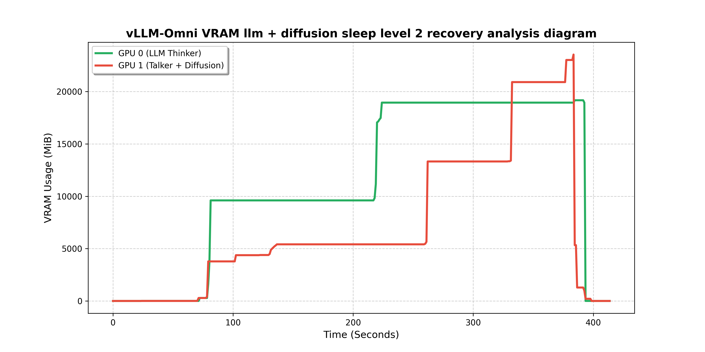
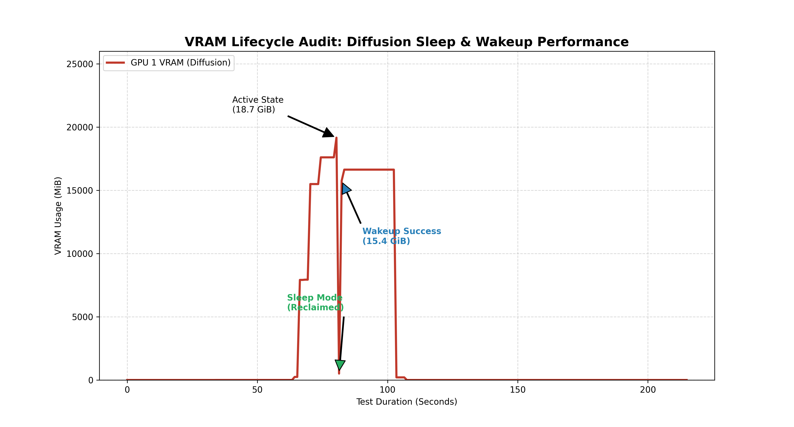

## processing

stage 0 for ready,    successful
stage 1 for ready,    successful
stage 2 for ready,    successful

waiting all worker send Handshake Received, successful

Logic for handling diffusion sleep and wakeup memory changes,  successful

Logic for handling llm and generation sleep and wakeup memory changes, successful

test pytest 5, successful

add AMD logic, successful

## next step

1. test AMD, pending

## NVIDIA 

RTX A5000 TP=2

### TEST 5

### TEST 6

1. test_llm_sleep_ack
   
description: 
   
result:

--- Running test: test_llm_sleep_ack
INFO 02-19 13:26:36 [omni_stage.py:566] [Stage-0] Status transitioned to: TRANSITIONING
INFO 02-19 13:26:36 [omni_stage.py:570] [Stage-0] Submitting SLEEP task (Level: 2)
INFO 02-19 13:26:36 [async_omni.py:885] [AsyncOrchestrator] Sleep initiated. Awaiting confirmation from 1 workers...
[Stage-0] INFO 02-19 13:26:36 [async_omni_llm.py:233] [AsyncOmniLLM] Engine Relay: Sleep Task 42204aa8-1f46-4e01-ada9-f8a229bd1027 (Level 2)
(EngineCore_DP0 pid=128264) [Stage-0] INFO 02-19 13:26:36 [base.py:143] [Omni Worker 0] Handshake Received: Task 42204aa8-1f46-4e01-ada9-f8a229bd1027, Level 2
(EngineCore_DP0 pid=128264) [Stage-0] INFO 02-19 13:26:37 [cumem.py:213] CuMemAllocator: sleep freed 9.49 GiB memory in total, of which 0.00 GiB is backed up in CPU and the rest 9.49 GiB is discarded directly.
(EngineCore_DP0 pid=128264) [Stage-0] INFO 02-19 13:26:37 [base.py:125] [LLM Worker 0] Sleep mode freed 10.88 GiB.
(EngineCore_DP0 pid=128264) [Stage-0] INFO 02-19 13:26:37 [base.py:168] [Omni Worker 0] ACK emitted for Task 42204aa8-1f46-4e01-ada9-f8a229bd1027
[Stage-0] INFO 02-19 13:26:37 [omni_stage.py:1323] [Stage-0] Sleep ACKs forwarded to Orchestrator
INFO 02-19 13:26:37 [async_omni.py:632] [AsyncOrchestrator] Intercepted wrapped ACK for task 42204aa8-1f46-4e01-ada9-f8a229bd1027 from stage-0
PASSEDGPU cleanup disabled
[rank0]:[W219 13:26:37.366831850 ProcessGroupNCCL.cpp:1524] Warning: WARNING: destroy_process_group() was not called before program exit, which can leak resources. For more info, please see https://pytorch.org/docs/stable/distributed.html#shutdown (function operator())
[rank0]:[W219 13:26:37.417116291 ProcessGroupNCCL.cpp:1524] Warning: WARNING: destroy_process_group() was not called before program exit, which can leak resources. For more info, please see https://pytorch.org/docs/stable/distributed.html#shutdown (function operator())
[Stage-0] INFO 02-19 13:26:37 [omni_stage.py:1428] Stage worker exiting
[Stage-1] INFO 02-19 13:26:38 [omni_stage.py:1428] Stage worker exiting

=============================== warnings summary ===============================
<frozen importlib._bootstrap>:488
  <frozen importlib._bootstrap>:488: DeprecationWarning: builtin type SwigPyPacked has no __module__ attribute

<frozen importlib._bootstrap>:488
  <frozen importlib._bootstrap>:488: DeprecationWarning: builtin type SwigPyObject has no __module__ attribute

-- Docs: https://docs.pytest.org/en/stable/how-to/capture-warnings.html
=========== 1 passed, 6 deselected, 2 warnings in 130.71s (0:02:10) ============

2. test_diffusion_sleep_handshake
   
description: 
   

result:

--- Running test: test_diffusion_sleep_handshake
INFO 02-19 09:52:14 [omni_stage.py:566] [Stage-0] Status transitioned to: TRANSITIONING
INFO 02-19 09:52:14 [omni_stage.py:570] [Stage-0] Submitting SLEEP task (Level: 2)
INFO 02-19 09:52:14 [async_omni.py:881] [AsyncOrchestrator] Sleep initiated. Awaiting confirmation from 1 workers...
[Stage-0] INFO 02-19 09:52:14 [async_omni_diffusion.py:309] [Entrypoint] Relaying Sleep Task: a0ce115b-0381-48ba-86c9-1eb92377877a (Level: 2)
[Stage-0] INFO 02-19 09:52:14 [diffusion_engine.py:401] [Diffusion Engine Relay] Dispatching Sleep Task a0ce115b-0381-48ba-86c9-1eb92377877a (Level: 2)
[Stage-0] INFO 02-19 09:52:14 [diffusion_worker.py:253] [Diffusion Worker 0] Handshake Received: Task a0ce115b-0381-48ba-86c9-1eb92377877a, Level 2
[Stage-0] INFO 02-19 09:52:14 [cumem.py:213] CuMemAllocator: sleep freed 14.89 GiB memory in total, of which 0.00 GiB is backed up in CPU and the rest 14.89 GiB is discarded directly.
[Stage-0] INFO 02-19 09:52:15 [diffusion_worker.py:209] Sleep mode freed 0.00 GiB memory, 14.89 GiB memory is still in use.
[Stage-0] INFO 02-19 09:52:15 [diffusion_worker.py:275] [Diffusion Worker 0]: ACK emitted. Freed 14.87 GiB.
[Stage-0] INFO 02-19 09:52:15 [omni_stage.py:1323] [Stage-0] Sleep ACKs forwarded to Orchestrator
INFO 02-19 09:52:15 [async_omni.py:628] [AsyncOrchestrator] Intercepted wrapped ACK for task a0ce115b-0381-48ba-86c9-1eb92377877a from stage-0

3. test_cross_device_cleanup

description: 
   
result:

--- Running test: test_cross_device_cleanup
INFO 02-18 10:10:42 [omni_stage.py:566] [Stage-0] Status transitioned to: TRANSITIONING
INFO 02-18 10:10:42 [omni_stage.py:570] [Stage-0] Submitting SLEEP task (Level: 2)
INFO 02-18 10:10:42 [async_omni.py:881] [AsyncOrchestrator] Sleep initiated. Awaiting confirmation from 1 workers...
[Stage-0] INFO 02-18 10:10:42 [async_omni_diffusion.py:309] [Entrypoint] Relaying Sleep Task: 0a3c7970-8920-4662-8e82-15523dcd6aed (Level: 2)
[Stage-0] INFO 02-18 10:10:42 [diffusion_engine.py:401] [Diffusion Engine Relay] Dispatching Sleep Task 0a3c7970-8920-4662-8e82-15523dcd6aed (Level: 2)
[Stage-0] INFO 02-18 10:10:42 [diffusion_worker.py:253] [Diffusion Worker 0] Handshake Received: Task 0a3c7970-8920-4662-8e82-15523dcd6aed, Level 2
[Stage-0] INFO 02-18 10:10:42 [cumem.py:213] CuMemAllocator: sleep freed 14.89 GiB memory in total, of which 0.00 GiB is backed up in CPU and the rest 14.89 GiB is discarded directly.
[Stage-0] INFO 02-18 10:10:42 [diffusion_worker.py:209] Sleep mode freed 0.00 GiB memory, 14.89 GiB memory is still in use.
[Stage-0] INFO 02-18 10:10:42 [diffusion_worker.py:278] [Diffusion Worker 0]: ACK emitted. Freed 14.87 GiB.
[Stage-0] INFO 02-18 10:10:42 [omni_stage.py:1323] [Stage-0] Sleep ACKs forwarded to Orchestrator
INFO 02-18 10:10:42 [async_omni.py:628] [AsyncOrchestrator] Intercepted wrapped ACK for task 0a3c7970-8920-4662-8e82-15523dcd6aed from stage-0

4. test_diffusion_integrity_bit_level
   
description: 
   
result:

--- Running test: test_diffusion_integrity_bit_level
INFO 02-18 10:43:22 [async_omni.py:367] [AsyncOrchestrator] Entering scheduling loop: stages=1, final_stage=0
[Stage-0] INFO 02-18 10:43:22 [manager.py:538] Deactivating all adapters: 0 layers
[Stage-0] WARNING 02-18 10:43:22 [kv_transfer_manager.py:356] No connector available for receiving KV cache
[Stage-0] INFO 02-18 10:43:23 [diffusion_engine.py:92] Generation completed successfully.
[Stage-0] INFO 02-18 10:43:23 [diffusion_engine.py:110] Post-processing completed in 0.0489 seconds
INFO 02-18 10:43:23 [omni_stage.py:566] [Stage-0] Status transitioned to: TRANSITIONING
INFO 02-18 10:43:23 [omni_stage.py:570] [Stage-0] Submitting SLEEP task (Level: 2)
INFO 02-18 10:43:23 [async_omni.py:881] [AsyncOrchestrator] Sleep initiated. Awaiting confirmation from 1 workers...
[Stage-0] INFO 02-18 10:43:23 [async_omni_diffusion.py:309] [Entrypoint] Relaying Sleep Task: 1f8d0c78-b1e2-4109-9523-6f15eac6d206 (Level: 2)
[Stage-0] INFO 02-18 10:43:23 [diffusion_engine.py:401] [Diffusion Engine Relay] Dispatching Sleep Task 1f8d0c78-b1e2-4109-9523-6f15eac6d206 (Level: 2)
[Stage-0] INFO 02-18 10:43:23 [diffusion_worker.py:253] [Diffusion Worker 0] Handshake Received: Task 1f8d0c78-b1e2-4109-9523-6f15eac6d206, Level 2
[Stage-0] INFO 02-18 10:43:23 [cumem.py:213] CuMemAllocator: sleep freed 14.89 GiB memory in total, of which 0.00 GiB is backed up in CPU and the rest 14.89 GiB is discarded directly.
[Stage-0] INFO 02-18 10:43:24 [diffusion_worker.py:209] Sleep mode freed 0.00 GiB memory, 14.89 GiB memory is still in use.
[Stage-0] INFO 02-18 10:43:24 [diffusion_worker.py:275] [Diffusion Worker 0]: ACK emitted. Freed 14.87 GiB.
[Stage-0] INFO 02-18 10:43:24 [omni_stage.py:1323] [Stage-0] Sleep ACKs forwarded to Orchestrator
INFO 02-18 10:43:24 [async_omni.py:628] [AsyncOrchestrator] Intercepted wrapped ACK for task 1f8d0c78-b1e2-4109-9523-6f15eac6d206 from stage-0
INFO 02-18 10:43:24 [omni_stage.py:579] [Stage-0] Submitting WAKE_UP task
INFO 02-18 10:43:24 [async_omni.py:903] [AsyncOrchestrator] Wake-up initiated. Awaiting confirmation from 1 workers...
[Stage-0] INFO 02-18 10:43:24 [async_omni_diffusion.py:318] [Entrypoint] Relaying WakeUp Task: 711290a9-5ae6-41b4-9be0-fdd5fd184a4c
[Stage-0] INFO 02-18 10:43:24 [diffusion_engine.py:424] [Diffusion Engine Relay] Dispatching Wake-up Task 711290a9-5ae6-41b4-9be0-fdd5fd184a4c to workers...
[Stage-0] INFO 02-18 10:43:24 [diffusion_worker.py:286] [Diffusion Worker 0] Responding to Wake-up Task: 711290a9-5ae6-41b4-9be0-fdd5fd184a4c
[Stage-0] INFO 02-18 10:43:24 [diffusion_worker.py:295] [Diffusion Worker 0] Wake-up confirmed.
INFO 02-18 10:43:24 [async_omni.py:628] [AsyncOrchestrator] Intercepted wrapped ACK for task 711290a9-5ae6-41b4-9be0-fdd5fd184a4c from stage-0
INFO 02-18 10:43:24 [async_omni.py:367] [AsyncOrchestrator] Entering scheduling loop: stages=1, final_stage=0
[Stage-0] INFO 02-18 10:43:24 [manager.py:538] Deactivating all adapters: 0 layers
[Stage-0] WARNING 02-18 10:43:24 [kv_transfer_manager.py:356] No connector available for receiving KV cache
[Stage-0] INFO 02-18 10:43:24 [diffusion_engine.py:92] Generation completed successfully.
[Stage-0] INFO 02-18 10:43:25 [diffusion_engine.py:110] Post-processing completed in 0.0079 seconds

5. test_coordinated_cross_device
   
description: 
   
result:

--- Running test: test_coordinated_cross_device
INFO 02-20 10:34:11 [omni_stage.py:566] [Stage-1] Status transitioned to: TRANSITIONING
INFO 02-20 10:34:11 [omni_stage.py:570] [Stage-1] Submitting SLEEP task (Level: 2)
INFO 02-20 10:34:11 [async_omni.py:894] [AsyncOrchestrator] Sleep initiated. Awaiting confirmation from 1 workers...
INFO 02-20 10:34:11 [omni_stage.py:566] [Stage-0] Status transitioned to: TRANSITIONING
INFO 02-20 10:34:11 [omni_stage.py:570] [Stage-0] Submitting SLEEP task (Level: 2)
INFO 02-20 10:34:11 [async_omni.py:894] [AsyncOrchestrator] Sleep initiated. Awaiting confirmation from 1 workers...
[Stage-0] INFO 02-20 10:34:11 [async_omni_diffusion.py:309] [Entrypoint] Relaying Sleep Task: d26c3fa6-b43d-4f63-9c06-3d97b5c2bb44 (Level: 2)
[Stage-0] INFO 02-20 10:34:11 [diffusion_engine.py:401] [Diffusion Engine Relay] Dispatching Sleep Task d26c3fa6-b43d-4f63-9c06-3d97b5c2bb44 (Level: 2)
[Stage-0] INFO 02-20 10:34:11 [diffusion_worker.py:253] [Diffusion Worker 0] Handshake Received: Task d26c3fa6-b43d-4f63-9c06-3d97b5c2bb44, Level 2
[Stage-1] INFO 02-20 10:34:11 [async_omni_llm.py:228] [AsyncOmniLLM] Engine Relay: Sleep Task 35f6c7c9-4168-42c0-81a8-49bdd1a39d88 (Level 2)
(EngineCore_DP0 pid=140115) [Stage-1] INFO 02-20 10:34:11 [base.py:157] [LLM Worker 0] Handshake Received: Task 35f6c7c9-4168-42c0-81a8-49bdd1a39d88, Level 2
(EngineCore_DP0 pid=140115) [Stage-1] INFO 02-20 10:34:11 [cumem.py:213] CuMemAllocator: sleep freed 0.47 GiB memory in total, of which 0.00 GiB is backed up in CPU and the rest 0.47 GiB is discarded directly.
(EngineCore_DP0 pid=140115) [Stage-1] INFO 02-20 10:34:11 [base.py:126] [LLM Worker 0] Level 2 Sleep: Offloading weights to CPU...
[Stage-0] INFO 02-20 10:34:11 [cumem.py:213] CuMemAllocator: sleep freed 14.89 GiB memory in total, of which 0.00 GiB is backed up in CPU and the rest 14.89 GiB is discarded directly.
[Stage-0] INFO 02-20 10:34:11 [diffusion_worker.py:209] Sleep mode freed 0.00 GiB memory, 14.89 GiB memory is still in use.
[Stage-0] INFO 02-20 10:34:11 [diffusion_worker.py:275] [Diffusion Worker 0]: ACK emitted. Freed 14.87 GiB.
[Stage-0] INFO 02-20 10:34:11 [omni_stage.py:1323] [Stage-0] Sleep ACKs forwarded to Orchestrator
INFO 02-20 10:34:11 [async_omni.py:641] [AsyncOrchestrator] Intercepted wrapped ACK for task d26c3fa6-b43d-4f63-9c06-3d97b5c2bb44 from stage-0
INFO 02-20 10:34:11 [omni_stage.py:566] [Stage-0] Status transitioned to: SLEEPING
(EngineCore_DP0 pid=140115) [Stage-1] INFO 02-20 10:34:13 [base.py:134] [LLM Worker 0] Sleep mode freed 4.53 GiB.
(EngineCore_DP0 pid=140115) [Stage-1] INFO 02-20 10:34:13 [base.py:182] [LLM Worker 0] ACK emitted for Task 35f6c7c9-4168-42c0-81a8-49bdd1a39d88
[Stage-1] INFO 02-20 10:34:13 [omni_stage.py:1323] [Stage-1] Sleep ACKs forwarded to Orchestrator
INFO 02-20 10:34:13 [async_omni.py:641] [AsyncOrchestrator] Intercepted wrapped ACK for task 35f6c7c9-4168-42c0-81a8-49bdd1a39d88 from stage-1
INFO 02-20 10:34:13 [omni_stage.py:566] [Stage-1] Status transitioned to: SLEEPING
PASSEDGPU cleanup disabled
[Stage-0] INFO 02-20 10:34:14 [diffusion_worker.py:436] Worker 0: Received shutdown message
[Stage-0] INFO 02-20 10:34:14 [diffusion_worker.py:457] event loop terminated.
[Stage-0] INFO 02-20 10:34:14 [diffusion_worker.py:488] Worker 0: Shutdown complete.
[Stage-0] INFO 02-20 10:34:18 [async_omni_diffusion.py:213] AsyncOmniDiffusion closed
[Stage-0] INFO 02-20 10:34:18 [omni_stage.py:1428] Stage worker exiting
[rank0]:[W220 10:34:19.356637799 ProcessGroupNCCL.cpp:1524] Warning: WARNING: destroy_process_group() was not called before program exit, which can leak resources. For more info, please see https://pytorch.org/docs/stable/distributed.html#shutdown (function operator())
[rank0]:[W220 10:34:19.383553223 ProcessGroupNCCL.cpp:1524] Warning: WARNING: destroy_process_group() was not called before program exit, which can leak resources. For more info, please see https://pytorch.org/docs/stable/distributed.html#shutdown (function operator())
[Stage-0] INFO 02-20 10:34:20 [omni_stage.py:1428] Stage worker exiting
[Stage-1] INFO 02-20 10:34:20 [omni_stage.py:1428] Stage worker exiting

=============================== warnings summary ===============================
<frozen importlib._bootstrap>:488
  <frozen importlib._bootstrap>:488: DeprecationWarning: builtin type SwigPyPacked has no __module__ attribute

<frozen importlib._bootstrap>:488
  <frozen importlib._bootstrap>:488: DeprecationWarning: builtin type SwigPyObject has no __module__ attribute

-- Docs: https://docs.pytest.org/en/stable/how-to/capture-warnings.html
=========== 1 passed, 4 deselected, 2 warnings in 384.72s (0:06:24) ============

6. test_diffusion_vram_lifecycle_audit 

description: 
   
result:

--- Running test: test_diffusion_vram_lifecycle_audit
INFO 02-22 05:31:24 [omni_stage.py:566] [Stage-0] Status transitioned to: TRANSITIONING
INFO 02-22 05:31:24 [omni_stage.py:570] [Stage-0] Submitting SLEEP task (Level: 2)
INFO 02-22 05:31:24 [async_omni.py:894] [AsyncOrchestrator] Sleep initiated. Awaiting confirmation from 1 workers...
[Stage-0] INFO 02-22 05:31:24 [async_omni_diffusion.py:309] [Entrypoint] Relaying Sleep Task: cb09dca7-2a3d-46ad-b47c-6b66243b9680 (Level: 2)
[Stage-0] INFO 02-22 05:31:24 [diffusion_engine.py:401] [Diffusion Engine Relay] Dispatching Sleep Task cb09dca7-2a3d-46ad-b47c-6b66243b9680 (Level: 2)
[Stage-0] INFO 02-22 05:31:24 [diffusion_worker.py:253] [Diffusion Worker 0] Handshake Received: Task cb09dca7-2a3d-46ad-b47c-6b66243b9680, Level 2
[Stage-0] INFO 02-22 05:31:24 [cumem.py:213] CuMemAllocator: sleep freed 14.89 GiB memory in total, of which 0.00 GiB is backed up in CPU and the rest 14.89 GiB is discarded directly.
[Stage-0] INFO 02-22 05:31:25 [diffusion_worker.py:209] Sleep mode freed 0.00 GiB memory, 14.89 GiB memory is still in use.
[Stage-0] INFO 02-22 05:31:25 [diffusion_worker.py:275] [Diffusion Worker 0]: ACK emitted. Freed 14.87 GiB.
[Stage-0] INFO 02-22 05:31:25 [omni_stage.py:1323] [Stage-0] Sleep ACKs forwarded to Orchestrator
INFO 02-22 05:31:25 [async_omni.py:641] [AsyncOrchestrator] Intercepted wrapped ACK for task cb09dca7-2a3d-46ad-b47c-6b66243b9680 from stage-0
INFO 02-22 05:31:25 [omni_stage.py:566] [Stage-0] Status transitioned to: SLEEPING
INFO 02-22 05:31:26 [omni_stage.py:579] [Stage-0] Submitting WAKE_UP task
INFO 02-22 05:31:26 [async_omni.py:921] [AsyncOrchestrator] Wake-up initiated. Awaiting confirmation from 1 workers...
[Stage-0] INFO 02-22 05:31:26 [async_omni_diffusion.py:318] [Entrypoint] Relaying WakeUp Task: 6dddc7c3-b77c-4c28-92aa-6eb739f9f704
[Stage-0] INFO 02-22 05:31:26 [diffusion_engine.py:424] [Diffusion Engine Relay] Dispatching Wake-up Task 6dddc7c3-b77c-4c28-92aa-6eb739f9f704 to workers...
[Stage-0] INFO 02-22 05:31:26 [diffusion_worker.py:286] [Diffusion Worker 0] Responding to Wake-up Task: 6dddc7c3-b77c-4c28-92aa-6eb739f9f704
[Stage-0] INFO 02-22 05:31:26 [diffusion_worker.py:295] [Diffusion Worker 0] Wake-up confirmed.
INFO 02-22 05:31:26 [async_omni.py:641] [AsyncOrchestrator] Intercepted wrapped ACK for task 6dddc7c3-b77c-4c28-92aa-6eb739f9f704 from stage-0
INFO 02-22 05:31:26 [omni_stage.py:566] [Stage-0] Status transitioned to: RUNNING
INFO 02-22 05:31:27 [async_omni.py:378] [AsyncOrchestrator] Entering scheduling loop: stages=1, final_stage=0
[Stage-0] INFO 02-22 05:31:27 [manager.py:538] Deactivating all adapters: 0 layers
[Stage-0] WARNING 02-22 05:31:27 [kv_transfer_manager.py:356] No connector available for receiving KV cache
[Stage-0] INFO 02-22 05:31:27 [diffusion_engine.py:92] Generation completed successfully.
[Stage-0] INFO 02-22 05:31:27 [diffusion_engine.py:110] Post-processing completed in 0.0516 seconds

## AMD

MI300X TP=2

1. test_llm_sleep_ack
   
description: 
   
result:

2. test_diffusion_sleep_handshake
   
description: 
   
result:

--- Running test: test_diffusion_sleep_handshake
INFO 02-22 15:08:36 [omni_stage.py:566] [Stage-0] Status transitioned to: TRANSITIONING
INFO 02-22 15:08:36 [omni_stage.py:570] [Stage-0] Submitting SLEEP task (Level: 2)
INFO 02-22 15:08:36 [async_omni.py:894] [AsyncOrchestrator] Sleep initiated. Awaiting confirmation from 1 workers...
[Stage-0] INFO 02-22 15:08:36 [async_omni_diffusion.py:309] [Entrypoint] Relaying Sleep Task: 3868e653-3030-4633-a616-b8f2c7df4ef9 (Level: 2)
[Stage-0] INFO 02-22 15:08:36 [diffusion_engine.py:401] [Diffusion Engine Relay] Dispatching Sleep Task 3868e653-3030-4633-a616-b8f2c7df4ef9 (Level: 2)
[Stage-0] INFO 02-22 15:08:36 [diffusion_worker.py:261] [Diffusion Worker 0] Handshake Received: Task 3868e653-3030-4633-a616-b8f2c7df4ef9, Level 2
[Stage-0] INFO 02-22 15:08:36 [cumem.py:213] CuMemAllocator: sleep freed 14.88 GiB memory in total, of which 0.00 GiB is backed up in CPU and the rest 14.88 GiB is discarded directly.
[Stage-0] INFO 02-22 15:08:37 [diffusion_worker.py:216] Sleep mode freed 2.99 GiB memory, 15.07 GiB memory is still in use.
[Stage-0] INFO 02-22 15:08:37 [diffusion_worker.py:283] [Diffusion Worker 0]: ACK emitted. Freed 14.87 GiB.
[Stage-0] INFO 02-22 15:08:37 [omni_stage.py:1323] [Stage-0] Sleep ACKs forwarded to Orchestrator
INFO 02-22 15:08:37 [async_omni.py:641] [AsyncOrchestrator] Intercepted wrapped ACK for task 3868e653-3030-4633-a616-b8f2c7df4ef9 from stage-0
INFO 02-22 15:08:37 [omni_stage.py:566] [Stage-0] Status transitioned to: SLEEPING

3. test_cross_device_cleanup

description: 
   
result:

--- Running test: test_cross_device_cleanup
INFO 02-22 15:12:32 [omni_stage.py:566] [Stage-0] Status transitioned to: TRANSITIONING
INFO 02-22 15:12:32 [omni_stage.py:570] [Stage-0] Submitting SLEEP task (Level: 2)
INFO 02-22 15:12:32 [async_omni.py:894] [AsyncOrchestrator] Sleep initiated. Awaiting confirmation from 1 workers...
[Stage-0] INFO 02-22 15:12:32 [async_omni_diffusion.py:309] [Entrypoint] Relaying Sleep Task: dcf62f54-2e20-4c06-b620-224eb0689036 (Level: 2)
[Stage-0] INFO 02-22 15:12:32 [diffusion_engine.py:401] [Diffusion Engine Relay] Dispatching Sleep Task dcf62f54-2e20-4c06-b620-224eb0689036 (Level: 2)
[Stage-0] INFO 02-22 15:12:32 [diffusion_worker.py:261] [Diffusion Worker 0] Handshake Received: Task dcf62f54-2e20-4c06-b620-224eb0689036, Level 2
[Stage-0] INFO 02-22 15:12:32 [cumem.py:213] CuMemAllocator: sleep freed 14.88 GiB memory in total, of which 0.00 GiB is backed up in CPU and the rest 14.88 GiB is discarded directly.
[Stage-0] INFO 02-22 15:12:32 [diffusion_worker.py:216] Sleep mode freed 2.99 GiB memory, 15.07 GiB memory is still in use.
[Stage-0] INFO 02-22 15:12:32 [diffusion_worker.py:283] [Diffusion Worker 0]: ACK emitted. Freed 14.87 GiB.
[Stage-0] INFO 02-22 15:12:32 [omni_stage.py:1323] [Stage-0] Sleep ACKs forwarded to Orchestrator
INFO 02-22 15:12:32 [async_omni.py:641] [AsyncOrchestrator] Intercepted wrapped ACK for task dcf62f54-2e20-4c06-b620-224eb0689036 from stage-0
INFO 02-22 15:12:32 [omni_stage.py:566] [Stage-0] Status transitioned to: SLEEPING

4. test_diffusion_integrity_bit_level
   
description: 
   
result:

--- Running test: test_diffusion_integrity_bit_level
INFO 02-22 15:20:22 [async_omni.py:378] [AsyncOrchestrator] Entering scheduling loop: stages=1, final_stage=0
[Stage-0] INFO 02-22 15:20:22 [manager.py:538] Deactivating all adapters: 0 layers
[Stage-0] WARNING 02-22 15:20:22 [kv_transfer_manager.py:356] No connector available for receiving KV cache
[Stage-0] INFO 02-22 15:20:34 [diffusion_engine.py:92] Generation completed successfully.
[Stage-0] INFO 02-22 15:20:34 [diffusion_engine.py:110] Post-processing completed in 0.1087 seconds
INFO 02-22 15:20:34 [omni_stage.py:566] [Stage-0] Status transitioned to: TRANSITIONING
INFO 02-22 15:20:34 [omni_stage.py:570] [Stage-0] Submitting SLEEP task (Level: 2)
INFO 02-22 15:20:34 [async_omni.py:894] [AsyncOrchestrator] Sleep initiated. Awaiting confirmation from 1 workers...
[Stage-0] INFO 02-22 15:20:34 [async_omni_diffusion.py:309] [Entrypoint] Relaying Sleep Task: 2cf5f67a-095e-44f4-b9c6-402005552b11 (Level: 2)
[Stage-0] INFO 02-22 15:20:34 [diffusion_engine.py:401] [Diffusion Engine Relay] Dispatching Sleep Task 2cf5f67a-095e-44f4-b9c6-402005552b11 (Level: 2)
[Stage-0] INFO 02-22 15:20:34 [diffusion_worker.py:261] [Diffusion Worker 0] Handshake Received: Task 2cf5f67a-095e-44f4-b9c6-402005552b11, Level 2
[Stage-0] INFO 02-22 15:20:34 [cumem.py:213] CuMemAllocator: sleep freed 14.88 GiB memory in total, of which 0.00 GiB is backed up in CPU and the rest 14.88 GiB is discarded directly.
[Stage-0] INFO 02-22 15:20:35 [diffusion_worker.py:216] Sleep mode freed 2.02 GiB memory, 15.08 GiB memory is still in use.
[Stage-0] INFO 02-22 15:20:35 [diffusion_worker.py:283] [Diffusion Worker 0]: ACK emitted. Freed 14.87 GiB.
[Stage-0] INFO 02-22 15:20:35 [omni_stage.py:1323] [Stage-0] Sleep ACKs forwarded to Orchestrator
INFO 02-22 15:20:35 [async_omni.py:641] [AsyncOrchestrator] Intercepted wrapped ACK for task 2cf5f67a-095e-44f4-b9c6-402005552b11 from stage-0
INFO 02-22 15:20:35 [omni_stage.py:566] [Stage-0] Status transitioned to: SLEEPING
INFO 02-22 15:20:35 [omni_stage.py:579] [Stage-0] Submitting WAKE_UP task
INFO 02-22 15:20:35 [async_omni.py:921] [AsyncOrchestrator] Wake-up initiated. Awaiting confirmation from 1 workers...
[Stage-0] INFO 02-22 15:20:35 [async_omni_diffusion.py:318] [Entrypoint] Relaying WakeUp Task: 8c7bc70e-5dc7-46cf-9d35-9a5025b490ea
[Stage-0] INFO 02-22 15:20:35 [diffusion_engine.py:424] [Diffusion Engine Relay] Dispatching Wake-up Task 8c7bc70e-5dc7-46cf-9d35-9a5025b490ea to workers...
[Stage-0] INFO 02-22 15:20:35 [diffusion_worker.py:294] [Diffusion Worker 0] Responding to Wake-up Task: 8c7bc70e-5dc7-46cf-9d35-9a5025b490ea
[Stage-0] INFO 02-22 15:20:35 [diffusion_worker.py:303] [Diffusion Worker 0] Wake-up confirmed.
INFO 02-22 15:20:35 [async_omni.py:641] [AsyncOrchestrator] Intercepted wrapped ACK for task 8c7bc70e-5dc7-46cf-9d35-9a5025b490ea from stage-0
INFO 02-22 15:20:35 [omni_stage.py:566] [Stage-0] Status transitioned to: RUNNING
INFO 02-22 15:20:35 [async_omni.py:378] [AsyncOrchestrator] Entering scheduling loop: stages=1, final_stage=0
[Stage-0] INFO 02-22 15:20:35 [manager.py:538] Deactivating all adapters: 0 layers
[Stage-0] WARNING 02-22 15:20:35 [kv_transfer_manager.py:356] No connector available for receiving KV cache
[Stage-0] INFO 02-22 15:20:35 [diffusion_engine.py:92] Generation completed successfully.
[Stage-0] INFO 02-22 15:20:35 [diffusion_engine.py:110] Post-processing completed in 0.0103 seconds

5. test_coordinated_cross_device
   
description: 
   
result:

6. test_diffusion_vram_lifecycle_audit 

description: 
   
result:

--- Running test: test_diffusion_vram_lifecycle_audit
INFO 02-22 15:33:16 [omni_stage.py:566] [Stage-0] Status transitioned to: TRANSITIONING
INFO 02-22 15:33:16 [omni_stage.py:570] [Stage-0] Submitting SLEEP task (Level: 2)
INFO 02-22 15:33:16 [async_omni.py:894] [AsyncOrchestrator] Sleep initiated. Awaiting confirmation from 1 workers...
[Stage-0] INFO 02-22 15:33:16 [async_omni_diffusion.py:309] [Entrypoint] Relaying Sleep Task: a1bfce73-d44c-4fe0-bca7-ec0d5b7667cb (Level: 2)
[Stage-0] INFO 02-22 15:33:16 [diffusion_engine.py:401] [Diffusion Engine Relay] Dispatching Sleep Task a1bfce73-d44c-4fe0-bca7-ec0d5b7667cb (Level: 2)
[Stage-0] INFO 02-22 15:33:16 [diffusion_worker.py:261] [Diffusion Worker 0] Handshake Received: Task a1bfce73-d44c-4fe0-bca7-ec0d5b7667cb, Level 2
[Stage-0] INFO 02-22 15:33:16 [cumem.py:213] CuMemAllocator: sleep freed 14.88 GiB memory in total, of which 0.00 GiB is backed up in CPU and the rest 14.88 GiB is discarded directly.
[Stage-0] INFO 02-22 15:33:16 [diffusion_worker.py:216] Sleep mode freed 2.88 GiB memory, 15.08 GiB memory is still in use.
[Stage-0] INFO 02-22 15:33:16 [diffusion_worker.py:283] [Diffusion Worker 0]: ACK emitted. Freed 14.87 GiB.
[Stage-0] INFO 02-22 15:33:16 [omni_stage.py:1323] [Stage-0] Sleep ACKs forwarded to Orchestrator
INFO 02-22 15:33:16 [async_omni.py:641] [AsyncOrchestrator] Intercepted wrapped ACK for task a1bfce73-d44c-4fe0-bca7-ec0d5b7667cb from stage-0
INFO 02-22 15:33:16 [omni_stage.py:566] [Stage-0] Status transitioned to: SLEEPING
INFO 02-22 15:33:17 [omni_stage.py:579] [Stage-0] Submitting WAKE_UP task
INFO 02-22 15:33:17 [async_omni.py:921] [AsyncOrchestrator] Wake-up initiated. Awaiting confirmation from 1 workers...
[Stage-0] INFO 02-22 15:33:17 [async_omni_diffusion.py:318] [Entrypoint] Relaying WakeUp Task: d61b7073-9ad6-4652-89fc-bf926717f64c
[Stage-0] INFO 02-22 15:33:17 [diffusion_engine.py:424] [Diffusion Engine Relay] Dispatching Wake-up Task d61b7073-9ad6-4652-89fc-bf926717f64c to workers...
[Stage-0] INFO 02-22 15:33:17 [diffusion_worker.py:294] [Diffusion Worker 0] Responding to Wake-up Task: d61b7073-9ad6-4652-89fc-bf926717f64c
[Stage-0] INFO 02-22 15:33:17 [diffusion_worker.py:303] [Diffusion Worker 0] Wake-up confirmed.
INFO 02-22 15:33:17 [async_omni.py:641] [AsyncOrchestrator] Intercepted wrapped ACK for task d61b7073-9ad6-4652-89fc-bf926717f64c from stage-0
INFO 02-22 15:33:17 [omni_stage.py:566] [Stage-0] Status transitioned to: RUNNING
INFO 02-22 15:33:18 [async_omni.py:378] [AsyncOrchestrator] Entering scheduling loop: stages=1, final_stage=0
[Stage-0] INFO 02-22 15:33:18 [manager.py:538] Deactivating all adapters: 0 layers
[Stage-0] WARNING 02-22 15:33:18 [kv_transfer_manager.py:356] No connector available for receiving KV cache
[Stage-0] INFO 02-22 15:33:18 [diffusion_engine.py:92] Generation completed successfully.
[Stage-0] INFO 02-22 15:33:19 [diffusion_engine.py:110] Post-processing completed in 0.1098 seconds