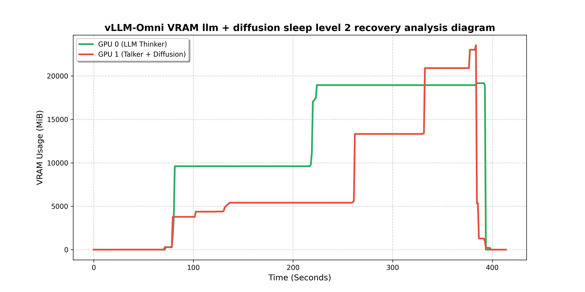
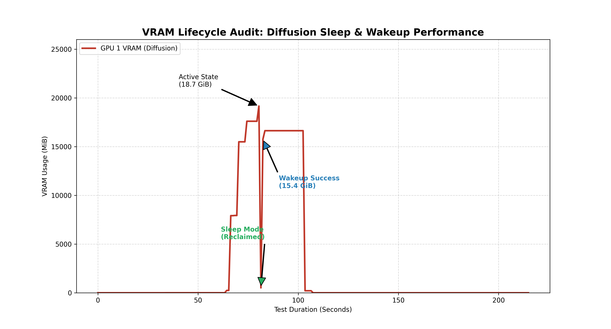

## processing

stage 0 for ready,    successful
stage 1 for ready,    successful
stage 2 for ready,    successful

waiting all worker send Handshake Received, successful

Logic for handling diffusion sleep and wakeup memory changes,  successful

Logic for handling llm and generation sleep and wakeup memory changes, successful

test pytest 5, successful

add AMD logic, successful

test AMD, pending. successful

adjust draftPR content style, successful

talk about RFC Feb 25, finished.

前置PR相关的issue和PR都已经提交，已成功提交PR，待最终合并。（争取在3月13号合并此PR，预计3月12号可以合并。）

备注：
1. sleep mode 前置PR关于diffusion worker显存计算的正确性，根据bagel模型复现bug，进行解决处理。
2. 在前置PR中，A100 PCie 去掉超时设置，跑通bagel模型的单元测试。

前置PR链接：https://github.com/vllm-project/vllm-omni/pull/1582

代码已合并，但是回滚了一部分，因为涉及到diffusion 动态计算的部分，目前测试场景不是很全，需要后面作为单独的PR处理。（后续计划）

## next step

and open new PR, pending. sleep mode ack PR合并到0.18版本，3月底合并。

待处理的点
sleep mode ack 大PR
 1. 在sleep mode ack机制上跑bagel模型测试（去掉draft PR中使用的qwen3和flux模型，全面使用bagel模型进行测试。）
 2. diffusion在AMD卡上sleep 的时候回收效果不如NVIDIA，要进一步测试，是不是算错了，还是AMD卡的问题，排查一下，具体文档中有记录。
 3. 协调NPU和XPU测试资源，PR提出来后，让maintainer协调资源去测试。
 4. 重新基于现有架构代码进行代码处理，重新提PR。
 5. AMD MI300X TP = 2
 6. NVIDIA A100 PCie TP = 2  或者H100等等

差不多会在3月17-18号新PR会提出来，留足够时间给reviewer和修改代码，因为需要根据最新代码结构修改sleep mode ack draft PR的代码。

4月份
sleep mode ack PR合并后，进行相关的pr或者issue问题解决

5月份
处理vLLM和vLLM-omni其他的issue

   

## NVIDIA 

NVIDIA RTXA6000 TP=2

### TEST 5

### TEST 6

NVIDIA A100PCIe TP=2

### TEST 1

### TEST 2

1. test_llm_sleep_ack
   
description: 

Unit Test 1: LLM 信号握手与物理显存回收审计
验证 LLM Thinker 阶段在接收到睡眠指令后，能否准确返回物理显存回收的确定性数据（ACK）。
   
result:

#### level 1

--- Running test: test_llm_sleep_ack
INFO 02-24 03:23:10 [omni_stage.py:566] [Stage-0] Status transitioned to: TRANSITIONING
INFO 02-24 03:23:10 [omni_stage.py:570] [Stage-0] Submitting SLEEP task (Level: 1)
INFO 02-24 03:23:10 [async_omni.py:894] [AsyncOrchestrator] Sleep initiated. Awaiting confirmation from 1 workers...
[Stage-0] INFO 02-24 03:23:10 [async_omni_llm.py:229] [AsyncOmniLLM] Engine Relay: Sleep Task cb1f9bf0-a3e1-4f9b-8dc8-000587e4a660 (Level 1)
(EngineCore_DP0 pid=30770) [Stage-0] INFO 02-24 03:23:10 [base.py:166] [LLM Worker 0] Handshake Received: Task cb1f9bf0-a3e1-4f9b-8dc8-000587e4a660, Level 1
(EngineCore_DP0 pid=30770) [Stage-0] INFO 02-24 03:23:19 [cumem.py:213] CuMemAllocator: sleep freed 42.44 GiB memory in total, of which 9.11 GiB is backed up in CPU and the rest 33.33 GiB is discarded directly.
(EngineCore_DP0 pid=30770) [Stage-0] INFO 02-24 03:23:19 [base.py:148] [LLM Worker 0] Level 1 Sleep: Freed 43.80 GiB. 0.66GiB memory is still in use.
(EngineCore_DP0 pid=30770) [Stage-0] INFO 02-24 03:23:19 [base.py:188] [LLM Worker 0] ACK emitted for Task cb1f9bf0-a3e1-4f9b-8dc8-000587e4a660
[Stage-0] INFO 02-24 03:23:19 [omni_stage.py:1323] [Stage-0] Sleep ACKs forwarded to Orchestrator
INFO 02-24 03:23:19 [async_omni.py:641] [AsyncOrchestrator] Intercepted wrapped ACK for task cb1f9bf0-a3e1-4f9b-8dc8-000587e4a660 from stage-0
INFO 02-24 03:23:19 [omni_stage.py:566] [Stage-0] Status transitioned to: SLEEPING

#### level 2

--- Running test: test_llm_sleep_ack
INFO 02-24 03:26:20 [omni_stage.py:566] [Stage-0] Status transitioned to: TRANSITIONING
INFO 02-24 03:26:20 [omni_stage.py:570] [Stage-0] Submitting SLEEP task (Level: 2)
INFO 02-24 03:26:20 [async_omni.py:894] [AsyncOrchestrator] Sleep initiated. Awaiting confirmation from 1 workers...
[Stage-0] INFO 02-24 03:26:20 [async_omni_llm.py:229] [AsyncOmniLLM] Engine Relay: Sleep Task f5259cd8-fe3a-408b-85f8-15631d2038ad (Level 2)
(EngineCore_DP0 pid=33846) [Stage-0] INFO 02-24 03:26:20 [base.py:166] [LLM Worker 0] Handshake Received: Task f5259cd8-fe3a-408b-85f8-15631d2038ad, Level 2
(EngineCore_DP0 pid=33846) [Stage-0] INFO 02-24 03:26:20 [cumem.py:213] CuMemAllocator: sleep freed 42.44 GiB memory in total, of which 0.00 GiB is backed up in CPU and the rest 42.44 GiB is discarded directly.
(EngineCore_DP0 pid=33846) [Stage-0] INFO 02-24 03:26:20 [base.py:148] [LLM Worker 0] Level 2 Sleep: Freed 43.83 GiB. 0.64GiB memory is still in use.
(EngineCore_DP0 pid=33846) [Stage-0] INFO 02-24 03:26:20 [base.py:188] [LLM Worker 0] ACK emitted for Task f5259cd8-fe3a-408b-85f8-15631d2038ad
[Stage-0] INFO 02-24 03:26:20 [omni_stage.py:1323] [Stage-0] Sleep ACKs forwarded to Orchestrator
INFO 02-24 03:26:20 [async_omni.py:641] [AsyncOrchestrator] Intercepted wrapped ACK for task f5259cd8-fe3a-408b-85f8-15631d2038ad from stage-0
INFO 02-24 03:26:20 [omni_stage.py:566] [Stage-0] Status transitioned to: SLEEPING

bagel模型测试

(EngineCore_DP0 pid=90497) [Stage-0] INFO 03-16 11:12:26 [base.py:106] Offloader set to NoopOffloader
(EngineCore_DP0 pid=90503) [Stage-1] INFO 03-16 11:12:26 [base.py:106] Offloader set to NoopOffloader
(EngineCore_DP0 pid=90497) [Stage-0] INFO 03-16 11:12:26 [gpu_model_runner.py:4255] Starting to load model ByteDance-Seed/BAGEL-7B-MoT...
(EngineCore_DP0 pid=90503) [Stage-1] INFO 03-16 11:12:26 [gpu_model_runner.py:4255] Starting to load model ByteDance-Seed/BAGEL-7B-MoT...
(EngineCore_DP0 pid=90497) [Stage-0] INFO 03-16 11:12:26 [vllm.py:747] Asynchronous scheduling is enabled.
..................................................................................
INFO 03-16 11:12:37 [omni.py:536] [AsyncOrchestrator] Stage-1 reported ready
INFO 03-16 11:12:37 [omni.py:536] [AsyncOrchestrator] Stage-0 reported ready
INFO 03-16 11:12:37 [omni.py:565] [AsyncOrchestrator] All stages initialized successfully
INFO 03-16 11:12:39 [async_omni.py:329] [AsyncOrchestrator] Initialized input_processor, io_processor, and model_config from stage-0
[2026-03-16 11:12:39] INFO test_omni_sleep_mode.py:99: Thinker initial VRAM: 0.00 GiB
INFO 03-16 11:12:39 [omni_stage.py:700] [Stage-0] Status transitioned to: TRANSITIONING
INFO 03-16 11:12:39 [omni_stage.py:704] [Stage-0] Submitting SLEEP task (Level: 2)
INFO 03-16 11:12:39 [async_omni.py:1091] [AsyncOrchestrator] Sleep initiated (Task: fdcb4fb8-5aaa-414c-ae97-28bba6783b79). Awaiting 1 ACKs...
[Stage-0] INFO 03-16 11:12:39 [async_omni_llm.py:225] [AsyncOmniLLM] Engine Relay: Sleep Task fdcb4fb8-5aaa-414c-ae97-28bba6783b79 (Level 2)
(EngineCore_DP0 pid=90497) [Stage-0] INFO 03-16 11:12:39 [base.py:171] [LLM Worker 0] Handshake Received: Task fdcb4fb8-5aaa-414c-ae97-28bba6783b79, Level 2
(EngineCore_DP0 pid=90497) [Stage-0] INFO 03-16 11:12:39 [cumem.py:216] CuMemAllocator: sleep freed 37.00 GiB memory in total, of which 0.00 GiB is backed up in CPU and the rest 37.00 GiB is discarded directly.
(EngineCore_DP0 pid=90497) [Stage-0] INFO 03-16 11:12:39 [base.py:153] [LLM Worker 0] Level 2 Sleep: Freed 37.54 GiB. 0.74GiB memory is still in use.
(EngineCore_DP0 pid=90497) [Stage-0] INFO 03-16 11:12:39 [base.py:193] [LLM Worker 0] ACK emitted for Task fdcb4fb8-5aaa-414c-ae97-28bba6783b79
[Stage-0] INFO 03-16 11:12:39 [omni_stage.py:1584] [Stage-0] Sleep ACKs forwarded to Orchestrator
INFO 03-16 11:12:39 [async_omni.py:883] [AsyncOrchestrator] Intercepted ACK for task fdcb4fb8-5aaa-414c-ae97-28bba6783b79 from stage-0
INFO 03-16 11:12:39 [omni_stage.py:700] [Stage-0] Status transitioned to: SLEEPING
[2026-03-16 11:12:39] INFO test_omni_sleep_mode.py:108: Thinker VRAM physically reclaimed: 37.54 GiB

2. test_diffusion_sleep_handshake
   
description: 

Unit Test 2: Diffusion 阶段分级睡眠动作与握手协议校验
物理触发 Diffusion 阶段的分级睡眠（Offload/Discard），验证分布式 Worker 在真实显存动作后的同步握手链路。
   

result:

#### level 1

--- Running test: test_diffusion_sleep_handshake
INFO 02-24 03:28:19 [omni_stage.py:566] [Stage-0] Status transitioned to: TRANSITIONING
INFO 02-24 03:28:19 [omni_stage.py:570] [Stage-0] Submitting SLEEP task (Level: 1)
INFO 02-24 03:28:19 [async_omni.py:894] [AsyncOrchestrator] Sleep initiated. Awaiting confirmation from 1 workers...
[Stage-0] INFO 02-24 03:28:19 [async_omni_diffusion.py:309] [Entrypoint] Relaying Sleep Task: a42a1cbf-8d2d-49c5-bd27-711b74ab6c68 (Level: 1)
[Stage-0] INFO 02-24 03:28:19 [diffusion_engine.py:401] [Diffusion Engine Relay] Dispatching Sleep Task a42a1cbf-8d2d-49c5-bd27-711b74ab6c68 (Level: 1)
[Stage-0] INFO 02-24 03:28:19 [diffusion_worker.py:228] [Diffusion Worker 0] Handshake Received: Task a42a1cbf-8d2d-49c5-bd27-711b74ab6c68, Level 1
[Stage-0] INFO 02-24 03:28:31 [cumem.py:213] CuMemAllocator: sleep freed 14.89 GiB memory in total, of which 14.89 GiB is backed up in CPU and the rest 0.00 GiB is discarded directly.
[Stage-0] INFO 02-24 03:28:32 [diffusion_worker.py:198] [Diffusion Worker 0] Level 1 Sleep: Freed 18.37 GiB. 0.41GiB memory is still in use.
[Stage-0] INFO 02-24 03:28:32 [diffusion_worker.py:246] [Diffusion Worker 0]: ACK emitted. Freed 18.37 GiB.
[Stage-0] INFO 02-24 03:28:32 [omni_stage.py:1323] [Stage-0] Sleep ACKs forwarded to Orchestrator
INFO 02-24 03:28:32 [async_omni.py:641] [AsyncOrchestrator] Intercepted wrapped ACK for task a42a1cbf-8d2d-49c5-bd27-711b74ab6c68 from stage-0
INFO 02-24 03:28:32 [omni_stage.py:566] [Stage-0] Status transitioned to: SLEEPING

#### level 2

--- Running test: test_diffusion_sleep_handshake
INFO 02-24 03:30:13 [omni_stage.py:566] [Stage-0] Status transitioned to: TRANSITIONING
INFO 02-24 03:30:13 [omni_stage.py:570] [Stage-0] Submitting SLEEP task (Level: 2)
INFO 02-24 03:30:13 [async_omni.py:894] [AsyncOrchestrator] Sleep initiated. Awaiting confirmation from 1 workers...
[Stage-0] INFO 02-24 03:30:13 [async_omni_diffusion.py:309] [Entrypoint] Relaying Sleep Task: ac2c59b3-b4a6-4321-9c4e-37d552d15a24 (Level: 2)
[Stage-0] INFO 02-24 03:30:13 [diffusion_engine.py:401] [Diffusion Engine Relay] Dispatching Sleep Task ac2c59b3-b4a6-4321-9c4e-37d552d15a24 (Level: 2)
[Stage-0] INFO 02-24 03:30:13 [diffusion_worker.py:228] [Diffusion Worker 0] Handshake Received: Task ac2c59b3-b4a6-4321-9c4e-37d552d15a24, Level 2
[Stage-0] INFO 02-24 03:30:13 [cumem.py:213] CuMemAllocator: sleep freed 14.89 GiB memory in total, of which 0.00 GiB is backed up in CPU and the rest 14.89 GiB is discarded directly.
[Stage-0] INFO 02-24 03:30:13 [diffusion_worker.py:198] [Diffusion Worker 0] Level 2 Sleep: Freed 18.40 GiB. 0.37GiB memory is still in use.
[Stage-0] INFO 02-24 03:30:13 [diffusion_worker.py:246] [Diffusion Worker 0]: ACK emitted. Freed 18.40 GiB.
[Stage-0] INFO 02-24 03:30:13 [omni_stage.py:1323] [Stage-0] Sleep ACKs forwarded to Orchestrator
INFO 02-24 03:30:13 [async_omni.py:641] [AsyncOrchestrator] Intercepted wrapped ACK for task ac2c59b3-b4a6-4321-9c4e-37d552d15a24 from stage-0
INFO 02-24 03:30:13 [omni_stage.py:566] [Stage-0] Status transitioned to: SLEEPING

3. test_cross_device_cleanup

description: 

Unit Test 3: 模型权重卸载与显存清空确定性审计
物理核验 Diffusion 模型权重在 Level1 或 level2模式下的卸载效率，确保显存物理占用达到预期阈值。
   

result:

#### level 1

--- Running test: test_cross_device_cleanup
INFO 02-24 03:32:04 [omni_stage.py:566] [Stage-0] Status transitioned to: TRANSITIONING
INFO 02-24 03:32:04 [omni_stage.py:570] [Stage-0] Submitting SLEEP task (Level: 1)
INFO 02-24 03:32:04 [async_omni.py:894] [AsyncOrchestrator] Sleep initiated. Awaiting confirmation from 1 workers...
[Stage-0] INFO 02-24 03:32:04 [async_omni_diffusion.py:309] [Entrypoint] Relaying Sleep Task: 144b63c4-d024-46a1-aa86-f8259b12f4ba (Level: 1)
[Stage-0] INFO 02-24 03:32:04 [diffusion_engine.py:401] [Diffusion Engine Relay] Dispatching Sleep Task 144b63c4-d024-46a1-aa86-f8259b12f4ba (Level: 1)
[Stage-0] INFO 02-24 03:32:04 [diffusion_worker.py:228] [Diffusion Worker 0] Handshake Received: Task 144b63c4-d024-46a1-aa86-f8259b12f4ba, Level 1
[Stage-0] INFO 02-24 03:32:19 [cumem.py:213] CuMemAllocator: sleep freed 14.89 GiB memory in total, of which 14.89 GiB is backed up in CPU and the rest 0.00 GiB is discarded directly.
[Stage-0] INFO 02-24 03:32:20 [diffusion_worker.py:198] [Diffusion Worker 0] Level 1 Sleep: Freed 18.37 GiB. 0.41GiB memory is still in use.
[Stage-0] INFO 02-24 03:32:20 [diffusion_worker.py:246] [Diffusion Worker 0]: ACK emitted. Freed 18.37 GiB.
[Stage-0] INFO 02-24 03:32:20 [omni_stage.py:1323] [Stage-0] Sleep ACKs forwarded to Orchestrator
INFO 02-24 03:32:20 [async_omni.py:641] [AsyncOrchestrator] Intercepted wrapped ACK for task 144b63c4-d024-46a1-aa86-f8259b12f4ba from stage-0
INFO 02-24 03:32:20 [omni_stage.py:566] [Stage-0] Status transitioned to: SLEEPING

#### level 2

--- Running test: test_cross_device_cleanup
INFO 02-24 03:33:48 [omni_stage.py:566] [Stage-0] Status transitioned to: TRANSITIONING
INFO 02-24 03:33:48 [omni_stage.py:570] [Stage-0] Submitting SLEEP task (Level: 2)
INFO 02-24 03:33:48 [async_omni.py:894] [AsyncOrchestrator] Sleep initiated. Awaiting confirmation from 1 workers...
[Stage-0] INFO 02-24 03:33:48 [async_omni_diffusion.py:309] [Entrypoint] Relaying Sleep Task: 88f4c69c-31a8-42e7-b23b-0949ef9831aa (Level: 2)
[Stage-0] INFO 02-24 03:33:48 [diffusion_engine.py:401] [Diffusion Engine Relay] Dispatching Sleep Task 88f4c69c-31a8-42e7-b23b-0949ef9831aa (Level: 2)
[Stage-0] INFO 02-24 03:33:48 [diffusion_worker.py:228] [Diffusion Worker 0] Handshake Received: Task 88f4c69c-31a8-42e7-b23b-0949ef9831aa, Level 2
[Stage-0] INFO 02-24 03:33:48 [cumem.py:213] CuMemAllocator: sleep freed 14.89 GiB memory in total, of which 0.00 GiB is backed up in CPU and the rest 14.89 GiB is discarded directly.
[Stage-0] INFO 02-24 03:33:49 [diffusion_worker.py:198] [Diffusion Worker 0] Level 2 Sleep: Freed 18.40 GiB. 0.37GiB memory is still in use.
[Stage-0] INFO 02-24 03:33:49 [diffusion_worker.py:246] [Diffusion Worker 0]: ACK emitted. Freed 18.40 GiB.
[Stage-0] INFO 02-24 03:33:49 [omni_stage.py:1323] [Stage-0] Sleep ACKs forwarded to Orchestrator
INFO 02-24 03:33:49 [async_omni.py:641] [AsyncOrchestrator] Intercepted wrapped ACK for task 88f4c69c-31a8-42e7-b23b-0949ef9831aa from stage-0
INFO 02-24 03:33:49 [omni_stage.py:566] [Stage-0] Status transitioned to: SLEEPING

4. test_diffusion_integrity_bit_level
   
description:

Unit Test 4: 唤醒后推理一致性与位级精度校验
验证 Diffusion 模型在经历“运行-睡眠-唤醒”全生命周期后，生成的图像数据是否具备位级一致性，防止模型状态损坏。
   
result:

#### level 1

--- Running test: test_diffusion_integrity_bit_level
INFO 02-24 03:38:51 [async_omni.py:378] [AsyncOrchestrator] Entering scheduling loop: stages=1, final_stage=0
[Stage-0] INFO 02-24 03:38:51 [manager.py:538] Deactivating all adapters: 0 layers
[Stage-0] WARNING 02-24 03:38:51 [kv_transfer_manager.py:356] No connector available for receiving KV cache
[Stage-0] INFO 02-24 03:38:52 [diffusion_engine.py:92] Generation completed successfully.
[Stage-0] INFO 02-24 03:38:52 [diffusion_engine.py:110] Post-processing completed in 0.0564 seconds
INFO 02-24 03:38:52 [omni_stage.py:566] [Stage-0] Status transitioned to: TRANSITIONING
INFO 02-24 03:38:52 [omni_stage.py:570] [Stage-0] Submitting SLEEP task (Level: 1)
INFO 02-24 03:38:52 [async_omni.py:894] [AsyncOrchestrator] Sleep initiated. Awaiting confirmation from 1 workers...
[Stage-0] INFO 02-24 03:38:52 [async_omni_diffusion.py:309] [Entrypoint] Relaying Sleep Task: 133b2334-0c15-401e-8f6b-a0d6d16f35ca (Level: 1)
[Stage-0] INFO 02-24 03:38:52 [diffusion_engine.py:401] [Diffusion Engine Relay] Dispatching Sleep Task 133b2334-0c15-401e-8f6b-a0d6d16f35ca (Level: 1)
[Stage-0] INFO 02-24 03:38:52 [diffusion_worker.py:228] [Diffusion Worker 0] Handshake Received: Task 133b2334-0c15-401e-8f6b-a0d6d16f35ca, Level 1
[Stage-0] INFO 02-24 03:39:04 [cumem.py:213] CuMemAllocator: sleep freed 14.89 GiB memory in total, of which 14.89 GiB is backed up in CPU and the rest 0.00 GiB is discarded directly.
[Stage-0] INFO 02-24 03:39:04 [diffusion_worker.py:198] [Diffusion Worker 0] Level 1 Sleep: Freed 18.38 GiB. 0.39GiB memory is still in use.
[Stage-0] INFO 02-24 03:39:04 [diffusion_worker.py:246] [Diffusion Worker 0]: ACK emitted. Freed 18.38 GiB.
[Stage-0] INFO 02-24 03:39:04 [omni_stage.py:1323] [Stage-0] Sleep ACKs forwarded to Orchestrator
INFO 02-24 03:39:04 [async_omni.py:641] [AsyncOrchestrator] Intercepted wrapped ACK for task 133b2334-0c15-401e-8f6b-a0d6d16f35ca from stage-0
INFO 02-24 03:39:04 [omni_stage.py:566] [Stage-0] Status transitioned to: SLEEPING
INFO 02-24 03:39:04 [omni_stage.py:579] [Stage-0] Submitting WAKE_UP task
INFO 02-24 03:39:04 [async_omni.py:921] [AsyncOrchestrator] Wake-up initiated. Awaiting confirmation from 1 workers...
[Stage-0] INFO 02-24 03:39:04 [async_omni_diffusion.py:318] [Entrypoint] Relaying WakeUp Task: f4e43980-b87d-4220-91fc-b252ec69bca3
[Stage-0] INFO 02-24 03:39:04 [diffusion_engine.py:424] [Diffusion Engine Relay] Dispatching Wake-up Task f4e43980-b87d-4220-91fc-b252ec69bca3 to workers...
[Stage-0] INFO 02-24 03:39:04 [diffusion_worker.py:257] [Diffusion Worker 0] Responding to Wake-up Task: f4e43980-b87d-4220-91fc-b252ec69bca3
[Stage-0] INFO 02-24 03:39:05 [diffusion_worker.py:217] [Diffusion Worker 0] Wake-up complete.
[Stage-0] INFO 02-24 03:39:05 [diffusion_worker.py:266] [Diffusion Worker 0] Wake-up confirmed.
INFO 02-24 03:39:05 [async_omni.py:641] [AsyncOrchestrator] Intercepted wrapped ACK for task f4e43980-b87d-4220-91fc-b252ec69bca3 from stage-0
INFO 02-24 03:39:05 [omni_stage.py:566] [Stage-0] Status transitioned to: RUNNING
INFO 02-24 03:39:05 [async_omni.py:378] [AsyncOrchestrator] Entering scheduling loop: stages=1, final_stage=0
[Stage-0] INFO 02-24 03:39:05 [manager.py:538] Deactivating all adapters: 0 layers
[Stage-0] WARNING 02-24 03:39:05 [kv_transfer_manager.py:356] No connector available for receiving KV cache
[Stage-0] INFO 02-24 03:39:05 [diffusion_engine.py:92] Generation completed successfully.
[Stage-0] INFO 02-24 03:39:05 [diffusion_engine.py:110] Post-processing completed in 0.0122 seconds

#### level 2

--- Running test: test_diffusion_integrity_bit_level
INFO 02-24 03:40:56 [async_omni.py:378] [AsyncOrchestrator] Entering scheduling loop: stages=1, final_stage=0
[Stage-0] INFO 02-24 03:40:56 [manager.py:538] Deactivating all adapters: 0 layers
[Stage-0] WARNING 02-24 03:40:56 [kv_transfer_manager.py:356] No connector available for receiving KV cache
[Stage-0] INFO 02-24 03:40:57 [diffusion_engine.py:92] Generation completed successfully.
[Stage-0] INFO 02-24 03:40:57 [diffusion_engine.py:110] Post-processing completed in 0.0552 seconds
INFO 02-24 03:40:57 [omni_stage.py:566] [Stage-0] Status transitioned to: TRANSITIONING
INFO 02-24 03:40:57 [omni_stage.py:570] [Stage-0] Submitting SLEEP task (Level: 2)
INFO 02-24 03:40:57 [async_omni.py:894] [AsyncOrchestrator] Sleep initiated. Awaiting confirmation from 1 workers...
[Stage-0] INFO 02-24 03:40:57 [async_omni_diffusion.py:309] [Entrypoint] Relaying Sleep Task: ed5b5e3b-217b-474a-a95e-1a3bce031a92 (Level: 2)
[Stage-0] INFO 02-24 03:40:57 [diffusion_engine.py:401] [Diffusion Engine Relay] Dispatching Sleep Task ed5b5e3b-217b-474a-a95e-1a3bce031a92 (Level: 2)
[Stage-0] INFO 02-24 03:40:57 [diffusion_worker.py:228] [Diffusion Worker 0] Handshake Received: Task ed5b5e3b-217b-474a-a95e-1a3bce031a92, Level 2
[Stage-0] INFO 02-24 03:40:57 [cumem.py:213] CuMemAllocator: sleep freed 14.89 GiB memory in total, of which 0.00 GiB is backed up in CPU and the rest 14.89 GiB is discarded directly.
[Stage-0] INFO 02-24 03:40:57 [diffusion_worker.py:198] [Diffusion Worker 0] Level 2 Sleep: Freed 18.42 GiB. 0.35GiB memory is still in use.
[Stage-0] INFO 02-24 03:40:57 [diffusion_worker.py:246] [Diffusion Worker 0]: ACK emitted. Freed 18.42 GiB.
[Stage-0] INFO 02-24 03:40:57 [omni_stage.py:1323] [Stage-0] Sleep ACKs forwarded to Orchestrator
INFO 02-24 03:40:57 [async_omni.py:641] [AsyncOrchestrator] Intercepted wrapped ACK for task ed5b5e3b-217b-474a-a95e-1a3bce031a92 from stage-0
INFO 02-24 03:40:57 [omni_stage.py:566] [Stage-0] Status transitioned to: SLEEPING
INFO 02-24 03:40:57 [omni_stage.py:579] [Stage-0] Submitting WAKE_UP task
INFO 02-24 03:40:57 [async_omni.py:921] [AsyncOrchestrator] Wake-up initiated. Awaiting confirmation from 1 workers...
[Stage-0] INFO 02-24 03:40:57 [async_omni_diffusion.py:318] [Entrypoint] Relaying WakeUp Task: 42e65f26-3fb1-47ff-8df3-cc0ed8a6381c
[Stage-0] INFO 02-24 03:40:57 [diffusion_engine.py:424] [Diffusion Engine Relay] Dispatching Wake-up Task 42e65f26-3fb1-47ff-8df3-cc0ed8a6381c to workers...
[Stage-0] INFO 02-24 03:40:57 [diffusion_worker.py:257] [Diffusion Worker 0] Responding to Wake-up Task: 42e65f26-3fb1-47ff-8df3-cc0ed8a6381c
[Stage-0] INFO 02-24 03:40:57 [diffusion_worker.py:217] [Diffusion Worker 0] Wake-up complete.
[Stage-0] INFO 02-24 03:40:57 [diffusion_worker.py:266] [Diffusion Worker 0] Wake-up confirmed.
INFO 02-24 03:40:57 [async_omni.py:641] [AsyncOrchestrator] Intercepted wrapped ACK for task 42e65f26-3fb1-47ff-8df3-cc0ed8a6381c from stage-0
INFO 02-24 03:40:57 [omni_stage.py:566] [Stage-0] Status transitioned to: RUNNING
INFO 02-24 03:40:57 [async_omni.py:378] [AsyncOrchestrator] Entering scheduling loop: stages=1, final_stage=0
[Stage-0] INFO 02-24 03:40:57 [manager.py:538] Deactivating all adapters: 0 layers
[Stage-0] WARNING 02-24 03:40:57 [kv_transfer_manager.py:356] No connector available for receiving KV cache
[Stage-0] INFO 02-24 03:40:58 [diffusion_engine.py:92] Generation completed successfully.
[Stage-0] INFO 02-24 03:40:58 [diffusion_engine.py:110] Post-processing completed in 0.0086 seconds

5. test_coordinated_cross_device
   
description: 

Unit Test 5: 异构引擎协同显存清理（共享 GPU测试）
模拟极端压力场景，测试 LLM Talker 与 Diffusion Base 协同运行在同一张 GPU 时，能否有序地完成显存物理释放与回收。
   
result:

#### level 1

--- Running test: test_coordinated_cross_device
INFO 02-24 03:48:47 [omni_stage.py:566] [Stage-1] Status transitioned to: TRANSITIONING
INFO 02-24 03:48:47 [omni_stage.py:570] [Stage-1] Submitting SLEEP task (Level: 1)
INFO 02-24 03:48:47 [async_omni.py:894] [AsyncOrchestrator] Sleep initiated. Awaiting confirmation from 1 workers...
[Stage-1] INFO 02-24 03:48:47 [async_omni_llm.py:229] [AsyncOmniLLM] Engine Relay: Sleep Task 5b92ca6b-f64d-44cf-9d6a-03b81d98612c (Level 1)
(EngineCore_DP0 pid=47422) [Stage-1] INFO 02-24 03:48:47 [base.py:166] [LLM Worker 0] Handshake Received: Task 5b92ca6b-f64d-44cf-9d6a-03b81d98612c, Level 1
(EngineCore_DP0 pid=47422) [Stage-1] INFO 02-24 03:48:51 [cumem.py:213] CuMemAllocator: sleep freed 13.52 GiB memory in total, of which 4.01 GiB is backed up in CPU and the rest 9.52 GiB is discarded directly.
(EngineCore_DP0 pid=47422) [Stage-1] INFO 02-24 03:48:51 [base.py:148] [LLM Worker 0] Level 1 Sleep: Freed 13.60 GiB. 19.42GiB memory is still in use.
(EngineCore_DP0 pid=47422) [Stage-1] INFO 02-24 03:48:51 [base.py:188] [LLM Worker 0] ACK emitted for Task 5b92ca6b-f64d-44cf-9d6a-03b81d98612c
[Stage-1] INFO 02-24 03:48:51 [omni_stage.py:1323] [Stage-1] Sleep ACKs forwarded to Orchestrator
INFO 02-24 03:48:51 [async_omni.py:641] [AsyncOrchestrator] Intercepted wrapped ACK for task 5b92ca6b-f64d-44cf-9d6a-03b81d98612c from stage-1
INFO 02-24 03:48:51 [omni_stage.py:566] [Stage-1] Status transitioned to: SLEEPING
INFO 02-24 03:48:52 [omni_stage.py:566] [Stage-0] Status transitioned to: TRANSITIONING
INFO 02-24 03:48:52 [omni_stage.py:570] [Stage-0] Submitting SLEEP task (Level: 1)
INFO 02-24 03:48:52 [async_omni.py:894] [AsyncOrchestrator] Sleep initiated. Awaiting confirmation from 1 workers...
[Stage-0] INFO 02-24 03:48:52 [async_omni_diffusion.py:309] [Entrypoint] Relaying Sleep Task: f5d21d44-f170-4996-ac12-508c71a9990d (Level: 1)
[Stage-0] INFO 02-24 03:48:52 [diffusion_engine.py:401] [Diffusion Engine Relay] Dispatching Sleep Task f5d21d44-f170-4996-ac12-508c71a9990d (Level: 1)
[Stage-0] INFO 02-24 03:48:52 [diffusion_worker.py:228] [Diffusion Worker 0] Handshake Received: Task f5d21d44-f170-4996-ac12-508c71a9990d, Level 1
[Stage-0] INFO 02-24 03:49:04 [cumem.py:213] CuMemAllocator: sleep freed 14.89 GiB memory in total, of which 14.89 GiB is backed up in CPU and the rest 0.00 GiB is discarded directly.
[Stage-0] INFO 02-24 03:49:05 [diffusion_worker.py:198] [Diffusion Worker 0] Level 1 Sleep: Freed 18.37 GiB. 1.05GiB memory is still in use.
[Stage-0] INFO 02-24 03:49:05 [diffusion_worker.py:246] [Diffusion Worker 0]: ACK emitted. Freed 18.37 GiB.
[Stage-0] INFO 02-24 03:49:05 [omni_stage.py:1323] [Stage-0] Sleep ACKs forwarded to Orchestrator
INFO 02-24 03:49:05 [async_omni.py:641] [AsyncOrchestrator] Intercepted wrapped ACK for task f5d21d44-f170-4996-ac12-508c71a9990d from stage-0
INFO 02-24 03:49:05 [omni_stage.py:566] [Stage-0] Status transitioned to: SLEEPING

#### level 2

--- Running test: test_coordinated_cross_device
INFO 02-24 05:17:40 [omni_stage.py:566] [Stage-1] Status transitioned to: TRANSITIONING
INFO 02-24 05:17:40 [omni_stage.py:570] [Stage-1] Submitting SLEEP task (Level: 2)
INFO 02-24 05:17:40 [async_omni.py:894] [AsyncOrchestrator] Sleep initiated. Awaiting confirmation from 1 workers...
[Stage-1] INFO 02-24 05:17:40 [async_omni_llm.py:229] [AsyncOmniLLM] Engine Relay: Sleep Task 5e836a82-39cf-4e2e-a167-c803b1c8ace0 (Level 2)
(EngineCore_DP0 pid=59255) [Stage-1] INFO 02-24 05:17:40 [base.py:166] [LLM Worker 0] Handshake Received: Task 5e836a82-39cf-4e2e-a167-c803b1c8ace0, Level 2
(EngineCore_DP0 pid=59255) [Stage-1] INFO 02-24 05:17:40 [cumem.py:213] CuMemAllocator: sleep freed 13.52 GiB memory in total, of which 0.00 GiB is backed up in CPU and the rest 13.52 GiB is discarded directly.
(EngineCore_DP0 pid=59255) [Stage-1] INFO 02-24 05:17:40 [base.py:148] [LLM Worker 0] Level 2 Sleep: Freed 13.61 GiB. 19.40GiB memory is still in use.
(EngineCore_DP0 pid=59255) [Stage-1] INFO 02-24 05:17:40 [base.py:188] [LLM Worker 0] ACK emitted for Task 5e836a82-39cf-4e2e-a167-c803b1c8ace0
[Stage-1] INFO 02-24 05:17:40 [omni_stage.py:1323] [Stage-1] Sleep ACKs forwarded to Orchestrator
INFO 02-24 05:17:40 [async_omni.py:641] [AsyncOrchestrator] Intercepted wrapped ACK for task 5e836a82-39cf-4e2e-a167-c803b1c8ace0 from stage-1
INFO 02-24 05:17:40 [omni_stage.py:566] [Stage-1] Status transitioned to: SLEEPING
INFO 02-24 05:17:41 [omni_stage.py:566] [Stage-0] Status transitioned to: TRANSITIONING
INFO 02-24 05:17:41 [omni_stage.py:570] [Stage-0] Submitting SLEEP task (Level: 2)
INFO 02-24 05:17:41 [async_omni.py:894] [AsyncOrchestrator] Sleep initiated. Awaiting confirmation from 1 workers...
[Stage-0] INFO 02-24 05:17:41 [async_omni_diffusion.py:309] [Entrypoint] Relaying Sleep Task: a07df077-3f65-4b9e-983e-f49e0420de88 (Level: 2)
[Stage-0] INFO 02-24 05:17:41 [diffusion_engine.py:401] [Diffusion Engine Relay] Dispatching Sleep Task a07df077-3f65-4b9e-983e-f49e0420de88 (Level: 2)
[Stage-0] INFO 02-24 05:17:41 [diffusion_worker.py:228] [Diffusion Worker 0] Handshake Received: Task a07df077-3f65-4b9e-983e-f49e0420de88, Level 2
[Stage-0] INFO 02-24 05:17:41 [cumem.py:213] CuMemAllocator: sleep freed 14.89 GiB memory in total, of which 0.00 GiB is backed up in CPU and the rest 14.89 GiB is discarded directly.
[Stage-0] INFO 02-24 05:17:42 [diffusion_worker.py:198] [Diffusion Worker 0] Level 2 Sleep: Freed 18.40 GiB. 1.00GiB memory is still in use.
[Stage-0] INFO 02-24 05:17:42 [diffusion_worker.py:246] [Diffusion Worker 0]: ACK emitted. Freed 18.40 GiB.
[Stage-0] INFO 02-24 05:17:42 [omni_stage.py:1323] [Stage-0] Sleep ACKs forwarded to Orchestrator
INFO 02-24 05:17:42 [async_omni.py:641] [AsyncOrchestrator] Intercepted wrapped ACK for task a07df077-3f65-4b9e-983e-f49e0420de88 from stage-0
INFO 02-24 05:17:42 [omni_stage.py:566] [Stage-0] Status transitioned to: SLEEPING

6. test_diffusion_vram_lifecycle_audit 

description: 

Unit Test 6: 端到端显存生命周期全循环审计
完整覆盖“活跃 (Active) -> 深度睡眠 (Deep Sleep) -> 重新唤醒 (Restored)”的闭环流程，验证显存池的动态吞吐能力。
   
result:

#### level 1

--- Running test: test_diffusion_vram_lifecycle_audit
INFO 02-24 05:20:22 [omni_stage.py:566] [Stage-0] Status transitioned to: TRANSITIONING
INFO 02-24 05:20:22 [omni_stage.py:570] [Stage-0] Submitting SLEEP task (Level: 1)
INFO 02-24 05:20:22 [async_omni.py:894] [AsyncOrchestrator] Sleep initiated. Awaiting confirmation from 1 workers...
[Stage-0] INFO 02-24 05:20:22 [async_omni_diffusion.py:309] [Entrypoint] Relaying Sleep Task: 9cb0a6be-1896-4499-a91d-1fc45112fec8 (Level: 1)
[Stage-0] INFO 02-24 05:20:22 [diffusion_engine.py:401] [Diffusion Engine Relay] Dispatching Sleep Task 9cb0a6be-1896-4499-a91d-1fc45112fec8 (Level: 1)
[Stage-0] INFO 02-24 05:20:22 [diffusion_worker.py:228] [Diffusion Worker 0] Handshake Received: Task 9cb0a6be-1896-4499-a91d-1fc45112fec8, Level 1
[Stage-0] INFO 02-24 05:20:34 [cumem.py:213] CuMemAllocator: sleep freed 14.89 GiB memory in total, of which 14.89 GiB is backed up in CPU and the rest 0.00 GiB is discarded directly.
[Stage-0] INFO 02-24 05:20:34 [diffusion_worker.py:198] [Diffusion Worker 0] Level 1 Sleep: Freed 18.37 GiB. 0.66GiB memory is still in use.
[Stage-0] INFO 02-24 05:20:34 [diffusion_worker.py:246] [Diffusion Worker 0]: ACK emitted. Freed 18.37 GiB.
[Stage-0] INFO 02-24 05:20:34 [omni_stage.py:1323] [Stage-0] Sleep ACKs forwarded to Orchestrator
INFO 02-24 05:20:34 [async_omni.py:641] [AsyncOrchestrator] Intercepted wrapped ACK for task 9cb0a6be-1896-4499-a91d-1fc45112fec8 from stage-0
INFO 02-24 05:20:34 [omni_stage.py:566] [Stage-0] Status transitioned to: SLEEPING
INFO 02-24 05:20:35 [omni_stage.py:579] [Stage-0] Submitting WAKE_UP task
INFO 02-24 05:20:35 [async_omni.py:921] [AsyncOrchestrator] Wake-up initiated. Awaiting confirmation from 1 workers...
[Stage-0] INFO 02-24 05:20:35 [async_omni_diffusion.py:318] [Entrypoint] Relaying WakeUp Task: 238be549-981f-450c-9a9e-eaaf793996ca
[Stage-0] INFO 02-24 05:20:35 [diffusion_engine.py:424] [Diffusion Engine Relay] Dispatching Wake-up Task 238be549-981f-450c-9a9e-eaaf793996ca to workers...
[Stage-0] INFO 02-24 05:20:35 [diffusion_worker.py:257] [Diffusion Worker 0] Responding to Wake-up Task: 238be549-981f-450c-9a9e-eaaf793996ca
[Stage-0] INFO 02-24 05:20:36 [diffusion_worker.py:217] [Diffusion Worker 0] Wake-up complete.
[Stage-0] INFO 02-24 05:20:36 [diffusion_worker.py:266] [Diffusion Worker 0] Wake-up confirmed.
INFO 02-24 05:20:36 [async_omni.py:641] [AsyncOrchestrator] Intercepted wrapped ACK for task 238be549-981f-450c-9a9e-eaaf793996ca from stage-0
INFO 02-24 05:20:36 [omni_stage.py:566] [Stage-0] Status transitioned to: RUNNING
INFO 02-24 05:20:37 [async_omni.py:378] [AsyncOrchestrator] Entering scheduling loop: stages=1, final_stage=0
[Stage-0] INFO 02-24 05:20:37 [manager.py:538] Deactivating all adapters: 0 layers
[Stage-0] WARNING 02-24 05:20:37 [kv_transfer_manager.py:356] No connector available for receiving KV cache
[Stage-0] INFO 02-24 05:20:37 [diffusion_engine.py:92] Generation completed successfully.
[Stage-0] INFO 02-24 05:20:37 [diffusion_engine.py:110] Post-processing completed in 0.0599 seconds

#### level 2

--- Running test: test_diffusion_vram_lifecycle_audit
INFO 02-24 05:26:31 [omni_stage.py:566] [Stage-0] Status transitioned to: TRANSITIONING
INFO 02-24 05:26:31 [omni_stage.py:570] [Stage-0] Submitting SLEEP task (Level: 2)
INFO 02-24 05:26:31 [async_omni.py:894] [AsyncOrchestrator] Sleep initiated. Awaiting confirmation from 1 workers...
[Stage-0] INFO 02-24 05:26:31 [async_omni_diffusion.py:309] [Entrypoint] Relaying Sleep Task: 07511ec4-8d3e-4a4f-b5ba-605462ba2348 (Level: 2)
[Stage-0] INFO 02-24 05:26:31 [diffusion_engine.py:401] [Diffusion Engine Relay] Dispatching Sleep Task 07511ec4-8d3e-4a4f-b5ba-605462ba2348 (Level: 2)
[Stage-0] INFO 02-24 05:26:31 [diffusion_worker.py:228] [Diffusion Worker 0] Handshake Received: Task 07511ec4-8d3e-4a4f-b5ba-605462ba2348, Level 2
[Stage-0] INFO 02-24 05:26:31 [cumem.py:213] CuMemAllocator: sleep freed 14.89 GiB memory in total, of which 0.00 GiB is backed up in CPU and the rest 14.89 GiB is discarded directly.
[Stage-0] INFO 02-24 05:26:31 [diffusion_worker.py:198] [Diffusion Worker 0] Level 2 Sleep: Freed 18.40 GiB. 0.62GiB memory is still in use.
[Stage-0] INFO 02-24 05:26:31 [diffusion_worker.py:246] [Diffusion Worker 0]: ACK emitted. Freed 18.40 GiB.
[Stage-0] INFO 02-24 05:26:31 [omni_stage.py:1323] [Stage-0] Sleep ACKs forwarded to Orchestrator
INFO 02-24 05:26:31 [async_omni.py:641] [AsyncOrchestrator] Intercepted wrapped ACK for task 07511ec4-8d3e-4a4f-b5ba-605462ba2348 from stage-0
INFO 02-24 05:26:31 [omni_stage.py:566] [Stage-0] Status transitioned to: SLEEPING
INFO 02-24 05:26:32 [omni_stage.py:579] [Stage-0] Submitting WAKE_UP task
INFO 02-24 05:26:32 [async_omni.py:921] [AsyncOrchestrator] Wake-up initiated. Awaiting confirmation from 1 workers...
[Stage-0] INFO 02-24 05:26:32 [async_omni_diffusion.py:318] [Entrypoint] Relaying WakeUp Task: 406bec5b-7bc2-42bb-9df9-014b92d62379
[Stage-0] INFO 02-24 05:26:32 [diffusion_engine.py:424] [Diffusion Engine Relay] Dispatching Wake-up Task 406bec5b-7bc2-42bb-9df9-014b92d62379 to workers...
[Stage-0] INFO 02-24 05:26:32 [diffusion_worker.py:257] [Diffusion Worker 0] Responding to Wake-up Task: 406bec5b-7bc2-42bb-9df9-014b92d62379
[Stage-0] INFO 02-24 05:26:32 [diffusion_worker.py:217] [Diffusion Worker 0] Wake-up complete.
[Stage-0] INFO 02-24 05:26:32 [diffusion_worker.py:266] [Diffusion Worker 0] Wake-up confirmed.
INFO 02-24 05:26:32 [async_omni.py:641] [AsyncOrchestrator] Intercepted wrapped ACK for task 406bec5b-7bc2-42bb-9df9-014b92d62379 from stage-0
INFO 02-24 05:26:32 [omni_stage.py:566] [Stage-0] Status transitioned to: RUNNING
INFO 02-24 05:26:33 [async_omni.py:378] [AsyncOrchestrator] Entering scheduling loop: stages=1, final_stage=0
[Stage-0] INFO 02-24 05:26:33 [manager.py:538] Deactivating all adapters: 0 layers
[Stage-0] WARNING 02-24 05:26:33 [kv_transfer_manager.py:356] No connector available for receiving KV cache
[Stage-0] INFO 02-24 05:26:33 [diffusion_engine.py:92] Generation completed successfully.
[Stage-0] INFO 02-24 05:26:33 [diffusion_engine.py:110] Post-processing completed in 0.0544 seconds

### 6个单元测试全部输出

============================= test session starts ==============================
platform linux -- Python 3.12.3, pytest-9.0.2, pluggy-1.6.0 -- /usr/bin/python3.12
cachedir: .pytest_cache
rootdir: /workspace/vllm-omni
configfile: pyproject.toml
plugins: asyncio-1.3.0, anyio-4.11.0
asyncio: mode=Mode.AUTO, debug=False, asyncio_default_fixture_loop_scope=None, asyncio_default_test_loop_scope=function
collecting ... WARNING 02-24 09:54:28 [envs.py:94] No Flash Attention backend found, using pytorch SDPA implementation
collected 6 items

tests/entrypoints/test_omni_sleep_mode.py::TestOmniSleepMode::test_llm_sleep_ack 
=== PRE-TEST GPU CLEANUP ===
GPU cleanup disabled
INFO 02-24 09:54:28 [scheduler.py:229] Chunked prefill is enabled with max_num_batched_tokens=2048.
INFO 02-24 09:54:28 [vllm.py:630] Asynchronous scheduling is enabled.
INFO 02-24 09:54:28 [vllm.py:637] Disabling NCCL for DP synchronization when using async scheduling.
--- Running test: test_llm_sleep_ack
INFO 02-24 09:54:28 [omni.py:117] Initializing stages for model: Qwen/Qwen2.5-Omni-3B
INFO 02-24 09:54:28 [initialization.py:35] No OmniTransferConfig provided
INFO 02-24 09:54:28 [omni_stage.py:239] [OmniStage] stage_config: {'stage_id': 0, 'stage_type': 'llm', 'runtime': {'process': True, 'devices': '0', 'max_batch_size': 1}, 'engine_args': {'enable_sleep_mode': True, 'dtype': 'bfloat16', 'trust_remote_code': True, 'max_model_len': 2048, 'gpu_memory_utilization': 0.7, 'enforce_eager': True, 'model_stage': 'thinker'}}
INFO 02-24 09:54:28 [omni_stage.py:239] [OmniStage] stage_config: {'stage_id': 1, 'stage_type': 'llm', 'engine_input_source': [0], 'runtime': {'process': True, 'devices': '1', 'max_batch_size': 1, 'connector_type': 'queue'}, 'engine_args': {'enable_sleep_mode': True, 'dtype': 'bfloat16', 'trust_remote_code': True, 'max_model_len': 2048, 'gpu_memory_utilization': 0.2, 'enforce_eager': True, 'model_stage': 'talker'}}
INFO 02-24 09:54:28 [omni.py:341] [AsyncOrchestrator] Waiting for 2 stages to initialize (timeout: 600s)
[Stage-0] WARNING 02-24 09:54:38 [envs.py:94] No Flash Attention backend found, using pytorch SDPA implementation
The argument `trust_remote_code` is to be used with Auto classes. It has no effect here and is ignored.
[Stage-1] WARNING 02-24 09:54:38 [envs.py:94] No Flash Attention backend found, using pytorch SDPA implementation
The argument `trust_remote_code` is to be used with Auto classes. It has no effect here and is ignored.
The argument `trust_remote_code` is to be used with Auto classes. It has no effect here and is ignored.
The argument `trust_remote_code` is to be used with Auto classes. It has no effect here and is ignored.
Unrecognized keys in `rope_scaling` for 'rope_type'='default': {'mrope_section'}
Unrecognized keys in `rope_scaling` for 'rope_type'='default': {'mrope_section'}
[Stage-0] INFO 02-24 09:54:39 [model.py:530] Resolved architecture: Qwen2_5OmniModel
[Stage-0] INFO 02-24 09:54:39 [model.py:1545] Using max model len 2048
The argument `trust_remote_code` is to be used with Auto classes. It has no effect here and is ignored.
[Stage-1] INFO 02-24 09:54:39 [model.py:530] Resolved architecture: Qwen2_5OmniModel
[Stage-1] INFO 02-24 09:54:39 [model.py:1545] Using max model len 2048
The argument `trust_remote_code` is to be used with Auto classes. It has no effect here and is ignored.
Unrecognized keys in `rope_scaling` for 'rope_type'='default': {'mrope_section'}
Unrecognized keys in `rope_scaling` for 'rope_type'='default': {'mrope_section'}
[Stage-0] INFO 02-24 09:54:51 [model.py:241] Resolved architecture: Qwen2_5OmniForConditionalGeneration
[Stage-0] INFO 02-24 09:54:51 [model.py:1545] Using max model len 2048
[Stage-0] INFO 02-24 09:54:51 [scheduler.py:229] Chunked prefill is enabled with max_num_batched_tokens=2048.
[Stage-0] INFO 02-24 09:54:51 [vllm.py:630] Asynchronous scheduling is enabled.
[Stage-0] INFO 02-24 09:54:51 [vllm.py:637] Disabling NCCL for DP synchronization when using async scheduling.
[Stage-0] WARNING 02-24 09:54:51 [vllm.py:665] Enforce eager set, overriding optimization level to -O0
[Stage-0] INFO 02-24 09:54:51 [vllm.py:765] Cudagraph is disabled under eager mode
[Stage-1] INFO 02-24 09:54:51 [model.py:241] Resolved architecture: Qwen2_5OmniForConditionalGeneration
[Stage-1] INFO 02-24 09:54:51 [model.py:1545] Using max model len 2048
[Stage-1] INFO 02-24 09:54:51 [scheduler.py:229] Chunked prefill is enabled with max_num_batched_tokens=2048.
[Stage-1] INFO 02-24 09:54:51 [vllm.py:630] Asynchronous scheduling is enabled.
[Stage-1] INFO 02-24 09:54:51 [vllm.py:637] Disabling NCCL for DP synchronization when using async scheduling.
[Stage-1] WARNING 02-24 09:54:51 [vllm.py:665] Enforce eager set, overriding optimization level to -O0
[Stage-1] INFO 02-24 09:54:51 [vllm.py:765] Cudagraph is disabled under eager mode
[Stage-0] WARNING 02-24 09:55:01 [envs.py:94] No Flash Attention backend found, using pytorch SDPA implementation
(EngineCore_DP0 pid=163921) [Stage-0] INFO 02-24 09:55:01 [core.py:97] Initializing a V1 LLM engine (v0.14.0) with config: model='Qwen/Qwen2.5-Omni-3B', speculative_config=None, tokenizer='Qwen/Qwen2.5-Omni-3B', skip_tokenizer_init=False, tokenizer_mode=auto, revision=None, tokenizer_revision=None, trust_remote_code=True, dtype=torch.bfloat16, max_seq_len=2048, download_dir=None, load_format=auto, tensor_parallel_size=1, pipeline_parallel_size=1, data_parallel_size=1, disable_custom_all_reduce=False, quantization=None, enforce_eager=True, enable_return_routed_experts=False, kv_cache_dtype=auto, device_config=cuda, structured_outputs_config=StructuredOutputsConfig(backend='auto', disable_fallback=False, disable_any_whitespace=False, disable_additional_properties=False, reasoning_parser='', reasoning_parser_plugin='', enable_in_reasoning=False), observability_config=ObservabilityConfig(show_hidden_metrics_for_version=None, otlp_traces_endpoint=None, collect_detailed_traces=None, kv_cache_metrics=False, kv_cache_metrics_sample=0.01, cudagraph_metrics=False, enable_layerwise_nvtx_tracing=False, enable_mfu_metrics=False, enable_mm_processor_stats=False, enable_logging_iteration_details=False), seed=0, served_model_name=Qwen/Qwen2.5-Omni-3B, enable_prefix_caching=True, enable_chunked_prefill=True, pooler_config=None, compilation_config={'level': None, 'mode': <CompilationMode.NONE: 0>, 'debug_dump_path': None, 'cache_dir': '', 'compile_cache_save_format': 'binary', 'backend': 'inductor', 'custom_ops': ['all'], 'splitting_ops': [], 'compile_mm_encoder': False, 'compile_sizes': [], 'compile_ranges_split_points': [2048], 'inductor_compile_config': {'enable_auto_functionalized_v2': False, 'combo_kernels': True, 'benchmark_combo_kernel': True}, 'inductor_passes': {}, 'cudagraph_mode': <CUDAGraphMode.NONE: 0>, 'cudagraph_num_of_warmups': 0, 'cudagraph_capture_sizes': [], 'cudagraph_copy_inputs': False, 'cudagraph_specialize_lora': True, 'use_inductor_graph_partition': False, 'pass_config': {'fuse_norm_quant': False, 'fuse_act_quant': False, 'fuse_attn_quant': False, 'eliminate_noops': False, 'enable_sp': False, 'fuse_gemm_comms': False, 'fuse_allreduce_rms': False}, 'max_cudagraph_capture_size': 0, 'dynamic_shapes_config': {'type': <DynamicShapesType.BACKED: 'backed'>, 'evaluate_guards': False, 'assume_32_bit_indexing': True}, 'local_cache_dir': None}
[Stage-1] WARNING 02-24 09:55:02 [envs.py:94] No Flash Attention backend found, using pytorch SDPA implementation
(EngineCore_DP0 pid=163938) [Stage-1] INFO 02-24 09:55:02 [core.py:97] Initializing a V1 LLM engine (v0.14.0) with config: model='Qwen/Qwen2.5-Omni-3B', speculative_config=None, tokenizer='Qwen/Qwen2.5-Omni-3B', skip_tokenizer_init=False, tokenizer_mode=auto, revision=None, tokenizer_revision=None, trust_remote_code=True, dtype=torch.bfloat16, max_seq_len=2048, download_dir=None, load_format=auto, tensor_parallel_size=1, pipeline_parallel_size=1, data_parallel_size=1, disable_custom_all_reduce=False, quantization=None, enforce_eager=True, enable_return_routed_experts=False, kv_cache_dtype=auto, device_config=cuda, structured_outputs_config=StructuredOutputsConfig(backend='auto', disable_fallback=False, disable_any_whitespace=False, disable_additional_properties=False, reasoning_parser='', reasoning_parser_plugin='', enable_in_reasoning=False), observability_config=ObservabilityConfig(show_hidden_metrics_for_version=None, otlp_traces_endpoint=None, collect_detailed_traces=None, kv_cache_metrics=False, kv_cache_metrics_sample=0.01, cudagraph_metrics=False, enable_layerwise_nvtx_tracing=False, enable_mfu_metrics=False, enable_mm_processor_stats=False, enable_logging_iteration_details=False), seed=0, served_model_name=Qwen/Qwen2.5-Omni-3B, enable_prefix_caching=True, enable_chunked_prefill=True, pooler_config=None, compilation_config={'level': None, 'mode': <CompilationMode.NONE: 0>, 'debug_dump_path': None, 'cache_dir': '', 'compile_cache_save_format': 'binary', 'backend': 'inductor', 'custom_ops': ['all'], 'splitting_ops': [], 'compile_mm_encoder': False, 'compile_sizes': [], 'compile_ranges_split_points': [2048], 'inductor_compile_config': {'enable_auto_functionalized_v2': False, 'combo_kernels': True, 'benchmark_combo_kernel': True}, 'inductor_passes': {}, 'cudagraph_mode': <CUDAGraphMode.NONE: 0>, 'cudagraph_num_of_warmups': 0, 'cudagraph_capture_sizes': [], 'cudagraph_copy_inputs': False, 'cudagraph_specialize_lora': True, 'use_inductor_graph_partition': False, 'pass_config': {'fuse_norm_quant': False, 'fuse_act_quant': False, 'fuse_attn_quant': False, 'eliminate_noops': False, 'enable_sp': False, 'fuse_gemm_comms': False, 'fuse_allreduce_rms': False}, 'max_cudagraph_capture_size': 0, 'dynamic_shapes_config': {'type': <DynamicShapesType.BACKED: 'backed'>, 'evaluate_guards': False, 'assume_32_bit_indexing': True}, 'local_cache_dir': None}
(EngineCore_DP0 pid=163921) [Stage-0] INFO 02-24 09:55:02 [parallel_state.py:1214] world_size=1 rank=0 local_rank=0 distributed_init_method=tcp://172.21.0.2:56783 backend=nccl
(EngineCore_DP0 pid=163921) [Stage-0] INFO 02-24 09:55:02 [parallel_state.py:1425] rank 0 in world size 1 is assigned as DP rank 0, PP rank 0, PCP rank 0, TP rank 0, EP rank N/A
(EngineCore_DP0 pid=163938) [Stage-1] INFO 02-24 09:55:03 [parallel_state.py:1214] world_size=1 rank=0 local_rank=0 distributed_init_method=tcp://172.21.0.2:37685 backend=nccl
(EngineCore_DP0 pid=163938) [Stage-1] INFO 02-24 09:55:03 [parallel_state.py:1425] rank 0 in world size 1 is assigned as DP rank 0, PP rank 0, PCP rank 0, TP rank 0, EP rank N/A
(EngineCore_DP0 pid=163921) The image processor of type `Qwen2VLImageProcessor` is now loaded as a fast processor by default, even if the model checkpoint was saved with a slow processor. This is a breaking change and may produce slightly different outputs. To continue using the slow processor, instantiate this class with `use_fast=False`. Note that this behavior will be extended to all models in a future release.
(EngineCore_DP0 pid=163938) The image processor of type `Qwen2VLImageProcessor` is now loaded as a fast processor by default, even if the model checkpoint was saved with a slow processor. This is a breaking change and may produce slightly different outputs. To continue using the slow processor, instantiate this class with `use_fast=False`. Note that this behavior will be extended to all models in a future release.
(EngineCore_DP0 pid=163921) [Stage-0] INFO 02-24 09:55:07 [gpu_model_runner.py:3808] Starting to load model Qwen/Qwen2.5-Omni-3B...
(EngineCore_DP0 pid=163921) [Stage-0] INFO 02-24 09:55:07 [vllm.py:630] Asynchronous scheduling is enabled.
(EngineCore_DP0 pid=163921) [Stage-0] WARNING 02-24 09:55:07 [vllm.py:672] Inductor compilation was disabled by user settings, optimizations settings that are only active during inductor compilation will be ignored.
(EngineCore_DP0 pid=163921) [Stage-0] INFO 02-24 09:55:07 [vllm.py:765] Cudagraph is disabled under eager mode
(EngineCore_DP0 pid=163921) [Stage-0] WARNING 02-24 09:55:07 [qwen2_5_omni_thinker.py:272] flash_attn is not available, the model may not yield the exactly same result as the transformers implementation in the audio tower part.
(EngineCore_DP0 pid=163921) [Stage-0] INFO 02-24 09:55:07 [mm_encoder_attention.py:86] Using AttentionBackendEnum.FLASH_ATTN for MMEncoderAttention.
(EngineCore_DP0 pid=163921) [Stage-0] WARNING 02-24 09:55:08 [vllm.py:672] Inductor compilation was disabled by user settings, optimizations settings that are only active during inductor compilation will be ignored.
(EngineCore_DP0 pid=163921) [Stage-0] INFO 02-24 09:55:08 [vllm.py:765] Cudagraph is disabled under eager mode
(EngineCore_DP0 pid=163921) [Stage-0] INFO 02-24 09:55:08 [cuda.py:351] Using FLASH_ATTN attention backend out of potential backends: ('FLASH_ATTN', 'FLASHINFER', 'TRITON_ATTN', 'FLEX_ATTENTION')
(EngineCore_DP0 pid=163938) [Stage-1] INFO 02-24 09:55:08 [gpu_model_runner.py:3808] Starting to load model Qwen/Qwen2.5-Omni-3B...
(EngineCore_DP0 pid=163921) 
Loading safetensors checkpoint shards:   0% Completed | 0/3 [00:00<?, ?it/s]
(EngineCore_DP0 pid=163921) 
Loading safetensors checkpoint shards: 100% Completed | 3/3 [00:00<00:00, 61.64it/s]
(EngineCore_DP0 pid=163921) 
(EngineCore_DP0 pid=163938) [Stage-1] INFO 02-24 09:55:08 [vllm.py:630] Asynchronous scheduling is enabled.
(EngineCore_DP0 pid=163938) [Stage-1] WARNING 02-24 09:55:08 [vllm.py:672] Inductor compilation was disabled by user settings, optimizations settings that are only active during inductor compilation will be ignored.
(EngineCore_DP0 pid=163938) [Stage-1] INFO 02-24 09:55:08 [vllm.py:765] Cudagraph is disabled under eager mode
(EngineCore_DP0 pid=163938) [Stage-1] WARNING 02-24 09:55:08 [vllm.py:672] Inductor compilation was disabled by user settings, optimizations settings that are only active during inductor compilation will be ignored.
(EngineCore_DP0 pid=163938) [Stage-1] INFO 02-24 09:55:08 [vllm.py:765] Cudagraph is disabled under eager mode
(EngineCore_DP0 pid=163938) [Stage-1] INFO 02-24 09:55:08 [cuda.py:351] Using FLASH_ATTN attention backend out of potential backends: ('FLASH_ATTN', 'FLASHINFER', 'TRITON_ATTN', 'FLEX_ATTENTION')
(EngineCore_DP0 pid=163938) [Stage-1] INFO 02-24 09:55:08 [mm_encoder_attention.py:86] Using AttentionBackendEnum.FLASH_ATTN for MMEncoderAttention.
(EngineCore_DP0 pid=163938) 
Loading safetensors checkpoint shards:   0% Completed | 0/3 [00:00<?, ?it/s]
(EngineCore_DP0 pid=163938) 
Loading safetensors checkpoint shards: 100% Completed | 3/3 [00:00<00:00, 58.13it/s]
(EngineCore_DP0 pid=163938) 
(EngineCore_DP0 pid=163921) [Stage-0] INFO 02-24 09:55:10 [default_loader.py:291] Loading weights took 1.85 seconds
(EngineCore_DP0 pid=163921) [Stage-0] INFO 02-24 09:55:10 [gpu_model_runner.py:3905] Model loading took 8.84 GiB memory and 2.580501 seconds
(EngineCore_DP0 pid=163921) [Stage-0] INFO 02-24 09:55:11 [gpu_model_runner.py:4698] Skipping memory profiling for multimodal encoder and encoder cache.
(EngineCore_DP0 pid=163921) [Stage-0] INFO 02-24 09:55:12 [base.py:86] Available KV cache memory: 33.27 GiB (process-scoped)
(EngineCore_DP0 pid=163921) [Stage-0] INFO 02-24 09:55:12 [kv_cache_utils.py:1305] GPU KV cache size: 969,056 tokens
(EngineCore_DP0 pid=163921) [Stage-0] INFO 02-24 09:55:12 [kv_cache_utils.py:1310] Maximum concurrency for 2,048 tokens per request: 473.17x
(EngineCore_DP0 pid=163921) [Stage-0] INFO 02-24 09:55:12 [core.py:273] init engine (profile, create kv cache, warmup model) took 1.86 seconds
(EngineCore_DP0 pid=163921) [Stage-0] WARNING 02-24 09:55:13 [vllm.py:672] Inductor compilation was disabled by user settings, optimizations settings that are only active during inductor compilation will be ignored.
(EngineCore_DP0 pid=163921) [Stage-0] INFO 02-24 09:55:13 [vllm.py:765] Cudagraph is disabled under eager mode
INFO 02-24 09:55:13 [omni.py:334] [AsyncOrchestrator] Stage-0 reported ready
(EngineCore_DP0 pid=163938) [Stage-1] INFO 02-24 09:55:16 [qwen2_5_omni_talker.py:196] [Model Loaded] name=Qwen2_5OmniTalkerForConditionalGeneration, success=True, size=3225.26 MB, device=cuda:0
(EngineCore_DP0 pid=163938) [Stage-1] INFO 02-24 09:55:16 [default_loader.py:291] Loading weights took 7.02 seconds
(EngineCore_DP0 pid=163938) [Stage-1] INFO 02-24 09:55:16 [gpu_model_runner.py:3905] Model loading took 3.76 GiB memory and 7.726839 seconds
(EngineCore_DP0 pid=163938) [Stage-1] INFO 02-24 09:55:17 [gpu_model_runner.py:4698] Skipping memory profiling for multimodal encoder and encoder cache.
(EngineCore_DP0 pid=163938) [Stage-1] INFO 02-24 09:55:18 [base.py:86] Available KV cache memory: 9.51 GiB (process-scoped)
(EngineCore_DP0 pid=163938) [Stage-1] INFO 02-24 09:55:18 [kv_cache_utils.py:1305] GPU KV cache size: 830,624 tokens
(EngineCore_DP0 pid=163938) [Stage-1] INFO 02-24 09:55:18 [kv_cache_utils.py:1310] Maximum concurrency for 2,048 tokens per request: 405.58x
(EngineCore_DP0 pid=163938) [Stage-1] INFO 02-24 09:55:18 [core.py:273] init engine (profile, create kv cache, warmup model) took 1.75 seconds
(EngineCore_DP0 pid=163938) [Stage-1] WARNING 02-24 09:55:18 [vllm.py:672] Inductor compilation was disabled by user settings, optimizations settings that are only active during inductor compilation will be ignored.
(EngineCore_DP0 pid=163938) [Stage-1] INFO 02-24 09:55:18 [vllm.py:765] Cudagraph is disabled under eager mode
INFO 02-24 09:55:19 [omni.py:334] [AsyncOrchestrator] Stage-1 reported ready
INFO 02-24 09:55:19 [omni.py:360] [AsyncOrchestrator] All stages initialized successfully
INFO 02-24 09:55:20 [async_omni.py:263] [AsyncOrchestrator] Initialized input_processor, io_processor, and model_config from stage-0
INFO 02-24 09:55:20 [omni_stage.py:566] [Stage-0] Status transitioned to: TRANSITIONING
INFO 02-24 09:55:20 [omni_stage.py:570] [Stage-0] Submitting SLEEP task (Level: 2)
INFO 02-24 09:55:20 [async_omni.py:894] [AsyncOrchestrator] Sleep initiated. Awaiting confirmation from 1 workers...
[Stage-0] INFO 02-24 09:55:20 [async_omni_llm.py:229] [AsyncOmniLLM] Engine Relay: Sleep Task a1ea216e-fcba-4d1e-9fc4-2c5418a48a4c (Level 2)
(EngineCore_DP0 pid=163921) [Stage-0] INFO 02-24 09:55:20 [base.py:166] [LLM Worker 0] Handshake Received: Task a1ea216e-fcba-4d1e-9fc4-2c5418a48a4c, Level 2
(EngineCore_DP0 pid=163921) [Stage-0] INFO 02-24 09:55:20 [cumem.py:213] CuMemAllocator: sleep freed 42.44 GiB memory in total, of which 0.00 GiB is backed up in CPU and the rest 42.44 GiB is discarded directly.
(EngineCore_DP0 pid=163921) [Stage-0] INFO 02-24 09:55:20 [base.py:148] [LLM Worker 0] Level 2 Sleep: Freed 43.83 GiB. 0.64GiB memory is still in use.
(EngineCore_DP0 pid=163921) [Stage-0] INFO 02-24 09:55:20 [base.py:188] [LLM Worker 0] ACK emitted for Task a1ea216e-fcba-4d1e-9fc4-2c5418a48a4c
[Stage-0] INFO 02-24 09:55:20 [omni_stage.py:1323] [Stage-0] Sleep ACKs forwarded to Orchestrator
INFO 02-24 09:55:20 [async_omni.py:641] [AsyncOrchestrator] Intercepted wrapped ACK for task a1ea216e-fcba-4d1e-9fc4-2c5418a48a4c from stage-0
INFO 02-24 09:55:20 [omni_stage.py:566] [Stage-0] Status transitioned to: SLEEPING
PASSED[rank0]:[W224 09:55:20.074763301 ProcessGroupNCCL.cpp:1524] Warning: WARNING: destroy_process_group() was not called before program exit, which can leak resources. For more info, please see https://pytorch.org/docs/stable/distributed.html#shutdown (function operator())
[rank0]:[W224 09:55:20.081779314 ProcessGroupNCCL.cpp:1524] Warning: WARNING: destroy_process_group() was not called before program exit, which can leak resources. For more info, please see https://pytorch.org/docs/stable/distributed.html#shutdown (function operator())
[Stage-0] INFO 02-24 09:55:21 [omni_stage.py:1428] Stage worker exiting
[Stage-1] INFO 02-24 09:55:21 [omni_stage.py:1428] Stage worker exiting
GPU cleanup disabled

tests/entrypoints/test_omni_sleep_mode.py::TestOmniSleepMode::test_diffusion_sleep_handshake 
=== PRE-TEST GPU CLEANUP ===
GPU cleanup disabled
INFO 02-24 09:55:22 [scheduler.py:229] Chunked prefill is enabled with max_num_batched_tokens=2048.
--- Running test: test_diffusion_sleep_handshake
INFO 02-24 09:55:22 [omni.py:117] Initializing stages for model: black-forest-labs/FLUX.2-klein-4B
INFO 02-24 09:55:22 [initialization.py:35] No OmniTransferConfig provided
INFO 02-24 09:55:22 [omni_stage.py:239] [OmniStage] stage_config: {'stage_id': 0, 'stage_type': 'diffusion', 'runtime': {'process': True, 'devices': '1', 'max_batch_size': 1}, 'engine_args': {'model_stage': 'base', 'gpu_memory_utilization': 0.6, 'model_class_name': 'FluxPipeline', 'enable_sleep_mode': True, 'enforce_eager': True}, 'final_output': True, 'final_output_type': 'image'}
INFO 02-24 09:55:22 [omni.py:341] [AsyncOrchestrator] Waiting for 1 stages to initialize (timeout: 600s)
[Stage-0] WARNING 02-24 09:55:32 [envs.py:94] No Flash Attention backend found, using pytorch SDPA implementation
[Stage-0] INFO 02-24 09:55:33 [weight_utils.py:46] Using model weights format ['*']
[Stage-0] INFO 02-24 09:55:34 [multiproc_executor.py:74] Starting server...
[Stage-0] WARNING 02-24 09:55:43 [envs.py:94] No Flash Attention backend found, using pytorch SDPA implementation
[Stage-0] INFO 02-24 09:55:44 [diffusion_worker.py:306] Worker 0 created result MessageQueue
[Stage-0] INFO 02-24 09:55:44 [scheduler.py:229] Chunked prefill is enabled with max_num_batched_tokens=2048.
[Stage-0] INFO 02-24 09:55:44 [vllm.py:630] Asynchronous scheduling is enabled.
[Stage-0] INFO 02-24 09:55:44 [vllm.py:637] Disabling NCCL for DP synchronization when using async scheduling.
[Gloo] Rank 0 is connected to 0 peer ranks. Expected number of connected peer ranks is : 0
[Stage-0] INFO 02-24 09:55:44 [diffusion_worker.py:105] Worker 0: Initialized device and distributed environment.
[Gloo] Rank 0 is connected to 0 peer ranks. Expected number of connected peer ranks is : 0
[Gloo] Rank 0 is connected to 0 peer ranks. Expected number of connected peer ranks is : 0
[Gloo] Rank 0 is connected to 0 peer ranks. Expected number of connected peer ranks is : 0
[Stage-0] INFO 02-24 09:55:44 [parallel_state.py:565] Building SP subgroups from explicit sp_group_ranks (sp_size=1, ulysses=1, ring=1, use_ulysses_low=True).
[Stage-0] INFO 02-24 09:55:44 [parallel_state.py:607] SP group details for rank 0: sp_group=[0], ulysses_group=[0], ring_group=[0]
[Gloo] Rank 0 is connected to 0 peer ranks. Expected number of connected peer ranks is : 0
[Gloo] Rank 0 is connected to 0 peer ranks. Expected number of connected peer ranks is : 0

Loading checkpoint shards:   0%|                                       | 0/2 [00:00<?, ?it/s]
Loading checkpoint shards:  50%|███████████████▌               | 1/2 [00:00<00:00,  1.20it/s]
Loading checkpoint shards: 100%|███████████████████████████████| 2/2 [00:01<00:00,  1.54it/s]
Loading checkpoint shards: 100%|███████████████████████████████| 2/2 [00:01<00:00,  1.48it/s]
[Stage-0] INFO 02-24 09:55:47 [platform.py:80] Defaulting to diffusion attention backend SDPA
[Stage-0] INFO 02-24 09:55:47 [weight_utils.py:550] No transformer/diffusion_pytorch_model.safetensors.index.json found in remote.

Loading safetensors checkpoint shards:   0% Completed | 0/1 [00:00<?, ?it/s]

Loading safetensors checkpoint shards: 100% Completed | 1/1 [00:00<00:00,  1.06it/s]

Loading safetensors checkpoint shards: 100% Completed | 1/1 [00:00<00:00,  1.06it/s]

[Stage-0] INFO 02-24 09:55:48 [diffusers_loader.py:227] Loading weights took 1.24 seconds
[Stage-0] INFO 02-24 09:55:49 [diffusion_model_runner.py:102] Model loading took 14.8747 GiB and 5.097826 seconds
[Stage-0] INFO 02-24 09:55:49 [diffusion_model_runner.py:107] Model runner: Model loaded successfully.
[Stage-0] INFO 02-24 09:55:49 [diffusion_model_runner.py:136] Model runner: Initialization complete.
[Stage-0] INFO 02-24 09:55:49 [manager.py:90] Initializing DiffusionLoRAManager: device=cuda:0, dtype=torch.bfloat16, max_cached_adapters=1, static_lora_path=None
[Stage-0] INFO 02-24 09:55:49 [diffusion_worker.py:137] Worker 0: Initialization complete.
[Stage-0] INFO 02-24 09:55:49 [diffusion_worker.py:444] Worker 0: Scheduler loop started.
[Stage-0] INFO 02-24 09:55:49 [diffusion_worker.py:358] Worker 0 ready to receive requests via shared memory
[Stage-0] INFO 02-24 09:55:49 [scheduler.py:38] SyncScheduler initialized result MessageQueue
[Stage-0] INFO 02-24 09:55:49 [diffusion_engine.py:349] dummy run to warm up the model
[Stage-0] INFO 02-24 09:55:49 [manager.py:538] Deactivating all adapters: 0 layers
[Stage-0] WARNING 02-24 09:55:49 [kv_transfer_manager.py:452] Request has no ID, cannot receive KV cache
[Stage-0] INFO 02-24 09:55:51 [async_omni_diffusion.py:113] AsyncOmniDiffusion initialized with model: black-forest-labs/FLUX.2-klein-4B
INFO 02-24 09:55:51 [omni.py:334] [AsyncOrchestrator] Stage-0 reported ready
INFO 02-24 09:55:51 [omni.py:360] [AsyncOrchestrator] All stages initialized successfully
WARNING 02-24 09:55:51 [async_omni.py:274] [AsyncOrchestrator] No LLM stage found, processors will not be available. This may cause issues with OpenAIServingModels.
INFO 02-24 09:55:51 [omni_stage.py:566] [Stage-0] Status transitioned to: TRANSITIONING
INFO 02-24 09:55:51 [omni_stage.py:570] [Stage-0] Submitting SLEEP task (Level: 2)
INFO 02-24 09:55:51 [async_omni.py:894] [AsyncOrchestrator] Sleep initiated. Awaiting confirmation from 1 workers...
[Stage-0] INFO 02-24 09:55:51 [async_omni_diffusion.py:309] [Entrypoint] Relaying Sleep Task: 4c7242cd-2fb9-4baa-a56a-f64078f1c60f (Level: 2)
[Stage-0] INFO 02-24 09:55:51 [diffusion_engine.py:401] [Diffusion Engine Relay] Dispatching Sleep Task 4c7242cd-2fb9-4baa-a56a-f64078f1c60f (Level: 2)
[Stage-0] INFO 02-24 09:55:51 [diffusion_worker.py:221] [Diffusion Worker 0] Handshake Received: Task 4c7242cd-2fb9-4baa-a56a-f64078f1c60f, Level 2
[Stage-0] INFO 02-24 09:55:51 [cumem.py:213] CuMemAllocator: sleep freed 14.89 GiB memory in total, of which 0.00 GiB is backed up in CPU and the rest 14.89 GiB is discarded directly.
[Stage-0] INFO 02-24 09:55:52 [diffusion_worker.py:198] [Diffusion Worker 0] Level 2 Sleep: Freed 18.40 GiB. 0.37GiB memory is still in use.
[Stage-0] INFO 02-24 09:55:52 [diffusion_worker.py:239] [Diffusion Worker 0]: ACK emitted. Freed 18.40 GiB.
[Stage-0] INFO 02-24 09:55:52 [omni_stage.py:1323] [Stage-0] Sleep ACKs forwarded to Orchestrator
INFO 02-24 09:55:52 [async_omni.py:641] [AsyncOrchestrator] Intercepted wrapped ACK for task 4c7242cd-2fb9-4baa-a56a-f64078f1c60f from stage-0
INFO 02-24 09:55:52 [omni_stage.py:566] [Stage-0] Status transitioned to: SLEEPING
PASSED[Stage-0] INFO 02-24 09:55:52 [diffusion_worker.py:400] Worker 0: Received shutdown message
[Stage-0] INFO 02-24 09:55:52 [diffusion_worker.py:421] event loop terminated.
[Stage-0] INFO 02-24 09:55:52 [diffusion_worker.py:452] Worker 0: Shutdown complete.
[Stage-0] INFO 02-24 09:55:55 [async_omni_diffusion.py:213] AsyncOmniDiffusion closed
[Stage-0] INFO 02-24 09:55:55 [omni_stage.py:1428] Stage worker exiting
GPU cleanup disabled

tests/entrypoints/test_omni_sleep_mode.py::TestOmniSleepMode::test_cross_device_cleanup 
=== PRE-TEST GPU CLEANUP ===
GPU cleanup disabled
INFO 02-24 09:55:56 [scheduler.py:229] Chunked prefill is enabled with max_num_batched_tokens=2048.
--- Running test: test_cross_device_cleanup
INFO 02-24 09:55:56 [omni.py:117] Initializing stages for model: black-forest-labs/FLUX.2-klein-4B
INFO 02-24 09:55:56 [initialization.py:35] No OmniTransferConfig provided
INFO 02-24 09:55:56 [omni_stage.py:239] [OmniStage] stage_config: {'stage_id': 0, 'stage_type': 'diffusion', 'runtime': {'process': True, 'devices': '1', 'max_batch_size': 1}, 'engine_args': {'model_stage': 'base', 'gpu_memory_utilization': 0.6, 'model_class_name': 'FluxPipeline', 'enable_sleep_mode': True, 'enforce_eager': True}, 'final_output': True, 'final_output_type': 'image'}
INFO 02-24 09:55:56 [omni.py:341] [AsyncOrchestrator] Waiting for 1 stages to initialize (timeout: 600s)
[Stage-0] WARNING 02-24 09:56:06 [envs.py:94] No Flash Attention backend found, using pytorch SDPA implementation
[Stage-0] INFO 02-24 09:56:07 [weight_utils.py:46] Using model weights format ['*']
[Stage-0] INFO 02-24 09:56:07 [multiproc_executor.py:74] Starting server...
[Stage-0] WARNING 02-24 09:56:16 [envs.py:94] No Flash Attention backend found, using pytorch SDPA implementation
[Stage-0] INFO 02-24 09:56:17 [diffusion_worker.py:306] Worker 0 created result MessageQueue
[Stage-0] INFO 02-24 09:56:17 [scheduler.py:229] Chunked prefill is enabled with max_num_batched_tokens=2048.
[Stage-0] INFO 02-24 09:56:17 [vllm.py:630] Asynchronous scheduling is enabled.
[Stage-0] INFO 02-24 09:56:17 [vllm.py:637] Disabling NCCL for DP synchronization when using async scheduling.
[Gloo] Rank 0 is connected to 0 peer ranks. Expected number of connected peer ranks is : 0
[Stage-0] INFO 02-24 09:56:17 [diffusion_worker.py:105] Worker 0: Initialized device and distributed environment.
[Gloo] Rank 0 is connected to 0 peer ranks. Expected number of connected peer ranks is : 0
[Gloo] Rank 0 is connected to 0 peer ranks. Expected number of connected peer ranks is : 0
[Gloo] Rank 0 is connected to 0 peer ranks. Expected number of connected peer ranks is : 0
[Stage-0] INFO 02-24 09:56:17 [parallel_state.py:565] Building SP subgroups from explicit sp_group_ranks (sp_size=1, ulysses=1, ring=1, use_ulysses_low=True).
[Stage-0] INFO 02-24 09:56:17 [parallel_state.py:607] SP group details for rank 0: sp_group=[0], ulysses_group=[0], ring_group=[0]
[Gloo] Rank 0 is connected to 0 peer ranks. Expected number of connected peer ranks is : 0
[Gloo] Rank 0 is connected to 0 peer ranks. Expected number of connected peer ranks is : 0

Loading checkpoint shards:   0%|                                       | 0/2 [00:00<?, ?it/s]
Loading checkpoint shards:  50%|███████████████▌               | 1/2 [00:00<00:00,  1.20it/s]
Loading checkpoint shards: 100%|███████████████████████████████| 2/2 [00:01<00:00,  1.53it/s]
Loading checkpoint shards: 100%|███████████████████████████████| 2/2 [00:01<00:00,  1.47it/s]
[Stage-0] INFO 02-24 09:56:20 [platform.py:80] Defaulting to diffusion attention backend SDPA
[Stage-0] INFO 02-24 09:56:21 [weight_utils.py:550] No transformer/diffusion_pytorch_model.safetensors.index.json found in remote.

Loading safetensors checkpoint shards:   0% Completed | 0/1 [00:00<?, ?it/s]

Loading safetensors checkpoint shards: 100% Completed | 1/1 [00:00<00:00,  1.07it/s]

Loading safetensors checkpoint shards: 100% Completed | 1/1 [00:00<00:00,  1.07it/s]

[Stage-0] INFO 02-24 09:56:22 [diffusers_loader.py:227] Loading weights took 1.23 seconds
[Stage-0] INFO 02-24 09:56:23 [diffusion_model_runner.py:102] Model loading took 14.8747 GiB and 5.159749 seconds
[Stage-0] INFO 02-24 09:56:23 [diffusion_model_runner.py:107] Model runner: Model loaded successfully.
[Stage-0] INFO 02-24 09:56:23 [diffusion_model_runner.py:136] Model runner: Initialization complete.
[Stage-0] INFO 02-24 09:56:23 [manager.py:90] Initializing DiffusionLoRAManager: device=cuda:0, dtype=torch.bfloat16, max_cached_adapters=1, static_lora_path=None
[Stage-0] INFO 02-24 09:56:23 [diffusion_worker.py:137] Worker 0: Initialization complete.
[Stage-0] INFO 02-24 09:56:23 [diffusion_worker.py:444] Worker 0: Scheduler loop started.
[Stage-0] INFO 02-24 09:56:23 [diffusion_worker.py:358] Worker 0 ready to receive requests via shared memory
[Stage-0] INFO 02-24 09:56:23 [scheduler.py:38] SyncScheduler initialized result MessageQueue
[Stage-0] INFO 02-24 09:56:23 [diffusion_engine.py:349] dummy run to warm up the model
[Stage-0] INFO 02-24 09:56:23 [manager.py:538] Deactivating all adapters: 0 layers
[Stage-0] WARNING 02-24 09:56:23 [kv_transfer_manager.py:452] Request has no ID, cannot receive KV cache
[Stage-0] INFO 02-24 09:56:25 [async_omni_diffusion.py:113] AsyncOmniDiffusion initialized with model: black-forest-labs/FLUX.2-klein-4B
INFO 02-24 09:56:25 [omni.py:334] [AsyncOrchestrator] Stage-0 reported ready
INFO 02-24 09:56:25 [omni.py:360] [AsyncOrchestrator] All stages initialized successfully
WARNING 02-24 09:56:25 [async_omni.py:274] [AsyncOrchestrator] No LLM stage found, processors will not be available. This may cause issues with OpenAIServingModels.
INFO 02-24 09:56:25 [omni_stage.py:566] [Stage-0] Status transitioned to: TRANSITIONING
INFO 02-24 09:56:25 [omni_stage.py:570] [Stage-0] Submitting SLEEP task (Level: 2)
INFO 02-24 09:56:25 [async_omni.py:894] [AsyncOrchestrator] Sleep initiated. Awaiting confirmation from 1 workers...
[Stage-0] INFO 02-24 09:56:25 [async_omni_diffusion.py:309] [Entrypoint] Relaying Sleep Task: 6bb50b06-b249-4b58-bbe8-41c2f3380d09 (Level: 2)
[Stage-0] INFO 02-24 09:56:25 [diffusion_engine.py:401] [Diffusion Engine Relay] Dispatching Sleep Task 6bb50b06-b249-4b58-bbe8-41c2f3380d09 (Level: 2)
[Stage-0] INFO 02-24 09:56:25 [diffusion_worker.py:221] [Diffusion Worker 0] Handshake Received: Task 6bb50b06-b249-4b58-bbe8-41c2f3380d09, Level 2
[Stage-0] INFO 02-24 09:56:25 [cumem.py:213] CuMemAllocator: sleep freed 14.89 GiB memory in total, of which 0.00 GiB is backed up in CPU and the rest 14.89 GiB is discarded directly.
[Stage-0] INFO 02-24 09:56:25 [diffusion_worker.py:198] [Diffusion Worker 0] Level 2 Sleep: Freed 18.40 GiB. 0.37GiB memory is still in use.
[Stage-0] INFO 02-24 09:56:25 [diffusion_worker.py:239] [Diffusion Worker 0]: ACK emitted. Freed 18.40 GiB.
[Stage-0] INFO 02-24 09:56:25 [omni_stage.py:1323] [Stage-0] Sleep ACKs forwarded to Orchestrator
INFO 02-24 09:56:25 [async_omni.py:641] [AsyncOrchestrator] Intercepted wrapped ACK for task 6bb50b06-b249-4b58-bbe8-41c2f3380d09 from stage-0
INFO 02-24 09:56:25 [omni_stage.py:566] [Stage-0] Status transitioned to: SLEEPING
PASSED[Stage-0] INFO 02-24 09:56:25 [diffusion_worker.py:400] Worker 0: Received shutdown message
[Stage-0] INFO 02-24 09:56:25 [diffusion_worker.py:421] event loop terminated.
[Stage-0] INFO 02-24 09:56:25 [diffusion_worker.py:452] Worker 0: Shutdown complete.
[Stage-0] INFO 02-24 09:56:28 [async_omni_diffusion.py:213] AsyncOmniDiffusion closed
[Stage-0] INFO 02-24 09:56:28 [omni_stage.py:1428] Stage worker exiting
GPU cleanup disabled

tests/entrypoints/test_omni_sleep_mode.py::TestOmniSleepMode::test_diffusion_integrity_bit_level 
=== PRE-TEST GPU CLEANUP ===
GPU cleanup disabled
INFO 02-24 09:56:30 [scheduler.py:229] Chunked prefill is enabled with max_num_batched_tokens=2048.
--- Running test: test_diffusion_integrity_bit_level
INFO 02-24 09:56:30 [omni.py:117] Initializing stages for model: black-forest-labs/FLUX.2-klein-4B
INFO 02-24 09:56:30 [initialization.py:35] No OmniTransferConfig provided
INFO 02-24 09:56:30 [omni_stage.py:239] [OmniStage] stage_config: {'stage_id': 0, 'stage_type': 'diffusion', 'runtime': {'process': True, 'devices': '1', 'max_batch_size': 1}, 'engine_args': {'model_stage': 'base', 'gpu_memory_utilization': 0.6, 'model_class_name': 'FluxPipeline', 'enable_sleep_mode': True, 'enforce_eager': True}, 'final_output': True, 'final_output_type': 'image'}
INFO 02-24 09:56:30 [omni.py:341] [AsyncOrchestrator] Waiting for 1 stages to initialize (timeout: 600s)
[Stage-0] WARNING 02-24 09:56:40 [envs.py:94] No Flash Attention backend found, using pytorch SDPA implementation
[Stage-0] INFO 02-24 09:56:41 [weight_utils.py:46] Using model weights format ['*']
[Stage-0] INFO 02-24 09:56:41 [multiproc_executor.py:74] Starting server...
[Stage-0] WARNING 02-24 09:56:50 [envs.py:94] No Flash Attention backend found, using pytorch SDPA implementation
[Stage-0] INFO 02-24 09:56:51 [diffusion_worker.py:306] Worker 0 created result MessageQueue
[Stage-0] INFO 02-24 09:56:52 [scheduler.py:229] Chunked prefill is enabled with max_num_batched_tokens=2048.
[Stage-0] INFO 02-24 09:56:52 [vllm.py:630] Asynchronous scheduling is enabled.
[Stage-0] INFO 02-24 09:56:52 [vllm.py:637] Disabling NCCL for DP synchronization when using async scheduling.
[Gloo] Rank 0 is connected to 0 peer ranks. Expected number of connected peer ranks is : 0
[Stage-0] INFO 02-24 09:56:52 [diffusion_worker.py:105] Worker 0: Initialized device and distributed environment.
[Gloo] Rank 0 is connected to 0 peer ranks. Expected number of connected peer ranks is : 0
[Gloo] Rank 0 is connected to 0 peer ranks. Expected number of connected peer ranks is : 0
[Gloo] Rank 0 is connected to 0 peer ranks. Expected number of connected peer ranks is : 0
[Stage-0] INFO 02-24 09:56:52 [parallel_state.py:565] Building SP subgroups from explicit sp_group_ranks (sp_size=1, ulysses=1, ring=1, use_ulysses_low=True).
[Stage-0] INFO 02-24 09:56:52 [parallel_state.py:607] SP group details for rank 0: sp_group=[0], ulysses_group=[0], ring_group=[0]
[Gloo] Rank 0 is connected to 0 peer ranks. Expected number of connected peer ranks is : 0
[Gloo] Rank 0 is connected to 0 peer ranks. Expected number of connected peer ranks is : 0

Loading checkpoint shards:   0%|                                       | 0/2 [00:00<?, ?it/s]
Loading checkpoint shards:  50%|███████████████▌               | 1/2 [00:00<00:00,  1.19it/s]
Loading checkpoint shards: 100%|███████████████████████████████| 2/2 [00:01<00:00,  1.53it/s]
Loading checkpoint shards: 100%|███████████████████████████████| 2/2 [00:01<00:00,  1.46it/s]
[Stage-0] INFO 02-24 09:56:55 [platform.py:80] Defaulting to diffusion attention backend SDPA
[Stage-0] INFO 02-24 09:56:55 [weight_utils.py:550] No transformer/diffusion_pytorch_model.safetensors.index.json found in remote.

Loading safetensors checkpoint shards:   0% Completed | 0/1 [00:00<?, ?it/s]

Loading safetensors checkpoint shards: 100% Completed | 1/1 [00:00<00:00,  1.06it/s]

Loading safetensors checkpoint shards: 100% Completed | 1/1 [00:00<00:00,  1.06it/s]

[Stage-0] INFO 02-24 09:56:56 [diffusers_loader.py:227] Loading weights took 1.24 seconds
[Stage-0] INFO 02-24 09:56:57 [diffusion_model_runner.py:102] Model loading took 14.8747 GiB and 5.139703 seconds
[Stage-0] INFO 02-24 09:56:57 [diffusion_model_runner.py:107] Model runner: Model loaded successfully.
[Stage-0] INFO 02-24 09:56:57 [diffusion_model_runner.py:136] Model runner: Initialization complete.
[Stage-0] INFO 02-24 09:56:57 [manager.py:90] Initializing DiffusionLoRAManager: device=cuda:0, dtype=torch.bfloat16, max_cached_adapters=1, static_lora_path=None
[Stage-0] INFO 02-24 09:56:57 [diffusion_worker.py:137] Worker 0: Initialization complete.
[Stage-0] INFO 02-24 09:56:57 [diffusion_worker.py:444] Worker 0: Scheduler loop started.
[Stage-0] INFO 02-24 09:56:57 [diffusion_worker.py:358] Worker 0 ready to receive requests via shared memory
[Stage-0] INFO 02-24 09:56:57 [scheduler.py:38] SyncScheduler initialized result MessageQueue
[Stage-0] INFO 02-24 09:56:57 [diffusion_engine.py:349] dummy run to warm up the model
[Stage-0] INFO 02-24 09:56:57 [manager.py:538] Deactivating all adapters: 0 layers
[Stage-0] WARNING 02-24 09:56:57 [kv_transfer_manager.py:452] Request has no ID, cannot receive KV cache
[Stage-0] INFO 02-24 09:56:59 [async_omni_diffusion.py:113] AsyncOmniDiffusion initialized with model: black-forest-labs/FLUX.2-klein-4B
INFO 02-24 09:56:59 [omni.py:334] [AsyncOrchestrator] Stage-0 reported ready
INFO 02-24 09:56:59 [omni.py:360] [AsyncOrchestrator] All stages initialized successfully
WARNING 02-24 09:56:59 [async_omni.py:274] [AsyncOrchestrator] No LLM stage found, processors will not be available. This may cause issues with OpenAIServingModels.
INFO 02-24 09:56:59 [async_omni.py:378] [AsyncOrchestrator] Entering scheduling loop: stages=1, final_stage=0
[Stage-0] INFO 02-24 09:56:59 [manager.py:538] Deactivating all adapters: 0 layers
[Stage-0] WARNING 02-24 09:56:59 [kv_transfer_manager.py:356] No connector available for receiving KV cache
[Stage-0] INFO 02-24 09:57:00 [diffusion_engine.py:92] Generation completed successfully.
[Stage-0] INFO 02-24 09:57:00 [diffusion_engine.py:110] Post-processing completed in 0.0592 seconds
INFO 02-24 09:57:00 [omni_stage.py:566] [Stage-0] Status transitioned to: TRANSITIONING
INFO 02-24 09:57:00 [omni_stage.py:570] [Stage-0] Submitting SLEEP task (Level: 2)
INFO 02-24 09:57:00 [async_omni.py:894] [AsyncOrchestrator] Sleep initiated. Awaiting confirmation from 1 workers...
[Stage-0] INFO 02-24 09:57:00 [async_omni_diffusion.py:309] [Entrypoint] Relaying Sleep Task: abcf4795-10b3-464a-a460-2138908cc197 (Level: 2)
[Stage-0] INFO 02-24 09:57:00 [diffusion_engine.py:401] [Diffusion Engine Relay] Dispatching Sleep Task abcf4795-10b3-464a-a460-2138908cc197 (Level: 2)
[Stage-0] INFO 02-24 09:57:00 [diffusion_worker.py:221] [Diffusion Worker 0] Handshake Received: Task abcf4795-10b3-464a-a460-2138908cc197, Level 2
[Stage-0] INFO 02-24 09:57:00 [cumem.py:213] CuMemAllocator: sleep freed 14.89 GiB memory in total, of which 0.00 GiB is backed up in CPU and the rest 14.89 GiB is discarded directly.
[Stage-0] INFO 02-24 09:57:00 [diffusion_worker.py:198] [Diffusion Worker 0] Level 2 Sleep: Freed 18.42 GiB. 0.35GiB memory is still in use.
[Stage-0] INFO 02-24 09:57:00 [diffusion_worker.py:239] [Diffusion Worker 0]: ACK emitted. Freed 18.42 GiB.
[Stage-0] INFO 02-24 09:57:00 [omni_stage.py:1323] [Stage-0] Sleep ACKs forwarded to Orchestrator
INFO 02-24 09:57:00 [async_omni.py:641] [AsyncOrchestrator] Intercepted wrapped ACK for task abcf4795-10b3-464a-a460-2138908cc197 from stage-0
INFO 02-24 09:57:00 [omni_stage.py:566] [Stage-0] Status transitioned to: SLEEPING
INFO 02-24 09:57:00 [omni_stage.py:579] [Stage-0] Submitting WAKE_UP task
INFO 02-24 09:57:00 [async_omni.py:921] [AsyncOrchestrator] Wake-up initiated. Awaiting confirmation from 1 workers...
[Stage-0] INFO 02-24 09:57:00 [async_omni_diffusion.py:318] [Entrypoint] Relaying WakeUp Task: 4dd7e40b-aa07-44c6-8001-f6928d0293df
[Stage-0] INFO 02-24 09:57:00 [diffusion_engine.py:424] [Diffusion Engine Relay] Dispatching Wake-up Task 4dd7e40b-aa07-44c6-8001-f6928d0293df to workers...
[Stage-0] INFO 02-24 09:57:00 [diffusion_worker.py:250] [Diffusion Worker 0] Responding to Wake-up Task: 4dd7e40b-aa07-44c6-8001-f6928d0293df
[Stage-0] INFO 02-24 09:57:00 [diffusion_worker.py:210] [Diffusion Worker 0] Wake-up complete.
[Stage-0] INFO 02-24 09:57:00 [diffusion_worker.py:259] [Diffusion Worker 0] Wake-up confirmed.
INFO 02-24 09:57:00 [async_omni.py:641] [AsyncOrchestrator] Intercepted wrapped ACK for task 4dd7e40b-aa07-44c6-8001-f6928d0293df from stage-0
INFO 02-24 09:57:00 [omni_stage.py:566] [Stage-0] Status transitioned to: RUNNING
INFO 02-24 09:57:00 [async_omni.py:378] [AsyncOrchestrator] Entering scheduling loop: stages=1, final_stage=0
[Stage-0] INFO 02-24 09:57:00 [manager.py:538] Deactivating all adapters: 0 layers
[Stage-0] WARNING 02-24 09:57:00 [kv_transfer_manager.py:356] No connector available for receiving KV cache
[Stage-0] INFO 02-24 09:57:01 [diffusion_engine.py:92] Generation completed successfully.
[Stage-0] INFO 02-24 09:57:01 [diffusion_engine.py:110] Post-processing completed in 0.0079 seconds
PASSED[Stage-0] INFO 02-24 09:57:01 [diffusion_worker.py:400] Worker 0: Received shutdown message
[Stage-0] INFO 02-24 09:57:01 [diffusion_worker.py:421] event loop terminated.
[Stage-0] INFO 02-24 09:57:01 [diffusion_worker.py:452] Worker 0: Shutdown complete.
[Stage-0] INFO 02-24 09:57:04 [async_omni_diffusion.py:213] AsyncOmniDiffusion closed
[Stage-0] INFO 02-24 09:57:04 [omni_stage.py:1428] Stage worker exiting
GPU cleanup disabled

tests/entrypoints/test_omni_sleep_mode.py::TestOmniSleepMode::test_coordinated_cross_device 
=== PRE-TEST GPU CLEANUP ===
GPU cleanup disabled
INFO 02-24 09:57:05 [scheduler.py:229] Chunked prefill is enabled with max_num_batched_tokens=2048.
--- Running test: test_coordinated_cross_device
INFO 02-24 09:57:05 [omni.py:117] Initializing stages for model: Qwen/Qwen2.5-Omni-3B
INFO 02-24 09:57:05 [initialization.py:35] No OmniTransferConfig provided
INFO 02-24 09:57:05 [omni_stage.py:239] [OmniStage] stage_config: {'stage_id': 0, 'stage_type': 'llm', 'runtime': {'process': True, 'devices': '0', 'max_batch_size': 1}, 'engine_args': {'enable_sleep_mode': True, 'dtype': 'bfloat16', 'trust_remote_code': True, 'max_model_len': 2048, 'gpu_memory_utilization': 0.7, 'enforce_eager': True, 'model_stage': 'thinker'}}
INFO 02-24 09:57:05 [omni_stage.py:239] [OmniStage] stage_config: {'stage_id': 1, 'stage_type': 'llm', 'engine_input_source': [0], 'runtime': {'process': True, 'devices': '1', 'max_batch_size': 1, 'connector_type': 'queue'}, 'engine_args': {'enable_sleep_mode': True, 'dtype': 'bfloat16', 'trust_remote_code': True, 'max_model_len': 2048, 'gpu_memory_utilization': 0.2, 'enforce_eager': True, 'model_stage': 'talker'}}
INFO 02-24 09:57:05 [omni.py:341] [AsyncOrchestrator] Waiting for 2 stages to initialize (timeout: 600s)
[Stage-0] WARNING 02-24 09:57:15 [envs.py:94] No Flash Attention backend found, using pytorch SDPA implementation
The argument `trust_remote_code` is to be used with Auto classes. It has no effect here and is ignored.
[Stage-1] WARNING 02-24 09:57:15 [envs.py:94] No Flash Attention backend found, using pytorch SDPA implementation
The argument `trust_remote_code` is to be used with Auto classes. It has no effect here and is ignored.
The argument `trust_remote_code` is to be used with Auto classes. It has no effect here and is ignored.
Unrecognized keys in `rope_scaling` for 'rope_type'='default': {'mrope_section'}
The argument `trust_remote_code` is to be used with Auto classes. It has no effect here and is ignored.
[Stage-0] INFO 02-24 09:57:16 [model.py:530] Resolved architecture: Qwen2_5OmniModel
[Stage-0] INFO 02-24 09:57:16 [model.py:1545] Using max model len 2048
The argument `trust_remote_code` is to be used with Auto classes. It has no effect here and is ignored.
Unrecognized keys in `rope_scaling` for 'rope_type'='default': {'mrope_section'}
Unrecognized keys in `rope_scaling` for 'rope_type'='default': {'mrope_section'}
[Stage-1] INFO 02-24 09:57:16 [model.py:530] Resolved architecture: Qwen2_5OmniModel
[Stage-1] INFO 02-24 09:57:16 [model.py:1545] Using max model len 2048
The argument `trust_remote_code` is to be used with Auto classes. It has no effect here and is ignored.
Unrecognized keys in `rope_scaling` for 'rope_type'='default': {'mrope_section'}
[Stage-1] INFO 02-24 09:57:29 [model.py:241] Resolved architecture: Qwen2_5OmniForConditionalGeneration
[Stage-1] INFO 02-24 09:57:29 [model.py:1545] Using max model len 2048
[Stage-1] INFO 02-24 09:57:29 [scheduler.py:229] Chunked prefill is enabled with max_num_batched_tokens=2048.
[Stage-1] INFO 02-24 09:57:29 [vllm.py:630] Asynchronous scheduling is enabled.
[Stage-1] INFO 02-24 09:57:29 [vllm.py:637] Disabling NCCL for DP synchronization when using async scheduling.
[Stage-1] WARNING 02-24 09:57:29 [vllm.py:665] Enforce eager set, overriding optimization level to -O0
[Stage-1] INFO 02-24 09:57:29 [vllm.py:765] Cudagraph is disabled under eager mode
[Stage-0] INFO 02-24 09:57:29 [model.py:241] Resolved architecture: Qwen2_5OmniForConditionalGeneration
[Stage-0] INFO 02-24 09:57:29 [model.py:1545] Using max model len 2048
[Stage-0] INFO 02-24 09:57:29 [scheduler.py:229] Chunked prefill is enabled with max_num_batched_tokens=2048.
[Stage-0] INFO 02-24 09:57:29 [vllm.py:630] Asynchronous scheduling is enabled.
[Stage-0] INFO 02-24 09:57:29 [vllm.py:637] Disabling NCCL for DP synchronization when using async scheduling.
[Stage-0] WARNING 02-24 09:57:29 [vllm.py:665] Enforce eager set, overriding optimization level to -O0
[Stage-0] INFO 02-24 09:57:29 [vllm.py:765] Cudagraph is disabled under eager mode
[Stage-1] WARNING 02-24 09:57:39 [envs.py:94] No Flash Attention backend found, using pytorch SDPA implementation
(EngineCore_DP0 pid=168977) [Stage-1] INFO 02-24 09:57:39 [core.py:97] Initializing a V1 LLM engine (v0.14.0) with config: model='Qwen/Qwen2.5-Omni-3B', speculative_config=None, tokenizer='Qwen/Qwen2.5-Omni-3B', skip_tokenizer_init=False, tokenizer_mode=auto, revision=None, tokenizer_revision=None, trust_remote_code=True, dtype=torch.bfloat16, max_seq_len=2048, download_dir=None, load_format=auto, tensor_parallel_size=1, pipeline_parallel_size=1, data_parallel_size=1, disable_custom_all_reduce=False, quantization=None, enforce_eager=True, enable_return_routed_experts=False, kv_cache_dtype=auto, device_config=cuda, structured_outputs_config=StructuredOutputsConfig(backend='auto', disable_fallback=False, disable_any_whitespace=False, disable_additional_properties=False, reasoning_parser='', reasoning_parser_plugin='', enable_in_reasoning=False), observability_config=ObservabilityConfig(show_hidden_metrics_for_version=None, otlp_traces_endpoint=None, collect_detailed_traces=None, kv_cache_metrics=False, kv_cache_metrics_sample=0.01, cudagraph_metrics=False, enable_layerwise_nvtx_tracing=False, enable_mfu_metrics=False, enable_mm_processor_stats=False, enable_logging_iteration_details=False), seed=0, served_model_name=Qwen/Qwen2.5-Omni-3B, enable_prefix_caching=True, enable_chunked_prefill=True, pooler_config=None, compilation_config={'level': None, 'mode': <CompilationMode.NONE: 0>, 'debug_dump_path': None, 'cache_dir': '', 'compile_cache_save_format': 'binary', 'backend': 'inductor', 'custom_ops': ['all'], 'splitting_ops': [], 'compile_mm_encoder': False, 'compile_sizes': [], 'compile_ranges_split_points': [2048], 'inductor_compile_config': {'enable_auto_functionalized_v2': False, 'combo_kernels': True, 'benchmark_combo_kernel': True}, 'inductor_passes': {}, 'cudagraph_mode': <CUDAGraphMode.NONE: 0>, 'cudagraph_num_of_warmups': 0, 'cudagraph_capture_sizes': [], 'cudagraph_copy_inputs': False, 'cudagraph_specialize_lora': True, 'use_inductor_graph_partition': False, 'pass_config': {'fuse_norm_quant': False, 'fuse_act_quant': False, 'fuse_attn_quant': False, 'eliminate_noops': False, 'enable_sp': False, 'fuse_gemm_comms': False, 'fuse_allreduce_rms': False}, 'max_cudagraph_capture_size': 0, 'dynamic_shapes_config': {'type': <DynamicShapesType.BACKED: 'backed'>, 'evaluate_guards': False, 'assume_32_bit_indexing': True}, 'local_cache_dir': None}
[Stage-0] WARNING 02-24 09:57:39 [envs.py:94] No Flash Attention backend found, using pytorch SDPA implementation
(EngineCore_DP0 pid=168984) [Stage-0] INFO 02-24 09:57:39 [core.py:97] Initializing a V1 LLM engine (v0.14.0) with config: model='Qwen/Qwen2.5-Omni-3B', speculative_config=None, tokenizer='Qwen/Qwen2.5-Omni-3B', skip_tokenizer_init=False, tokenizer_mode=auto, revision=None, tokenizer_revision=None, trust_remote_code=True, dtype=torch.bfloat16, max_seq_len=2048, download_dir=None, load_format=auto, tensor_parallel_size=1, pipeline_parallel_size=1, data_parallel_size=1, disable_custom_all_reduce=False, quantization=None, enforce_eager=True, enable_return_routed_experts=False, kv_cache_dtype=auto, device_config=cuda, structured_outputs_config=StructuredOutputsConfig(backend='auto', disable_fallback=False, disable_any_whitespace=False, disable_additional_properties=False, reasoning_parser='', reasoning_parser_plugin='', enable_in_reasoning=False), observability_config=ObservabilityConfig(show_hidden_metrics_for_version=None, otlp_traces_endpoint=None, collect_detailed_traces=None, kv_cache_metrics=False, kv_cache_metrics_sample=0.01, cudagraph_metrics=False, enable_layerwise_nvtx_tracing=False, enable_mfu_metrics=False, enable_mm_processor_stats=False, enable_logging_iteration_details=False), seed=0, served_model_name=Qwen/Qwen2.5-Omni-3B, enable_prefix_caching=True, enable_chunked_prefill=True, pooler_config=None, compilation_config={'level': None, 'mode': <CompilationMode.NONE: 0>, 'debug_dump_path': None, 'cache_dir': '', 'compile_cache_save_format': 'binary', 'backend': 'inductor', 'custom_ops': ['all'], 'splitting_ops': [], 'compile_mm_encoder': False, 'compile_sizes': [], 'compile_ranges_split_points': [2048], 'inductor_compile_config': {'enable_auto_functionalized_v2': False, 'combo_kernels': True, 'benchmark_combo_kernel': True}, 'inductor_passes': {}, 'cudagraph_mode': <CUDAGraphMode.NONE: 0>, 'cudagraph_num_of_warmups': 0, 'cudagraph_capture_sizes': [], 'cudagraph_copy_inputs': False, 'cudagraph_specialize_lora': True, 'use_inductor_graph_partition': False, 'pass_config': {'fuse_norm_quant': False, 'fuse_act_quant': False, 'fuse_attn_quant': False, 'eliminate_noops': False, 'enable_sp': False, 'fuse_gemm_comms': False, 'fuse_allreduce_rms': False}, 'max_cudagraph_capture_size': 0, 'dynamic_shapes_config': {'type': <DynamicShapesType.BACKED: 'backed'>, 'evaluate_guards': False, 'assume_32_bit_indexing': True}, 'local_cache_dir': None}
(EngineCore_DP0 pid=168977) [Stage-1] INFO 02-24 09:57:40 [parallel_state.py:1214] world_size=1 rank=0 local_rank=0 distributed_init_method=tcp://172.21.0.2:45261 backend=nccl
(EngineCore_DP0 pid=168984) [Stage-0] INFO 02-24 09:57:41 [parallel_state.py:1214] world_size=1 rank=0 local_rank=0 distributed_init_method=tcp://172.21.0.2:38247 backend=nccl
(EngineCore_DP0 pid=168977) [Stage-1] INFO 02-24 09:57:41 [parallel_state.py:1425] rank 0 in world size 1 is assigned as DP rank 0, PP rank 0, PCP rank 0, TP rank 0, EP rank N/A
(EngineCore_DP0 pid=168984) [Stage-0] INFO 02-24 09:57:41 [parallel_state.py:1425] rank 0 in world size 1 is assigned as DP rank 0, PP rank 0, PCP rank 0, TP rank 0, EP rank N/A
(EngineCore_DP0 pid=168977) The image processor of type `Qwen2VLImageProcessor` is now loaded as a fast processor by default, even if the model checkpoint was saved with a slow processor. This is a breaking change and may produce slightly different outputs. To continue using the slow processor, instantiate this class with `use_fast=False`. Note that this behavior will be extended to all models in a future release.
(EngineCore_DP0 pid=168984) The image processor of type `Qwen2VLImageProcessor` is now loaded as a fast processor by default, even if the model checkpoint was saved with a slow processor. This is a breaking change and may produce slightly different outputs. To continue using the slow processor, instantiate this class with `use_fast=False`. Note that this behavior will be extended to all models in a future release.
(EngineCore_DP0 pid=168977) [Stage-1] INFO 02-24 09:57:45 [gpu_model_runner.py:3808] Starting to load model Qwen/Qwen2.5-Omni-3B...
(EngineCore_DP0 pid=168977) [Stage-1] INFO 02-24 09:57:45 [vllm.py:630] Asynchronous scheduling is enabled.
(EngineCore_DP0 pid=168977) [Stage-1] WARNING 02-24 09:57:45 [vllm.py:672] Inductor compilation was disabled by user settings, optimizations settings that are only active during inductor compilation will be ignored.
(EngineCore_DP0 pid=168977) [Stage-1] INFO 02-24 09:57:45 [vllm.py:765] Cudagraph is disabled under eager mode
(EngineCore_DP0 pid=168977) [Stage-1] WARNING 02-24 09:57:45 [vllm.py:672] Inductor compilation was disabled by user settings, optimizations settings that are only active during inductor compilation will be ignored.
(EngineCore_DP0 pid=168977) [Stage-1] INFO 02-24 09:57:45 [vllm.py:765] Cudagraph is disabled under eager mode
(EngineCore_DP0 pid=168984) [Stage-0] INFO 02-24 09:57:46 [gpu_model_runner.py:3808] Starting to load model Qwen/Qwen2.5-Omni-3B...
(EngineCore_DP0 pid=168977) [Stage-1] INFO 02-24 09:57:46 [cuda.py:351] Using FLASH_ATTN attention backend out of potential backends: ('FLASH_ATTN', 'FLASHINFER', 'TRITON_ATTN', 'FLEX_ATTENTION')
(EngineCore_DP0 pid=168977) [Stage-1] INFO 02-24 09:57:46 [mm_encoder_attention.py:86] Using AttentionBackendEnum.FLASH_ATTN for MMEncoderAttention.
(EngineCore_DP0 pid=168984) [Stage-0] INFO 02-24 09:57:46 [vllm.py:630] Asynchronous scheduling is enabled.
(EngineCore_DP0 pid=168984) [Stage-0] WARNING 02-24 09:57:46 [vllm.py:672] Inductor compilation was disabled by user settings, optimizations settings that are only active during inductor compilation will be ignored.
(EngineCore_DP0 pid=168984) [Stage-0] INFO 02-24 09:57:46 [vllm.py:765] Cudagraph is disabled under eager mode
(EngineCore_DP0 pid=168984) [Stage-0] WARNING 02-24 09:57:46 [qwen2_5_omni_thinker.py:272] flash_attn is not available, the model may not yield the exactly same result as the transformers implementation in the audio tower part.
(EngineCore_DP0 pid=168977) 
Loading safetensors checkpoint shards:   0% Completed | 0/3 [00:00<?, ?it/s]
(EngineCore_DP0 pid=168977) 
Loading safetensors checkpoint shards: 100% Completed | 3/3 [00:00<00:00, 60.42it/s]
(EngineCore_DP0 pid=168977) 
(EngineCore_DP0 pid=168984) [Stage-0] INFO 02-24 09:57:46 [mm_encoder_attention.py:86] Using AttentionBackendEnum.FLASH_ATTN for MMEncoderAttention.
(EngineCore_DP0 pid=168984) [Stage-0] WARNING 02-24 09:57:46 [vllm.py:672] Inductor compilation was disabled by user settings, optimizations settings that are only active during inductor compilation will be ignored.
(EngineCore_DP0 pid=168984) [Stage-0] INFO 02-24 09:57:46 [vllm.py:765] Cudagraph is disabled under eager mode
(EngineCore_DP0 pid=168984) [Stage-0] INFO 02-24 09:57:46 [cuda.py:351] Using FLASH_ATTN attention backend out of potential backends: ('FLASH_ATTN', 'FLASHINFER', 'TRITON_ATTN', 'FLEX_ATTENTION')
(EngineCore_DP0 pid=168984) 
Loading safetensors checkpoint shards:   0% Completed | 0/3 [00:00<?, ?it/s]
(EngineCore_DP0 pid=168984) 
Loading safetensors checkpoint shards: 100% Completed | 3/3 [00:00<00:00, 59.13it/s]
(EngineCore_DP0 pid=168984) 
(EngineCore_DP0 pid=168984) [Stage-0] INFO 02-24 09:57:49 [default_loader.py:291] Loading weights took 1.93 seconds
(EngineCore_DP0 pid=168984) [Stage-0] INFO 02-24 09:57:49 [gpu_model_runner.py:3905] Model loading took 8.84 GiB memory and 2.671983 seconds
(EngineCore_DP0 pid=168984) [Stage-0] INFO 02-24 09:57:50 [gpu_model_runner.py:4698] Skipping memory profiling for multimodal encoder and encoder cache.
(EngineCore_DP0 pid=168984) [Stage-0] INFO 02-24 09:57:51 [base.py:86] Available KV cache memory: 33.27 GiB (process-scoped)
(EngineCore_DP0 pid=168984) [Stage-0] INFO 02-24 09:57:51 [kv_cache_utils.py:1305] GPU KV cache size: 969,056 tokens
(EngineCore_DP0 pid=168984) [Stage-0] INFO 02-24 09:57:51 [kv_cache_utils.py:1310] Maximum concurrency for 2,048 tokens per request: 473.17x
(EngineCore_DP0 pid=168984) [Stage-0] INFO 02-24 09:57:51 [core.py:273] init engine (profile, create kv cache, warmup model) took 1.86 seconds
(EngineCore_DP0 pid=168984) [Stage-0] WARNING 02-24 09:57:52 [vllm.py:672] Inductor compilation was disabled by user settings, optimizations settings that are only active during inductor compilation will be ignored.
(EngineCore_DP0 pid=168984) [Stage-0] INFO 02-24 09:57:52 [vllm.py:765] Cudagraph is disabled under eager mode
INFO 02-24 09:57:52 [omni.py:334] [AsyncOrchestrator] Stage-0 reported ready
(EngineCore_DP0 pid=168977) [Stage-1] INFO 02-24 09:57:53 [qwen2_5_omni_talker.py:196] [Model Loaded] name=Qwen2_5OmniTalkerForConditionalGeneration, success=True, size=3225.26 MB, device=cuda:0
(EngineCore_DP0 pid=168977) [Stage-1] INFO 02-24 09:57:53 [default_loader.py:291] Loading weights took 6.96 seconds
(EngineCore_DP0 pid=168977) [Stage-1] INFO 02-24 09:57:54 [gpu_model_runner.py:3905] Model loading took 3.76 GiB memory and 7.687588 seconds
(EngineCore_DP0 pid=168977) [Stage-1] INFO 02-24 09:57:54 [gpu_model_runner.py:4698] Skipping memory profiling for multimodal encoder and encoder cache.
(EngineCore_DP0 pid=168977) [Stage-1] INFO 02-24 09:57:55 [base.py:86] Available KV cache memory: 9.51 GiB (process-scoped)
(EngineCore_DP0 pid=168977) [Stage-1] INFO 02-24 09:57:55 [kv_cache_utils.py:1305] GPU KV cache size: 830,624 tokens
(EngineCore_DP0 pid=168977) [Stage-1] INFO 02-24 09:57:55 [kv_cache_utils.py:1310] Maximum concurrency for 2,048 tokens per request: 405.58x
(EngineCore_DP0 pid=168977) [Stage-1] INFO 02-24 09:57:56 [core.py:273] init engine (profile, create kv cache, warmup model) took 1.73 seconds
(EngineCore_DP0 pid=168977) [Stage-1] WARNING 02-24 09:57:56 [vllm.py:672] Inductor compilation was disabled by user settings, optimizations settings that are only active during inductor compilation will be ignored.
(EngineCore_DP0 pid=168977) [Stage-1] INFO 02-24 09:57:56 [vllm.py:765] Cudagraph is disabled under eager mode
INFO 02-24 09:57:57 [omni.py:334] [AsyncOrchestrator] Stage-1 reported ready
INFO 02-24 09:57:57 [omni.py:360] [AsyncOrchestrator] All stages initialized successfully
INFO 02-24 09:57:57 [async_omni.py:263] [AsyncOrchestrator] Initialized input_processor, io_processor, and model_config from stage-0
INFO 02-24 09:57:57 [omni.py:117] Initializing stages for model: black-forest-labs/FLUX.2-klein-4B
INFO 02-24 09:57:57 [initialization.py:35] No OmniTransferConfig provided
INFO 02-24 09:57:57 [omni_stage.py:239] [OmniStage] stage_config: {'stage_id': 0, 'stage_type': 'diffusion', 'runtime': {'process': True, 'devices': '1', 'max_batch_size': 1}, 'engine_args': {'model_stage': 'base', 'gpu_memory_utilization': 0.6, 'model_class_name': 'FluxPipeline', 'enable_sleep_mode': True, 'enforce_eager': True}, 'final_output': True, 'final_output_type': 'image'}
INFO 02-24 09:57:57 [omni.py:341] [AsyncOrchestrator] Waiting for 1 stages to initialize (timeout: 600s)
[Stage-0] WARNING 02-24 09:58:07 [envs.py:94] No Flash Attention backend found, using pytorch SDPA implementation
[Stage-0] INFO 02-24 09:58:08 [weight_utils.py:46] Using model weights format ['*']
[Stage-0] INFO 02-24 09:58:08 [multiproc_executor.py:74] Starting server...
[Stage-0] WARNING 02-24 09:58:18 [envs.py:94] No Flash Attention backend found, using pytorch SDPA implementation
[Stage-0] INFO 02-24 09:58:19 [diffusion_worker.py:306] Worker 0 created result MessageQueue
[Stage-0] INFO 02-24 09:58:19 [scheduler.py:229] Chunked prefill is enabled with max_num_batched_tokens=2048.
[Stage-0] INFO 02-24 09:58:19 [vllm.py:630] Asynchronous scheduling is enabled.
[Stage-0] INFO 02-24 09:58:19 [vllm.py:637] Disabling NCCL for DP synchronization when using async scheduling.
[Gloo] Rank 0 is connected to 0 peer ranks. Expected number of connected peer ranks is : 0
[Stage-0] INFO 02-24 09:58:19 [diffusion_worker.py:105] Worker 0: Initialized device and distributed environment.
[Gloo] Rank 0 is connected to 0 peer ranks. Expected number of connected peer ranks is : 0
[Gloo] Rank 0 is connected to 0 peer ranks. Expected number of connected peer ranks is : 0
[Gloo] Rank 0 is connected to 0 peer ranks. Expected number of connected peer ranks is : 0
[Stage-0] INFO 02-24 09:58:19 [parallel_state.py:565] Building SP subgroups from explicit sp_group_ranks (sp_size=1, ulysses=1, ring=1, use_ulysses_low=True).
[Stage-0] INFO 02-24 09:58:19 [parallel_state.py:607] SP group details for rank 0: sp_group=[0], ulysses_group=[0], ring_group=[0]
[Gloo] Rank 0 is connected to 0 peer ranks. Expected number of connected peer ranks is : 0
[Gloo] Rank 0 is connected to 0 peer ranks. Expected number of connected peer ranks is : 0

Loading checkpoint shards:   0%|                                       | 0/2 [00:00<?, ?it/s]
Loading checkpoint shards:  50%|███████████████▌               | 1/2 [00:00<00:00,  1.21it/s]
Loading checkpoint shards: 100%|███████████████████████████████| 2/2 [00:01<00:00,  1.55it/s]
Loading checkpoint shards: 100%|███████████████████████████████| 2/2 [00:01<00:00,  1.48it/s]
[Stage-0] INFO 02-24 09:58:22 [platform.py:80] Defaulting to diffusion attention backend SDPA
[Stage-0] INFO 02-24 09:58:22 [weight_utils.py:550] No transformer/diffusion_pytorch_model.safetensors.index.json found in remote.

Loading safetensors checkpoint shards:   0% Completed | 0/1 [00:00<?, ?it/s]

Loading safetensors checkpoint shards: 100% Completed | 1/1 [00:00<00:00,  1.08it/s]

Loading safetensors checkpoint shards: 100% Completed | 1/1 [00:00<00:00,  1.08it/s]

[Stage-0] INFO 02-24 09:58:24 [diffusers_loader.py:227] Loading weights took 1.22 seconds
[Stage-0] INFO 02-24 09:58:24 [diffusion_model_runner.py:102] Model loading took 14.8747 GiB and 5.091319 seconds
[Stage-0] INFO 02-24 09:58:24 [diffusion_model_runner.py:107] Model runner: Model loaded successfully.
[Stage-0] INFO 02-24 09:58:24 [diffusion_model_runner.py:136] Model runner: Initialization complete.
[Stage-0] INFO 02-24 09:58:24 [manager.py:90] Initializing DiffusionLoRAManager: device=cuda:0, dtype=torch.bfloat16, max_cached_adapters=1, static_lora_path=None
[Stage-0] INFO 02-24 09:58:24 [diffusion_worker.py:137] Worker 0: Initialization complete.
[Stage-0] INFO 02-24 09:58:24 [diffusion_worker.py:444] Worker 0: Scheduler loop started.
[Stage-0] INFO 02-24 09:58:24 [diffusion_worker.py:358] Worker 0 ready to receive requests via shared memory
[Stage-0] INFO 02-24 09:58:24 [scheduler.py:38] SyncScheduler initialized result MessageQueue
[Stage-0] INFO 02-24 09:58:24 [diffusion_engine.py:349] dummy run to warm up the model
[Stage-0] INFO 02-24 09:58:24 [manager.py:538] Deactivating all adapters: 0 layers
[Stage-0] WARNING 02-24 09:58:24 [kv_transfer_manager.py:452] Request has no ID, cannot receive KV cache
[Stage-0] INFO 02-24 09:58:27 [async_omni_diffusion.py:113] AsyncOmniDiffusion initialized with model: black-forest-labs/FLUX.2-klein-4B
INFO 02-24 09:58:27 [omni.py:334] [AsyncOrchestrator] Stage-0 reported ready
INFO 02-24 09:58:27 [omni.py:360] [AsyncOrchestrator] All stages initialized successfully
WARNING 02-24 09:58:27 [async_omni.py:274] [AsyncOrchestrator] No LLM stage found, processors will not be available. This may cause issues with OpenAIServingModels.
INFO 02-24 09:58:27 [omni_stage.py:579] [Stage-1] Submitting WAKE_UP task
INFO 02-24 09:58:27 [async_omni.py:921] [AsyncOrchestrator] Wake-up initiated. Awaiting confirmation from 1 workers...
[Stage-1] INFO 02-24 09:58:27 [async_omni_llm.py:239] [AsyncOmniLLM] Engine Relay: WakeUp Task 92f54f9f-6d23-4e01-84c6-39eee23cb91b
CUDA Error: invalid argument at /workspace/csrc/cumem_allocator.cpp:126
(EngineCore_DP0 pid=168977) [Stage-1] ERROR 02-24 09:58:27 [base.py:209] [LLM Worker 0] Wake-up Failed: CUDA Error: invalid argument at /workspace/csrc/cumem_allocator.cpp:126
INFO 02-24 09:58:27 [async_omni.py:641] [AsyncOrchestrator] Intercepted wrapped ACK for task 92f54f9f-6d23-4e01-84c6-39eee23cb91b from stage-1
INFO 02-24 09:58:27 [omni_stage.py:566] [Stage-1] Status transitioned to: RUNNING
INFO 02-24 09:58:27 [omni_stage.py:579] [Stage-0] Submitting WAKE_UP task
INFO 02-24 09:58:27 [async_omni.py:921] [AsyncOrchestrator] Wake-up initiated. Awaiting confirmation from 1 workers...
[Stage-0] INFO 02-24 09:58:27 [async_omni_diffusion.py:318] [Entrypoint] Relaying WakeUp Task: 8ada696b-36d7-4982-a03e-d188645ac209
[Stage-0] INFO 02-24 09:58:27 [diffusion_engine.py:424] [Diffusion Engine Relay] Dispatching Wake-up Task 8ada696b-36d7-4982-a03e-d188645ac209 to workers...
[Stage-0] INFO 02-24 09:58:27 [diffusion_worker.py:250] [Diffusion Worker 0] Responding to Wake-up Task: 8ada696b-36d7-4982-a03e-d188645ac209
CUDA Error: invalid argument at /workspace/csrc/cumem_allocator.cpp:126
[Stage-0] ERROR 02-24 09:58:27 [diffusion_worker.py:262] Wake-up failed on rank 0: CUDA Error: invalid argument at /workspace/csrc/cumem_allocator.cpp:126
INFO 02-24 09:58:27 [async_omni.py:641] [AsyncOrchestrator] Intercepted wrapped ACK for task 8ada696b-36d7-4982-a03e-d188645ac209 from stage-0
INFO 02-24 09:58:27 [omni_stage.py:566] [Stage-0] Status transitioned to: RUNNING
INFO 02-24 09:58:29 [omni_stage.py:566] [Stage-1] Status transitioned to: TRANSITIONING
INFO 02-24 09:58:29 [omni_stage.py:570] [Stage-1] Submitting SLEEP task (Level: 2)
INFO 02-24 09:58:29 [async_omni.py:894] [AsyncOrchestrator] Sleep initiated. Awaiting confirmation from 1 workers...
[Stage-1] INFO 02-24 09:58:29 [async_omni_llm.py:229] [AsyncOmniLLM] Engine Relay: Sleep Task e8ddb3b0-582b-4274-8dd2-fc0681b97bc2 (Level 2)
(EngineCore_DP0 pid=168977) [Stage-1] INFO 02-24 09:58:29 [base.py:166] [LLM Worker 0] Handshake Received: Task e8ddb3b0-582b-4274-8dd2-fc0681b97bc2, Level 2
(EngineCore_DP0 pid=168977) [Stage-1] INFO 02-24 09:58:29 [cumem.py:213] CuMemAllocator: sleep freed 13.52 GiB memory in total, of which 0.00 GiB is backed up in CPU and the rest 13.52 GiB is discarded directly.
(EngineCore_DP0 pid=168977) [Stage-1] INFO 02-24 09:58:29 [base.py:148] [LLM Worker 0] Level 2 Sleep: Freed 13.61 GiB. 20.15GiB memory is still in use.
(EngineCore_DP0 pid=168977) [Stage-1] INFO 02-24 09:58:29 [base.py:188] [LLM Worker 0] ACK emitted for Task e8ddb3b0-582b-4274-8dd2-fc0681b97bc2
[Stage-1] INFO 02-24 09:58:29 [omni_stage.py:1323] [Stage-1] Sleep ACKs forwarded to Orchestrator
INFO 02-24 09:58:29 [async_omni.py:641] [AsyncOrchestrator] Intercepted wrapped ACK for task e8ddb3b0-582b-4274-8dd2-fc0681b97bc2 from stage-1
INFO 02-24 09:58:29 [omni_stage.py:566] [Stage-1] Status transitioned to: SLEEPING
INFO 02-24 09:58:31 [omni_stage.py:566] [Stage-0] Status transitioned to: TRANSITIONING
INFO 02-24 09:58:31 [omni_stage.py:570] [Stage-0] Submitting SLEEP task (Level: 2)
INFO 02-24 09:58:31 [async_omni.py:894] [AsyncOrchestrator] Sleep initiated. Awaiting confirmation from 1 workers...
[Stage-0] INFO 02-24 09:58:31 [async_omni_diffusion.py:309] [Entrypoint] Relaying Sleep Task: d066aec1-a206-4abe-a956-38a3373523c8 (Level: 2)
[Stage-0] INFO 02-24 09:58:31 [diffusion_engine.py:401] [Diffusion Engine Relay] Dispatching Sleep Task d066aec1-a206-4abe-a956-38a3373523c8 (Level: 2)
[Stage-0] INFO 02-24 09:58:31 [diffusion_worker.py:221] [Diffusion Worker 0] Handshake Received: Task d066aec1-a206-4abe-a956-38a3373523c8, Level 2
[Stage-0] INFO 02-24 09:58:31 [cumem.py:213] CuMemAllocator: sleep freed 14.89 GiB memory in total, of which 0.00 GiB is backed up in CPU and the rest 14.89 GiB is discarded directly.
[Stage-0] INFO 02-24 09:58:31 [diffusion_worker.py:198] [Diffusion Worker 0] Level 2 Sleep: Freed 18.42 GiB. 1.72GiB memory is still in use.
[Stage-0] INFO 02-24 09:58:31 [diffusion_worker.py:239] [Diffusion Worker 0]: ACK emitted. Freed 18.42 GiB.
[Stage-0] INFO 02-24 09:58:31 [omni_stage.py:1323] [Stage-0] Sleep ACKs forwarded to Orchestrator
INFO 02-24 09:58:31 [async_omni.py:641] [AsyncOrchestrator] Intercepted wrapped ACK for task d066aec1-a206-4abe-a956-38a3373523c8 from stage-0
INFO 02-24 09:58:31 [omni_stage.py:566] [Stage-0] Status transitioned to: SLEEPING
PASSED[Stage-0] INFO 02-24 09:58:32 [diffusion_worker.py:400] Worker 0: Received shutdown message
[Stage-0] INFO 02-24 09:58:32 [diffusion_worker.py:421] event loop terminated.
[Stage-0] INFO 02-24 09:58:32 [diffusion_worker.py:452] Worker 0: Shutdown complete.
[Stage-0] INFO 02-24 09:58:35 [async_omni_diffusion.py:213] AsyncOmniDiffusion closed
[Stage-0] INFO 02-24 09:58:35 [omni_stage.py:1428] Stage worker exiting
[rank0]:[W224 09:58:37.766649338 ProcessGroupNCCL.cpp:1524] Warning: WARNING: destroy_process_group() was not called before program exit, which can leak resources. For more info, please see https://pytorch.org/docs/stable/distributed.html#shutdown (function operator())
[rank0]:[W224 09:58:37.768277690 ProcessGroupNCCL.cpp:1524] Warning: WARNING: destroy_process_group() was not called before program exit, which can leak resources. For more info, please see https://pytorch.org/docs/stable/distributed.html#shutdown (function operator())
[Stage-0] INFO 02-24 09:58:38 [omni_stage.py:1428] Stage worker exiting
[Stage-1] INFO 02-24 09:58:38 [omni_stage.py:1428] Stage worker exiting
GPU cleanup disabled

tests/entrypoints/test_omni_sleep_mode.py::TestOmniSleepMode::test_diffusion_vram_lifecycle_audit 
=== PRE-TEST GPU CLEANUP ===
GPU cleanup disabled
INFO 02-24 09:58:39 [scheduler.py:229] Chunked prefill is enabled with max_num_batched_tokens=2048.
--- Running test: test_diffusion_vram_lifecycle_audit
INFO 02-24 09:58:39 [omni.py:117] Initializing stages for model: black-forest-labs/FLUX.2-klein-4B
INFO 02-24 09:58:39 [initialization.py:35] No OmniTransferConfig provided
INFO 02-24 09:58:39 [omni_stage.py:239] [OmniStage] stage_config: {'stage_id': 0, 'stage_type': 'diffusion', 'runtime': {'process': True, 'devices': '1', 'max_batch_size': 1}, 'engine_args': {'model_stage': 'base', 'gpu_memory_utilization': 0.6, 'model_class_name': 'FluxPipeline', 'enable_sleep_mode': True, 'enforce_eager': True}, 'final_output': True, 'final_output_type': 'image'}
INFO 02-24 09:58:39 [omni.py:341] [AsyncOrchestrator] Waiting for 1 stages to initialize (timeout: 600s)
[Stage-0] WARNING 02-24 09:58:48 [envs.py:94] No Flash Attention backend found, using pytorch SDPA implementation
[Stage-0] INFO 02-24 09:58:50 [weight_utils.py:46] Using model weights format ['*']
[Stage-0] INFO 02-24 09:58:50 [multiproc_executor.py:74] Starting server...
[Stage-0] WARNING 02-24 09:58:59 [envs.py:94] No Flash Attention backend found, using pytorch SDPA implementation
[Stage-0] INFO 02-24 09:59:00 [diffusion_worker.py:306] Worker 0 created result MessageQueue
[Stage-0] INFO 02-24 09:59:01 [scheduler.py:229] Chunked prefill is enabled with max_num_batched_tokens=2048.
[Stage-0] INFO 02-24 09:59:01 [vllm.py:630] Asynchronous scheduling is enabled.
[Stage-0] INFO 02-24 09:59:01 [vllm.py:637] Disabling NCCL for DP synchronization when using async scheduling.
[Gloo] Rank 0 is connected to 0 peer ranks. Expected number of connected peer ranks is : 0
[Stage-0] INFO 02-24 09:59:01 [diffusion_worker.py:105] Worker 0: Initialized device and distributed environment.
[Gloo] Rank 0 is connected to 0 peer ranks. Expected number of connected peer ranks is : 0
[Gloo] Rank 0 is connected to 0 peer ranks. Expected number of connected peer ranks is : 0
[Gloo] Rank 0 is connected to 0 peer ranks. Expected number of connected peer ranks is : 0
[Stage-0] INFO 02-24 09:59:01 [parallel_state.py:565] Building SP subgroups from explicit sp_group_ranks (sp_size=1, ulysses=1, ring=1, use_ulysses_low=True).
[Stage-0] INFO 02-24 09:59:01 [parallel_state.py:607] SP group details for rank 0: sp_group=[0], ulysses_group=[0], ring_group=[0]
[Gloo] Rank 0 is connected to 0 peer ranks. Expected number of connected peer ranks is : 0
[Gloo] Rank 0 is connected to 0 peer ranks. Expected number of connected peer ranks is : 0

Loading checkpoint shards:   0%|                                       | 0/2 [00:00<?, ?it/s]
Loading checkpoint shards:  50%|███████████████▌               | 1/2 [00:00<00:00,  1.18it/s]
Loading checkpoint shards: 100%|███████████████████████████████| 2/2 [00:01<00:00,  1.52it/s]
Loading checkpoint shards: 100%|███████████████████████████████| 2/2 [00:01<00:00,  1.46it/s]
[Stage-0] INFO 02-24 09:59:04 [platform.py:80] Defaulting to diffusion attention backend SDPA
[Stage-0] INFO 02-24 09:59:04 [weight_utils.py:550] No transformer/diffusion_pytorch_model.safetensors.index.json found in remote.

Loading safetensors checkpoint shards:   0% Completed | 0/1 [00:00<?, ?it/s]

Loading safetensors checkpoint shards: 100% Completed | 1/1 [00:00<00:00,  1.07it/s]

Loading safetensors checkpoint shards: 100% Completed | 1/1 [00:00<00:00,  1.06it/s]

[Stage-0] INFO 02-24 09:59:05 [diffusers_loader.py:227] Loading weights took 1.24 seconds
[Stage-0] INFO 02-24 09:59:06 [diffusion_model_runner.py:102] Model loading took 14.8747 GiB and 5.131585 seconds
[Stage-0] INFO 02-24 09:59:06 [diffusion_model_runner.py:107] Model runner: Model loaded successfully.
[Stage-0] INFO 02-24 09:59:06 [diffusion_model_runner.py:136] Model runner: Initialization complete.
[Stage-0] INFO 02-24 09:59:06 [manager.py:90] Initializing DiffusionLoRAManager: device=cuda:0, dtype=torch.bfloat16, max_cached_adapters=1, static_lora_path=None
[Stage-0] INFO 02-24 09:59:06 [diffusion_worker.py:137] Worker 0: Initialization complete.
[Stage-0] INFO 02-24 09:59:06 [diffusion_worker.py:444] Worker 0: Scheduler loop started.
[Stage-0] INFO 02-24 09:59:06 [diffusion_worker.py:358] Worker 0 ready to receive requests via shared memory
[Stage-0] INFO 02-24 09:59:06 [scheduler.py:38] SyncScheduler initialized result MessageQueue
[Stage-0] INFO 02-24 09:59:06 [diffusion_engine.py:349] dummy run to warm up the model
[Stage-0] INFO 02-24 09:59:06 [manager.py:538] Deactivating all adapters: 0 layers
[Stage-0] WARNING 02-24 09:59:06 [kv_transfer_manager.py:452] Request has no ID, cannot receive KV cache
[Stage-0] INFO 02-24 09:59:08 [async_omni_diffusion.py:113] AsyncOmniDiffusion initialized with model: black-forest-labs/FLUX.2-klein-4B
INFO 02-24 09:59:08 [omni.py:334] [AsyncOrchestrator] Stage-0 reported ready
INFO 02-24 09:59:08 [omni.py:360] [AsyncOrchestrator] All stages initialized successfully
WARNING 02-24 09:59:08 [async_omni.py:274] [AsyncOrchestrator] No LLM stage found, processors will not be available. This may cause issues with OpenAIServingModels.
INFO 02-24 09:59:08 [omni_stage.py:566] [Stage-0] Status transitioned to: TRANSITIONING
INFO 02-24 09:59:08 [omni_stage.py:570] [Stage-0] Submitting SLEEP task (Level: 2)
INFO 02-24 09:59:08 [async_omni.py:894] [AsyncOrchestrator] Sleep initiated. Awaiting confirmation from 1 workers...
[Stage-0] INFO 02-24 09:59:08 [async_omni_diffusion.py:309] [Entrypoint] Relaying Sleep Task: 05eda0a7-27f5-4843-ad1a-24291b0dc7d4 (Level: 2)
[Stage-0] INFO 02-24 09:59:08 [diffusion_engine.py:401] [Diffusion Engine Relay] Dispatching Sleep Task 05eda0a7-27f5-4843-ad1a-24291b0dc7d4 (Level: 2)
[Stage-0] INFO 02-24 09:59:08 [diffusion_worker.py:221] [Diffusion Worker 0] Handshake Received: Task 05eda0a7-27f5-4843-ad1a-24291b0dc7d4, Level 2
[Stage-0] INFO 02-24 09:59:08 [cumem.py:213] CuMemAllocator: sleep freed 14.89 GiB memory in total, of which 0.00 GiB is backed up in CPU and the rest 14.89 GiB is discarded directly.
[Stage-0] INFO 02-24 09:59:09 [diffusion_worker.py:198] [Diffusion Worker 0] Level 2 Sleep: Freed 18.40 GiB. 0.62GiB memory is still in use.
[Stage-0] INFO 02-24 09:59:09 [diffusion_worker.py:239] [Diffusion Worker 0]: ACK emitted. Freed 18.40 GiB.
[Stage-0] INFO 02-24 09:59:09 [omni_stage.py:1323] [Stage-0] Sleep ACKs forwarded to Orchestrator
INFO 02-24 09:59:09 [async_omni.py:641] [AsyncOrchestrator] Intercepted wrapped ACK for task 05eda0a7-27f5-4843-ad1a-24291b0dc7d4 from stage-0
INFO 02-24 09:59:09 [omni_stage.py:566] [Stage-0] Status transitioned to: SLEEPING
INFO 02-24 09:59:10 [omni_stage.py:579] [Stage-0] Submitting WAKE_UP task
INFO 02-24 09:59:10 [async_omni.py:921] [AsyncOrchestrator] Wake-up initiated. Awaiting confirmation from 1 workers...
[Stage-0] INFO 02-24 09:59:10 [async_omni_diffusion.py:318] [Entrypoint] Relaying WakeUp Task: c9a8e0a2-699a-4f3c-ac62-6b7bb08b3b43
[Stage-0] INFO 02-24 09:59:10 [diffusion_engine.py:424] [Diffusion Engine Relay] Dispatching Wake-up Task c9a8e0a2-699a-4f3c-ac62-6b7bb08b3b43 to workers...
[Stage-0] INFO 02-24 09:59:10 [diffusion_worker.py:250] [Diffusion Worker 0] Responding to Wake-up Task: c9a8e0a2-699a-4f3c-ac62-6b7bb08b3b43
[Stage-0] INFO 02-24 09:59:10 [diffusion_worker.py:210] [Diffusion Worker 0] Wake-up complete.
[Stage-0] INFO 02-24 09:59:10 [diffusion_worker.py:259] [Diffusion Worker 0] Wake-up confirmed.
INFO 02-24 09:59:10 [async_omni.py:641] [AsyncOrchestrator] Intercepted wrapped ACK for task c9a8e0a2-699a-4f3c-ac62-6b7bb08b3b43 from stage-0
INFO 02-24 09:59:10 [omni_stage.py:566] [Stage-0] Status transitioned to: RUNNING
INFO 02-24 09:59:11 [async_omni.py:378] [AsyncOrchestrator] Entering scheduling loop: stages=1, final_stage=0
[Stage-0] INFO 02-24 09:59:11 [manager.py:538] Deactivating all adapters: 0 layers
[Stage-0] WARNING 02-24 09:59:11 [kv_transfer_manager.py:356] No connector available for receiving KV cache
[Stage-0] INFO 02-24 09:59:11 [diffusion_engine.py:92] Generation completed successfully.
[Stage-0] INFO 02-24 09:59:11 [diffusion_engine.py:110] Post-processing completed in 0.0583 seconds
PASSED[Stage-0] INFO 02-24 09:59:26 [diffusion_worker.py:400] Worker 0: Received shutdown message
[Stage-0] INFO 02-24 09:59:26 [diffusion_worker.py:421] event loop terminated.
[Stage-0] INFO 02-24 09:59:26 [diffusion_worker.py:452] Worker 0: Shutdown complete.
[Stage-0] INFO 02-24 09:59:29 [async_omni_diffusion.py:213] AsyncOmniDiffusion closed
[Stage-0] INFO 02-24 09:59:29 [omni_stage.py:1428] Stage worker exiting
GPU cleanup disabled

=============================== warnings summary ===============================
<frozen importlib._bootstrap>:488
  <frozen importlib._bootstrap>:488: DeprecationWarning: builtin type SwigPyPacked has no __module__ attribute

<frozen importlib._bootstrap>:488
  <frozen importlib._bootstrap>:488: DeprecationWarning: builtin type SwigPyObject has no __module__ attribute

-- Docs: https://docs.pytest.org/en/stable/how-to/capture-warnings.html
================== 6 passed, 2 warnings in 309.81s (0:05:09) ===================

## AMD

MI300X TP=2

1. test_llm_sleep_ack（skip, next plan）
   
description: 
   
result:

2. test_diffusion_sleep_handshake
   
description: 
   
result:

#### level 1

--- Running test: test_diffusion_sleep_handshake
INFO 02-23 06:03:20 [omni_stage.py:566] [Stage-0] Status transitioned to: TRANSITIONING
INFO 02-23 06:03:20 [omni_stage.py:570] [Stage-0] Submitting SLEEP task (Level: 1)
INFO 02-23 06:03:20 [async_omni.py:894] [AsyncOrchestrator] Sleep initiated. Awaiting confirmation from 1 workers...
[Stage-0] INFO 02-23 06:03:20 [async_omni_diffusion.py:309] [Entrypoint] Relaying Sleep Task: 683740e3-53fe-4846-abb9-00afc9c4bfcf (Level: 1)
[Stage-0] INFO 02-23 06:03:20 [diffusion_engine.py:401] [Diffusion Engine Relay] Dispatching Sleep Task 683740e3-53fe-4846-abb9-00afc9c4bfcf (Level: 1)
[Stage-0] INFO 02-23 06:03:20 [diffusion_worker.py:228] [Diffusion Worker 0] Handshake Received: Task 683740e3-53fe-4846-abb9-00afc9c4bfcf, Level 1
[Stage-0] INFO 02-23 06:03:23 [cumem.py:213] CuMemAllocator: sleep freed 14.88 GiB memory in total, of which 14.88 GiB is backed up in CPU and the rest 0.00 GiB is discarded directly.
[Stage-0] INFO 02-23 06:03:23 [diffusion_worker.py:198] [Diffusion Worker 0] Level 1 Sleep: Freed 15.90 GiB. 2.06GiB memory is still in use.
[Stage-0] INFO 02-23 06:03:23 [diffusion_worker.py:246] [Diffusion Worker 0]: ACK emitted. Freed 15.90 GiB.
[Stage-0] INFO 02-23 06:03:23 [omni_stage.py:1323] [Stage-0] Sleep ACKs forwarded to Orchestrator
INFO 02-23 06:03:23 [async_omni.py:641] [AsyncOrchestrator] Intercepted wrapped ACK for task 683740e3-53fe-4846-abb9-00afc9c4bfcf from stage-0
INFO 02-23 06:03:23 [omni_stage.py:566] [Stage-0] Status transitioned to: SLEEPING

#### level 2
--- Running test: test_diffusion_sleep_handshake
INFO 02-23 05:58:49 [omni_stage.py:566] [Stage-0] Status transitioned to: TRANSITIONING
INFO 02-23 05:58:49 [omni_stage.py:570] [Stage-0] Submitting SLEEP task (Level: 2)
INFO 02-23 05:58:49 [async_omni.py:894] [AsyncOrchestrator] Sleep initiated. Awaiting confirmation from 1 workers...
[Stage-0] INFO 02-23 05:58:49 [async_omni_diffusion.py:309] [Entrypoint] Relaying Sleep Task: c8e254b5-cfa9-4130-8d24-2bbfa5fdc15b (Level: 2)
[Stage-0] INFO 02-23 05:58:49 [diffusion_engine.py:401] [Diffusion Engine Relay] Dispatching Sleep Task c8e254b5-cfa9-4130-8d24-2bbfa5fdc15b (Level: 2)
[Stage-0] INFO 02-23 05:58:49 [diffusion_worker.py:228] [Diffusion Worker 0] Handshake Received: Task c8e254b5-cfa9-4130-8d24-2bbfa5fdc15b, Level 2
[Stage-0] INFO 02-23 05:58:49 [cumem.py:213] CuMemAllocator: sleep freed 14.88 GiB memory in total, of which 0.00 GiB is backed up in CPU and the rest 14.88 GiB is discarded directly.
[Stage-0] INFO 02-23 05:58:49 [diffusion_worker.py:198] [Diffusion Worker 0] Level 2 Sleep: Freed 15.90 GiB. 2.06GiB memory is still in use.
[Stage-0] INFO 02-23 05:58:49 [diffusion_worker.py:246] [Diffusion Worker 0]: ACK emitted. Freed 15.90 GiB.
[Stage-0] INFO 02-23 05:58:49 [omni_stage.py:1323] [Stage-0] Sleep ACKs forwarded to Orchestrator
INFO 02-23 05:58:49 [async_omni.py:641] [AsyncOrchestrator] Intercepted wrapped ACK for task c8e254b5-cfa9-4130-8d24-2bbfa5fdc15b from stage-0
INFO 02-23 05:58:49 [omni_stage.py:566] [Stage-0] Status transitioned to: SLEEPING

3. test_cross_device_cleanup

description: 
   
result:

#### level 3
--- Running test: test_cross_device_cleanup
INFO 02-23 06:17:00 [omni_stage.py:566] [Stage-0] Status transitioned to: TRANSITIONING
INFO 02-23 06:17:00 [omni_stage.py:570] [Stage-0] Submitting SLEEP task (Level: 1)
INFO 02-23 06:17:00 [async_omni.py:894] [AsyncOrchestrator] Sleep initiated. Awaiting confirmation from 1 workers...
[Stage-0] INFO 02-23 06:17:00 [async_omni_diffusion.py:309] [Entrypoint] Relaying Sleep Task: 4103d96e-3f7d-44a6-97b8-3af4562be6f9 (Level: 1)
[Stage-0] INFO 02-23 06:17:00 [diffusion_engine.py:401] [Diffusion Engine Relay] Dispatching Sleep Task 4103d96e-3f7d-44a6-97b8-3af4562be6f9 (Level: 1)
[Stage-0] INFO 02-23 06:17:00 [diffusion_worker.py:228] [Diffusion Worker 0] Handshake Received: Task 4103d96e-3f7d-44a6-97b8-3af4562be6f9, Level 1
[Stage-0] INFO 02-23 06:17:02 [cumem.py:213] CuMemAllocator: sleep freed 14.88 GiB memory in total, of which 14.88 GiB is backed up in CPU and the rest 0.00 GiB is discarded directly.
[Stage-0] INFO 02-23 06:17:03 [diffusion_worker.py:198] [Diffusion Worker 0] Level 1 Sleep: Freed 15.90 GiB. 2.06GiB memory is still in use.
[Stage-0] INFO 02-23 06:17:03 [diffusion_worker.py:246] [Diffusion Worker 0]: ACK emitted. Freed 15.90 GiB.
[Stage-0] INFO 02-23 06:17:03 [omni_stage.py:1323] [Stage-0] Sleep ACKs forwarded to Orchestrator
INFO 02-23 06:17:03 [async_omni.py:641] [AsyncOrchestrator] Intercepted wrapped ACK for task 4103d96e-3f7d-44a6-97b8-3af4562be6f9 from stage-0
INFO 02-23 06:17:03 [omni_stage.py:566] [Stage-0] Status transitioned to: SLEEPING

#### level 2
--- Running test: test_cross_device_cleanup
INFO 02-23 06:13:56 [omni_stage.py:566] [Stage-0] Status transitioned to: TRANSITIONING
INFO 02-23 06:13:56 [omni_stage.py:570] [Stage-0] Submitting SLEEP task (Level: 2)
INFO 02-23 06:13:56 [async_omni.py:894] [AsyncOrchestrator] Sleep initiated. Awaiting confirmation from 1 workers...
[Stage-0] INFO 02-23 06:13:56 [async_omni_diffusion.py:309] [Entrypoint] Relaying Sleep Task: 5921c52d-c8c2-4736-b01c-ecc7d5b70eb6 (Level: 2)
[Stage-0] INFO 02-23 06:13:56 [diffusion_engine.py:401] [Diffusion Engine Relay] Dispatching Sleep Task 5921c52d-c8c2-4736-b01c-ecc7d5b70eb6 (Level: 2)
[Stage-0] INFO 02-23 06:13:56 [diffusion_worker.py:228] [Diffusion Worker 0] Handshake Received: Task 5921c52d-c8c2-4736-b01c-ecc7d5b70eb6, Level 2
[Stage-0] INFO 02-23 06:13:56 [cumem.py:213] CuMemAllocator: sleep freed 14.88 GiB memory in total, of which 0.00 GiB is backed up in CPU and the rest 14.88 GiB is discarded directly.
[Stage-0] INFO 02-23 06:13:57 [diffusion_worker.py:198] [Diffusion Worker 0] Level 2 Sleep: Freed 15.90 GiB. 2.06GiB memory is still in use.
[Stage-0] INFO 02-23 06:13:57 [diffusion_worker.py:246] [Diffusion Worker 0]: ACK emitted. Freed 15.90 GiB.
[Stage-0] INFO 02-23 06:13:57 [omni_stage.py:1323] [Stage-0] Sleep ACKs forwarded to Orchestrator
INFO 02-23 06:13:57 [async_omni.py:641] [AsyncOrchestrator] Intercepted wrapped ACK for task 5921c52d-c8c2-4736-b01c-ecc7d5b70eb6 from stage-0
INFO 02-23 06:13:57 [omni_stage.py:566] [Stage-0] Status transitioned to: SLEEPING

4. test_diffusion_integrity_bit_level
   
description: 
   
result:

#### level 1
--- Running test: test_diffusion_integrity_bit_level
INFO 02-23 06:24:45 [async_omni.py:378] [AsyncOrchestrator] Entering scheduling loop: stages=1, final_stage=0
[Stage-0] INFO 02-23 06:24:45 [manager.py:538] Deactivating all adapters: 0 layers
[Stage-0] WARNING 02-23 06:24:45 [kv_transfer_manager.py:356] No connector available for receiving KV cache
[Stage-0] INFO 02-23 06:24:46 [diffusion_engine.py:92] Generation completed successfully.
[Stage-0] INFO 02-23 06:24:46 [diffusion_engine.py:110] Post-processing completed in 0.1148 seconds
INFO 02-23 06:24:46 [omni_stage.py:566] [Stage-0] Status transitioned to: TRANSITIONING
INFO 02-23 06:24:46 [omni_stage.py:570] [Stage-0] Submitting SLEEP task (Level: 1)
INFO 02-23 06:24:46 [async_omni.py:894] [AsyncOrchestrator] Sleep initiated. Awaiting confirmation from 1 workers...
[Stage-0] INFO 02-23 06:24:46 [async_omni_diffusion.py:309] [Entrypoint] Relaying Sleep Task: 352e7bd2-4d38-41e6-a4b2-8cdfb0a16394 (Level: 1)
[Stage-0] INFO 02-23 06:24:46 [diffusion_engine.py:401] [Diffusion Engine Relay] Dispatching Sleep Task 352e7bd2-4d38-41e6-a4b2-8cdfb0a16394 (Level: 1)
[Stage-0] INFO 02-23 06:24:46 [diffusion_worker.py:228] [Diffusion Worker 0] Handshake Received: Task 352e7bd2-4d38-41e6-a4b2-8cdfb0a16394, Level 1
[Stage-0] INFO 02-23 06:24:48 [cumem.py:213] CuMemAllocator: sleep freed 14.88 GiB memory in total, of which 14.88 GiB is backed up in CPU and the rest 0.00 GiB is discarded directly.
[Stage-0] INFO 02-23 06:24:49 [diffusion_worker.py:198] [Diffusion Worker 0] Level 1 Sleep: Freed 15.00 GiB. 2.08GiB memory is still in use.
[Stage-0] INFO 02-23 06:24:49 [diffusion_worker.py:246] [Diffusion Worker 0]: ACK emitted. Freed 15.00 GiB.
[Stage-0] INFO 02-23 06:24:49 [omni_stage.py:1323] [Stage-0] Sleep ACKs forwarded to Orchestrator
INFO 02-23 06:24:49 [async_omni.py:641] [AsyncOrchestrator] Intercepted wrapped ACK for task 352e7bd2-4d38-41e6-a4b2-8cdfb0a16394 from stage-0
INFO 02-23 06:24:49 [omni_stage.py:566] [Stage-0] Status transitioned to: SLEEPING
INFO 02-23 06:24:49 [omni_stage.py:579] [Stage-0] Submitting WAKE_UP task
INFO 02-23 06:24:49 [async_omni.py:921] [AsyncOrchestrator] Wake-up initiated. Awaiting confirmation from 1 workers...
[Stage-0] INFO 02-23 06:24:49 [async_omni_diffusion.py:318] [Entrypoint] Relaying WakeUp Task: 771a17a8-6698-4ebf-9904-07f84a9a0fa1
[Stage-0] INFO 02-23 06:24:49 [diffusion_engine.py:424] [Diffusion Engine Relay] Dispatching Wake-up Task 771a17a8-6698-4ebf-9904-07f84a9a0fa1 to workers...
[Stage-0] INFO 02-23 06:24:49 [diffusion_worker.py:257] [Diffusion Worker 0] Responding to Wake-up Task: 771a17a8-6698-4ebf-9904-07f84a9a0fa1
[Stage-0] INFO 02-23 06:24:49 [diffusion_worker.py:217] [Diffusion Worker 0] Wake-up complete.
[Stage-0] INFO 02-23 06:24:49 [diffusion_worker.py:266] [Diffusion Worker 0] Wake-up confirmed.
INFO 02-23 06:24:49 [async_omni.py:641] [AsyncOrchestrator] Intercepted wrapped ACK for task 771a17a8-6698-4ebf-9904-07f84a9a0fa1 from stage-0
INFO 02-23 06:24:49 [omni_stage.py:566] [Stage-0] Status transitioned to: RUNNING
INFO 02-23 06:24:49 [async_omni.py:378] [AsyncOrchestrator] Entering scheduling loop: stages=1, final_stage=0
[Stage-0] INFO 02-23 06:24:49 [manager.py:538] Deactivating all adapters: 0 layers
[Stage-0] WARNING 02-23 06:24:49 [kv_transfer_manager.py:356] No connector available for receiving KV cache
[Stage-0] INFO 02-23 06:24:49 [diffusion_engine.py:92] Generation completed successfully.
[Stage-0] INFO 02-23 06:24:49 [diffusion_engine.py:110] Post-processing completed in 0.0154 seconds

#### level 2
--- Running test: test_diffusion_integrity_bit_level
INFO 02-23 06:20:03 [async_omni.py:378] [AsyncOrchestrator] Entering scheduling loop: stages=1, final_stage=0
[Stage-0] INFO 02-23 06:20:03 [manager.py:538] Deactivating all adapters: 0 layers
[Stage-0] WARNING 02-23 06:20:03 [kv_transfer_manager.py:356] No connector available for receiving KV cache
[Stage-0] INFO 02-23 06:20:03 [diffusion_engine.py:92] Generation completed successfully.
[Stage-0] INFO 02-23 06:20:03 [diffusion_engine.py:110] Post-processing completed in 0.1070 seconds
INFO 02-23 06:20:03 [omni_stage.py:566] [Stage-0] Status transitioned to: TRANSITIONING
INFO 02-23 06:20:03 [omni_stage.py:570] [Stage-0] Submitting SLEEP task (Level: 2)
INFO 02-23 06:20:03 [async_omni.py:894] [AsyncOrchestrator] Sleep initiated. Awaiting confirmation from 1 workers...
[Stage-0] INFO 02-23 06:20:03 [async_omni_diffusion.py:309] [Entrypoint] Relaying Sleep Task: 749aae02-5c8e-420a-a655-d3601cc73f48 (Level: 2)
[Stage-0] INFO 02-23 06:20:03 [diffusion_engine.py:401] [Diffusion Engine Relay] Dispatching Sleep Task 749aae02-5c8e-420a-a655-d3601cc73f48 (Level: 2)
[Stage-0] INFO 02-23 06:20:03 [diffusion_worker.py:228] [Diffusion Worker 0] Handshake Received: Task 749aae02-5c8e-420a-a655-d3601cc73f48, Level 2
[Stage-0] INFO 02-23 06:20:04 [cumem.py:213] CuMemAllocator: sleep freed 14.88 GiB memory in total, of which 0.00 GiB is backed up in CPU and the rest 14.88 GiB is discarded directly.
[Stage-0] INFO 02-23 06:20:04 [diffusion_worker.py:198] [Diffusion Worker 0] Level 2 Sleep: Freed 15.00 GiB. 2.08GiB memory is still in use.
[Stage-0] INFO 02-23 06:20:04 [diffusion_worker.py:246] [Diffusion Worker 0]: ACK emitted. Freed 15.00 GiB.
[Stage-0] INFO 02-23 06:20:04 [omni_stage.py:1323] [Stage-0] Sleep ACKs forwarded to Orchestrator
INFO 02-23 06:20:04 [async_omni.py:641] [AsyncOrchestrator] Intercepted wrapped ACK for task 749aae02-5c8e-420a-a655-d3601cc73f48 from stage-0
INFO 02-23 06:20:04 [omni_stage.py:566] [Stage-0] Status transitioned to: SLEEPING
INFO 02-23 06:20:04 [omni_stage.py:579] [Stage-0] Submitting WAKE_UP task
INFO 02-23 06:20:04 [async_omni.py:921] [AsyncOrchestrator] Wake-up initiated. Awaiting confirmation from 1 workers...
[Stage-0] INFO 02-23 06:20:04 [async_omni_diffusion.py:318] [Entrypoint] Relaying WakeUp Task: bec85424-de88-4da8-9c33-91fedf274965
[Stage-0] INFO 02-23 06:20:04 [diffusion_engine.py:424] [Diffusion Engine Relay] Dispatching Wake-up Task bec85424-de88-4da8-9c33-91fedf274965 to workers...
[Stage-0] INFO 02-23 06:20:04 [diffusion_worker.py:257] [Diffusion Worker 0] Responding to Wake-up Task: bec85424-de88-4da8-9c33-91fedf274965
[Stage-0] INFO 02-23 06:20:04 [diffusion_worker.py:217] [Diffusion Worker 0] Wake-up complete.
[Stage-0] INFO 02-23 06:20:04 [diffusion_worker.py:266] [Diffusion Worker 0] Wake-up confirmed.
INFO 02-23 06:20:04 [async_omni.py:641] [AsyncOrchestrator] Intercepted wrapped ACK for task bec85424-de88-4da8-9c33-91fedf274965 from stage-0
INFO 02-23 06:20:04 [omni_stage.py:566] [Stage-0] Status transitioned to: RUNNING
INFO 02-23 06:20:04 [async_omni.py:378] [AsyncOrchestrator] Entering scheduling loop: stages=1, final_stage=0
[Stage-0] INFO 02-23 06:20:04 [manager.py:538] Deactivating all adapters: 0 layers
[Stage-0] WARNING 02-23 06:20:04 [kv_transfer_manager.py:356] No connector available for receiving KV cache
[Stage-0] INFO 02-23 06:20:04 [diffusion_engine.py:92] Generation completed successfully.
[Stage-0] INFO 02-23 06:20:04 [diffusion_engine.py:110] Post-processing completed in 0.0099 seconds

5. test_coordinated_cross_device（skip, next plan）
   
description: 
   
result:

6. test_diffusion_vram_lifecycle_audit 

description: 
   
result:

#### level 1
--- Running test: test_diffusion_vram_lifecycle_audit
INFO 02-23 06:29:36 [omni_stage.py:566] [Stage-0] Status transitioned to: TRANSITIONING
INFO 02-23 06:29:36 [omni_stage.py:570] [Stage-0] Submitting SLEEP task (Level: 1)
INFO 02-23 06:29:36 [async_omni.py:894] [AsyncOrchestrator] Sleep initiated. Awaiting confirmation from 1 workers...
[Stage-0] INFO 02-23 06:29:36 [async_omni_diffusion.py:309] [Entrypoint] Relaying Sleep Task: 38de3321-1f5b-48a8-acb9-6f01d03e6b42 (Level: 1)
[Stage-0] INFO 02-23 06:29:36 [diffusion_engine.py:401] [Diffusion Engine Relay] Dispatching Sleep Task 38de3321-1f5b-48a8-acb9-6f01d03e6b42 (Level: 1)
[Stage-0] INFO 02-23 06:29:36 [diffusion_worker.py:228] [Diffusion Worker 0] Handshake Received: Task 38de3321-1f5b-48a8-acb9-6f01d03e6b42, Level 1
[Stage-0] INFO 02-23 06:29:39 [cumem.py:213] CuMemAllocator: sleep freed 14.88 GiB memory in total, of which 14.88 GiB is backed up in CPU and the rest 0.00 GiB is discarded directly.
[Stage-0] INFO 02-23 06:29:39 [diffusion_worker.py:198] [Diffusion Worker 0] Level 1 Sleep: Freed 15.90 GiB. 2.06GiB memory is still in use.
[Stage-0] INFO 02-23 06:29:39 [diffusion_worker.py:246] [Diffusion Worker 0]: ACK emitted. Freed 15.90 GiB.
[Stage-0] INFO 02-23 06:29:39 [omni_stage.py:1323] [Stage-0] Sleep ACKs forwarded to Orchestrator
INFO 02-23 06:29:39 [async_omni.py:641] [AsyncOrchestrator] Intercepted wrapped ACK for task 38de3321-1f5b-48a8-acb9-6f01d03e6b42 from stage-0
INFO 02-23 06:29:39 [omni_stage.py:566] [Stage-0] Status transitioned to: SLEEPING
INFO 02-23 06:29:40 [omni_stage.py:579] [Stage-0] Submitting WAKE_UP task
INFO 02-23 06:29:40 [async_omni.py:921] [AsyncOrchestrator] Wake-up initiated. Awaiting confirmation from 1 workers...
[Stage-0] INFO 02-23 06:29:40 [async_omni_diffusion.py:318] [Entrypoint] Relaying WakeUp Task: c883f23f-4713-4bfd-bbbb-c44657930363
[Stage-0] INFO 02-23 06:29:40 [diffusion_engine.py:424] [Diffusion Engine Relay] Dispatching Wake-up Task c883f23f-4713-4bfd-bbbb-c44657930363 to workers...
[Stage-0] INFO 02-23 06:29:40 [diffusion_worker.py:257] [Diffusion Worker 0] Responding to Wake-up Task: c883f23f-4713-4bfd-bbbb-c44657930363
[Stage-0] INFO 02-23 06:29:40 [diffusion_worker.py:217] [Diffusion Worker 0] Wake-up complete.
[Stage-0] INFO 02-23 06:29:40 [diffusion_worker.py:266] [Diffusion Worker 0] Wake-up confirmed.
INFO 02-23 06:29:40 [async_omni.py:641] [AsyncOrchestrator] Intercepted wrapped ACK for task c883f23f-4713-4bfd-bbbb-c44657930363 from stage-0
INFO 02-23 06:29:40 [omni_stage.py:566] [Stage-0] Status transitioned to: RUNNING
INFO 02-23 06:29:41 [async_omni.py:378] [AsyncOrchestrator] Entering scheduling loop: stages=1, final_stage=0
[Stage-0] INFO 02-23 06:29:41 [manager.py:538] Deactivating all adapters: 0 layers
[Stage-0] WARNING 02-23 06:29:41 [kv_transfer_manager.py:356] No connector available for receiving KV cache
[Stage-0] INFO 02-23 06:29:41 [diffusion_engine.py:92] Generation completed successfully.
[Stage-0] INFO 02-23 06:29:42 [diffusion_engine.py:110] Post-processing completed in 0.1179 seconds

#### level 2
--- Running test: test_diffusion_vram_lifecycle_audit
INFO 02-23 06:27:02 [omni_stage.py:566] [Stage-0] Status transitioned to: TRANSITIONING
INFO 02-23 06:27:02 [omni_stage.py:570] [Stage-0] Submitting SLEEP task (Level: 2)
INFO 02-23 06:27:02 [async_omni.py:894] [AsyncOrchestrator] Sleep initiated. Awaiting confirmation from 1 workers...
[Stage-0] INFO 02-23 06:27:02 [async_omni_diffusion.py:309] [Entrypoint] Relaying Sleep Task: 29e1f28f-0352-41a8-9907-47a3fbf0f0d9 (Level: 2)
[Stage-0] INFO 02-23 06:27:02 [diffusion_engine.py:401] [Diffusion Engine Relay] Dispatching Sleep Task 29e1f28f-0352-41a8-9907-47a3fbf0f0d9 (Level: 2)
[Stage-0] INFO 02-23 06:27:02 [diffusion_worker.py:228] [Diffusion Worker 0] Handshake Received: Task 29e1f28f-0352-41a8-9907-47a3fbf0f0d9, Level 2
[Stage-0] INFO 02-23 06:27:02 [cumem.py:213] CuMemAllocator: sleep freed 14.88 GiB memory in total, of which 0.00 GiB is backed up in CPU and the rest 14.88 GiB is discarded directly.
[Stage-0] INFO 02-23 06:27:03 [diffusion_worker.py:198] [Diffusion Worker 0] Level 2 Sleep: Freed 15.90 GiB. 2.06GiB memory is still in use.
[Stage-0] INFO 02-23 06:27:03 [diffusion_worker.py:246] [Diffusion Worker 0]: ACK emitted. Freed 15.90 GiB.
[Stage-0] INFO 02-23 06:27:03 [omni_stage.py:1323] [Stage-0] Sleep ACKs forwarded to Orchestrator
INFO 02-23 06:27:03 [async_omni.py:641] [AsyncOrchestrator] Intercepted wrapped ACK for task 29e1f28f-0352-41a8-9907-47a3fbf0f0d9 from stage-0
INFO 02-23 06:27:03 [omni_stage.py:566] [Stage-0] Status transitioned to: SLEEPING
INFO 02-23 06:27:04 [omni_stage.py:579] [Stage-0] Submitting WAKE_UP task
INFO 02-23 06:27:04 [async_omni.py:921] [AsyncOrchestrator] Wake-up initiated. Awaiting confirmation from 1 workers...
[Stage-0] INFO 02-23 06:27:04 [async_omni_diffusion.py:318] [Entrypoint] Relaying WakeUp Task: 388daadd-f527-4f6f-b722-a8215e63b298
[Stage-0] INFO 02-23 06:27:04 [diffusion_engine.py:424] [Diffusion Engine Relay] Dispatching Wake-up Task 388daadd-f527-4f6f-b722-a8215e63b298 to workers...
[Stage-0] INFO 02-23 06:27:04 [diffusion_worker.py:257] [Diffusion Worker 0] Responding to Wake-up Task: 388daadd-f527-4f6f-b722-a8215e63b298
[Stage-0] INFO 02-23 06:27:04 [diffusion_worker.py:217] [Diffusion Worker 0] Wake-up complete.
[Stage-0] INFO 02-23 06:27:04 [diffusion_worker.py:266] [Diffusion Worker 0] Wake-up confirmed.
INFO 02-23 06:27:04 [async_omni.py:641] [AsyncOrchestrator] Intercepted wrapped ACK for task 388daadd-f527-4f6f-b722-a8215e63b298 from stage-0
INFO 02-23 06:27:04 [omni_stage.py:566] [Stage-0] Status transitioned to: RUNNING
INFO 02-23 06:27:05 [async_omni.py:378] [AsyncOrchestrator] Entering scheduling loop: stages=1, final_stage=0
[Stage-0] INFO 02-23 06:27:05 [manager.py:538] Deactivating all adapters: 0 layers
[Stage-0] WARNING 02-23 06:27:05 [kv_transfer_manager.py:356] No connector available for receiving KV cache
[Stage-0] INFO 02-23 06:27:05 [diffusion_engine.py:92] Generation completed successfully.
[Stage-0] INFO 02-23 06:27:05 [diffusion_engine.py:110] Post-processing completed in 0.1101 seconds

### 4个单元测试全部输出

============================= test session starts ==============================
platform linux -- Python 3.12.12, pytest-9.0.2, pluggy-1.6.0 -- /usr/bin/python3
cachedir: .pytest_cache
rootdir: /app/vllm-omni
configfile: pyproject.toml
plugins: asyncio-1.3.0, anyio-4.12.1, typeguard-4.3.0
asyncio: mode=Mode.AUTO, debug=False, asyncio_default_fixture_loop_scope=None, asyncio_default_test_loop_scope=function
collecting ... WARNING 02-24 10:15:49 [gpt_oss_triton_kernels_moe.py:55] Using legacy triton_kernels on ROCm
collected 6 items

tests/entrypoints/test_omni_sleep_mode.py::TestOmniSleepMode::test_llm_sleep_ack SKIPPED
tests/entrypoints/test_omni_sleep_mode.py::TestOmniSleepMode::test_diffusion_sleep_handshake 
=== PRE-TEST GPU CLEANUP ===
GPU cleanup disabled
INFO 02-24 10:15:50 [scheduler.py:224] Chunked prefill is enabled with max_num_batched_tokens=2048.
INFO 02-24 10:15:50 [vllm.py:697] Asynchronous scheduling is enabled.
--- Running test: test_diffusion_sleep_handshake
INFO 02-24 10:15:50 [omni.py:117] Initializing stages for model: black-forest-labs/FLUX.2-klein-4B
INFO 02-24 10:15:50 [initialization.py:35] No OmniTransferConfig provided
INFO 02-24 10:15:50 [omni_stage.py:239] [OmniStage] stage_config: {'stage_id': 0, 'stage_type': 'diffusion', 'runtime': {'process': True, 'devices': '1', 'max_batch_size': 1}, 'engine_args': {'model_stage': 'base', 'gpu_memory_utilization': 0.6, 'model_class_name': 'FluxPipeline', 'enable_sleep_mode': True, 'enforce_eager': True}, 'final_output': True, 'final_output_type': 'image'}
INFO 02-24 10:15:50 [omni.py:341] [AsyncOrchestrator] Waiting for 1 stages to initialize (timeout: 600s)
[Stage-0] WARNING 02-24 10:15:57 [gpt_oss_triton_kernels_moe.py:55] Using legacy triton_kernels on ROCm
[aiter] import [module_aiter_enum] under /usr/local/lib/python3.12/dist-packages/aiter/jit/module_aiter_enum.so
[2026-02-24 10:16:01] INFO core.py:477: import [module_aiter_enum] under /usr/local/lib/python3.12/dist-packages/aiter/jit/module_aiter_enum.so
[Stage-0] INFO 02-24 10:16:01 [weight_utils.py:46] Using model weights format ['*']
[Stage-0] INFO 02-24 10:16:02 [multiproc_executor.py:74] Starting server...
[Stage-0] WARNING 02-24 10:16:08 [gpt_oss_triton_kernels_moe.py:55] Using legacy triton_kernels on ROCm
[aiter] import [module_aiter_enum] under /usr/local/lib/python3.12/dist-packages/aiter/jit/module_aiter_enum.so
[2026-02-24 10:16:12] INFO core.py:477: import [module_aiter_enum] under /usr/local/lib/python3.12/dist-packages/aiter/jit/module_aiter_enum.so
[Stage-0] INFO 02-24 10:16:12 [diffusion_worker.py:306] Worker 0 created result MessageQueue
[Stage-0] INFO 02-24 10:16:13 [scheduler.py:224] Chunked prefill is enabled with max_num_batched_tokens=2048.
[Stage-0] INFO 02-24 10:16:13 [vllm.py:697] Asynchronous scheduling is enabled.
[Gloo] Rank 0 is connected to 0 peer ranks. Expected number of connected peer ranks is : 0
[Stage-0] INFO 02-24 10:16:13 [diffusion_worker.py:105] Worker 0: Initialized device and distributed environment.
[Gloo] Rank 0 is connected to 0 peer ranks. Expected number of connected peer ranks is : 0
[Gloo] Rank 0 is connected to 0 peer ranks. Expected number of connected peer ranks is : 0
[Gloo] Rank 0 is connected to 0 peer ranks. Expected number of connected peer ranks is : 0
[Stage-0] INFO 02-24 10:16:13 [parallel_state.py:565] Building SP subgroups from explicit sp_group_ranks (sp_size=1, ulysses=1, ring=1, use_ulysses_low=True).
[Stage-0] INFO 02-24 10:16:13 [parallel_state.py:607] SP group details for rank 0: sp_group=[0], ulysses_group=[0], ring_group=[0]
[Gloo] Rank 0 is connected to 0 peer ranks. Expected number of connected peer ranks is : 0
[Gloo] Rank 0 is connected to 0 peer ranks. Expected number of connected peer ranks is : 0

Loading checkpoint shards:   0%|                                    | 0/2 [00:00<?, ?it/s]
Loading checkpoint shards:  50%|██████████████              | 1/2 [00:02<00:02,  2.38s/it]
Loading checkpoint shards: 100%|████████████████████████████| 2/2 [00:03<00:00,  1.79s/it]
Loading checkpoint shards: 100%|████████████████████████████| 2/2 [00:03<00:00,  1.88s/it]
[Stage-0] INFO 02-24 10:16:19 [platform.py:63] Defaulting to diffusion attention backend FLASH_ATTN
[Stage-0] INFO 02-24 10:16:20 [weight_utils.py:580] No transformer/diffusion_pytorch_model.safetensors.index.json found in remote.

Loading safetensors checkpoint shards:   0% Completed | 0/1 [00:00<?, ?it/s]

Loading safetensors checkpoint shards: 100% Completed | 1/1 [00:02<00:00,  2.64s/it]

Loading safetensors checkpoint shards: 100% Completed | 1/1 [00:02<00:00,  2.64s/it]

[Stage-0] INFO 02-24 10:16:23 [diffusers_loader.py:227] Loading weights took 3.14 seconds
[Stage-0] INFO 02-24 10:16:23 [diffusion_model_runner.py:102] Model loading took 15.0488 GiB and 10.539902 seconds
[Stage-0] INFO 02-24 10:16:23 [diffusion_model_runner.py:107] Model runner: Model loaded successfully.
[Stage-0] INFO 02-24 10:16:23 [diffusion_model_runner.py:136] Model runner: Initialization complete.
[Stage-0] INFO 02-24 10:16:23 [manager.py:90] Initializing DiffusionLoRAManager: device=cuda:0, dtype=torch.bfloat16, max_cached_adapters=1, static_lora_path=None
[Stage-0] INFO 02-24 10:16:23 [diffusion_worker.py:137] Worker 0: Initialization complete.
[Stage-0] INFO 02-24 10:16:23 [diffusion_worker.py:444] Worker 0: Scheduler loop started.
[Stage-0] INFO 02-24 10:16:23 [diffusion_worker.py:358] Worker 0 ready to receive requests via shared memory
[Stage-0] INFO 02-24 10:16:23 [scheduler.py:38] SyncScheduler initialized result MessageQueue
[Stage-0] INFO 02-24 10:16:23 [diffusion_engine.py:349] dummy run to warm up the model
[Stage-0] INFO 02-24 10:16:23 [manager.py:538] Deactivating all adapters: 0 layers
[Stage-0] WARNING 02-24 10:16:23 [kv_transfer_manager.py:452] Request has no ID, cannot receive KV cache
[aiter] import [module_fmha_v3_fwd] under /usr/local/lib/python3.12/dist-packages/aiter/jit/module_fmha_v3_fwd.so
[2026-02-24 10:16:45] INFO core.py:477: import [module_fmha_v3_fwd] under /usr/local/lib/python3.12/dist-packages/aiter/jit/module_fmha_v3_fwd.so
[aiter] type hints mismatch, override to --> fmha_v3_fwd(q: torch.Tensor, k: torch.Tensor, v: torch.Tensor, dropout_p: float, softmax_scale: float, is_causal: bool, window_size_left: int, window_size_right: int, return_softmax_lse: bool, return_dropout_randval: bool, how_v3_bf16_cvt: int, out: Optional[torch.Tensor] = None, bias: Optional[torch.Tensor] = None, alibi_slopes: Optional[torch.Tensor] = None, gen: Optional[torch.Generator] = None) -> List[torch.Tensor]
[2026-02-24 10:16:45] WARNING core.py:927: type hints mismatch, override to --> fmha_v3_fwd(q: torch.Tensor, k: torch.Tensor, v: torch.Tensor, dropout_p: float, softmax_scale: float, is_causal: bool, window_size_left: int, window_size_right: int, return_softmax_lse: bool, return_dropout_randval: bool, how_v3_bf16_cvt: int, out: Optional[torch.Tensor] = None, bias: Optional[torch.Tensor] = None, alibi_slopes: Optional[torch.Tensor] = None, gen: Optional[torch.Generator] = None) -> List[torch.Tensor]
[Stage-0] INFO 02-24 10:16:45 [async_omni_diffusion.py:113] AsyncOmniDiffusion initialized with model: black-forest-labs/FLUX.2-klein-4B
INFO 02-24 10:16:45 [omni.py:334] [AsyncOrchestrator] Stage-0 reported ready
INFO 02-24 10:16:45 [omni.py:360] [AsyncOrchestrator] All stages initialized successfully
WARNING 02-24 10:16:45 [async_omni.py:274] [AsyncOrchestrator] No LLM stage found, processors will not be available. This may cause issues with OpenAIServingModels.
INFO 02-24 10:16:45 [omni_stage.py:566] [Stage-0] Status transitioned to: TRANSITIONING
INFO 02-24 10:16:45 [omni_stage.py:570] [Stage-0] Submitting SLEEP task (Level: 2)
INFO 02-24 10:16:45 [async_omni.py:894] [AsyncOrchestrator] Sleep initiated. Awaiting confirmation from 1 workers...
[Stage-0] INFO 02-24 10:16:45 [async_omni_diffusion.py:309] [Entrypoint] Relaying Sleep Task: c6335e00-af93-4da8-b3eb-f6b7974393d2 (Level: 2)
[Stage-0] INFO 02-24 10:16:45 [diffusion_engine.py:401] [Diffusion Engine Relay] Dispatching Sleep Task c6335e00-af93-4da8-b3eb-f6b7974393d2 (Level: 2)
[Stage-0] INFO 02-24 10:16:45 [diffusion_worker.py:221] [Diffusion Worker 0] Handshake Received: Task c6335e00-af93-4da8-b3eb-f6b7974393d2, Level 2
[Stage-0] INFO 02-24 10:16:46 [cumem.py:213] CuMemAllocator: sleep freed 14.88 GiB memory in total, of which 0.00 GiB is backed up in CPU and the rest 14.88 GiB is discarded directly.
[Stage-0] INFO 02-24 10:16:46 [diffusion_worker.py:198] [Diffusion Worker 0] Level 2 Sleep: Freed 15.90 GiB. 2.06GiB memory is still in use.
[Stage-0] INFO 02-24 10:16:46 [diffusion_worker.py:239] [Diffusion Worker 0]: ACK emitted. Freed 15.90 GiB.
[Stage-0] INFO 02-24 10:16:46 [omni_stage.py:1323] [Stage-0] Sleep ACKs forwarded to Orchestrator
INFO 02-24 10:16:46 [async_omni.py:641] [AsyncOrchestrator] Intercepted wrapped ACK for task c6335e00-af93-4da8-b3eb-f6b7974393d2 from stage-0
INFO 02-24 10:16:46 [omni_stage.py:566] [Stage-0] Status transitioned to: SLEEPING
PASSED[Stage-0] INFO 02-24 10:16:46 [diffusion_worker.py:400] Worker 0: Received shutdown message
[Stage-0] INFO 02-24 10:16:46 [diffusion_worker.py:421] event loop terminated.
[Stage-0] INFO 02-24 10:16:46 [diffusion_worker.py:452] Worker 0: Shutdown complete.
[Stage-0] INFO 02-24 10:16:49 [async_omni_diffusion.py:213] AsyncOmniDiffusion closed
[Stage-0] INFO 02-24 10:16:49 [omni_stage.py:1428] Stage worker exiting
GPU cleanup disabled

tests/entrypoints/test_omni_sleep_mode.py::TestOmniSleepMode::test_cross_device_cleanup 
=== PRE-TEST GPU CLEANUP ===
GPU cleanup disabled
INFO 02-24 10:16:50 [scheduler.py:224] Chunked prefill is enabled with max_num_batched_tokens=2048.
--- Running test: test_cross_device_cleanup
INFO 02-24 10:16:50 [omni.py:117] Initializing stages for model: black-forest-labs/FLUX.2-klein-4B
INFO 02-24 10:16:50 [initialization.py:35] No OmniTransferConfig provided
INFO 02-24 10:16:50 [omni_stage.py:239] [OmniStage] stage_config: {'stage_id': 0, 'stage_type': 'diffusion', 'runtime': {'process': True, 'devices': '1', 'max_batch_size': 1}, 'engine_args': {'model_stage': 'base', 'gpu_memory_utilization': 0.6, 'model_class_name': 'FluxPipeline', 'enable_sleep_mode': True, 'enforce_eager': True}, 'final_output': True, 'final_output_type': 'image'}
INFO 02-24 10:16:50 [omni.py:341] [AsyncOrchestrator] Waiting for 1 stages to initialize (timeout: 600s)
[Stage-0] WARNING 02-24 10:16:57 [gpt_oss_triton_kernels_moe.py:55] Using legacy triton_kernels on ROCm
[aiter] import [module_aiter_enum] under /usr/local/lib/python3.12/dist-packages/aiter/jit/module_aiter_enum.so
[2026-02-24 10:17:01] INFO core.py:477: import [module_aiter_enum] under /usr/local/lib/python3.12/dist-packages/aiter/jit/module_aiter_enum.so
[Stage-0] INFO 02-24 10:17:01 [weight_utils.py:46] Using model weights format ['*']
[Stage-0] INFO 02-24 10:17:02 [multiproc_executor.py:74] Starting server...
[Stage-0] WARNING 02-24 10:17:08 [gpt_oss_triton_kernels_moe.py:55] Using legacy triton_kernels on ROCm
[aiter] import [module_aiter_enum] under /usr/local/lib/python3.12/dist-packages/aiter/jit/module_aiter_enum.so
[2026-02-24 10:17:12] INFO core.py:477: import [module_aiter_enum] under /usr/local/lib/python3.12/dist-packages/aiter/jit/module_aiter_enum.so
[Stage-0] INFO 02-24 10:17:12 [diffusion_worker.py:306] Worker 0 created result MessageQueue
[Stage-0] INFO 02-24 10:17:13 [scheduler.py:224] Chunked prefill is enabled with max_num_batched_tokens=2048.
[Stage-0] INFO 02-24 10:17:13 [vllm.py:697] Asynchronous scheduling is enabled.
[Gloo] Rank 0 is connected to 0 peer ranks. Expected number of connected peer ranks is : 0
[Stage-0] INFO 02-24 10:17:13 [diffusion_worker.py:105] Worker 0: Initialized device and distributed environment.
[Gloo] Rank 0 is connected to 0 peer ranks. Expected number of connected peer ranks is : 0
[Gloo] Rank 0 is connected to 0 peer ranks. Expected number of connected peer ranks is : 0
[Gloo] Rank 0 is connected to 0 peer ranks. Expected number of connected peer ranks is : 0
[Stage-0] INFO 02-24 10:17:13 [parallel_state.py:565] Building SP subgroups from explicit sp_group_ranks (sp_size=1, ulysses=1, ring=1, use_ulysses_low=True).
[Stage-0] INFO 02-24 10:17:13 [parallel_state.py:607] SP group details for rank 0: sp_group=[0], ulysses_group=[0], ring_group=[0]
[Gloo] Rank 0 is connected to 0 peer ranks. Expected number of connected peer ranks is : 0
[Gloo] Rank 0 is connected to 0 peer ranks. Expected number of connected peer ranks is : 0

Loading checkpoint shards:   0%|                                    | 0/2 [00:00<?, ?it/s]
Loading checkpoint shards:  50%|██████████████              | 1/2 [00:02<00:02,  2.17s/it]
Loading checkpoint shards: 100%|████████████████████████████| 2/2 [00:03<00:00,  1.70s/it]
Loading checkpoint shards: 100%|████████████████████████████| 2/2 [00:03<00:00,  1.77s/it]
[Stage-0] INFO 02-24 10:17:19 [platform.py:63] Defaulting to diffusion attention backend FLASH_ATTN
[Stage-0] INFO 02-24 10:17:19 [weight_utils.py:580] No transformer/diffusion_pytorch_model.safetensors.index.json found in remote.

Loading safetensors checkpoint shards:   0% Completed | 0/1 [00:00<?, ?it/s]

Loading safetensors checkpoint shards: 100% Completed | 1/1 [00:02<00:00,  2.65s/it]

Loading safetensors checkpoint shards: 100% Completed | 1/1 [00:02<00:00,  2.65s/it]

[Stage-0] INFO 02-24 10:17:22 [diffusers_loader.py:227] Loading weights took 3.15 seconds
[Stage-0] INFO 02-24 10:17:23 [diffusion_model_runner.py:102] Model loading took 15.0488 GiB and 10.273209 seconds
[Stage-0] INFO 02-24 10:17:23 [diffusion_model_runner.py:107] Model runner: Model loaded successfully.
[Stage-0] INFO 02-24 10:17:23 [diffusion_model_runner.py:136] Model runner: Initialization complete.
[Stage-0] INFO 02-24 10:17:23 [manager.py:90] Initializing DiffusionLoRAManager: device=cuda:0, dtype=torch.bfloat16, max_cached_adapters=1, static_lora_path=None
[Stage-0] INFO 02-24 10:17:23 [diffusion_worker.py:137] Worker 0: Initialization complete.
[Stage-0] INFO 02-24 10:17:23 [diffusion_worker.py:444] Worker 0: Scheduler loop started.
[Stage-0] INFO 02-24 10:17:23 [diffusion_worker.py:358] Worker 0 ready to receive requests via shared memory
[Stage-0] INFO 02-24 10:17:23 [scheduler.py:38] SyncScheduler initialized result MessageQueue
[Stage-0] INFO 02-24 10:17:23 [diffusion_engine.py:349] dummy run to warm up the model
[Stage-0] INFO 02-24 10:17:23 [manager.py:538] Deactivating all adapters: 0 layers
[Stage-0] WARNING 02-24 10:17:23 [kv_transfer_manager.py:452] Request has no ID, cannot receive KV cache
[aiter] import [module_fmha_v3_fwd] under /usr/local/lib/python3.12/dist-packages/aiter/jit/module_fmha_v3_fwd.so
[2026-02-24 10:17:45] INFO core.py:477: import [module_fmha_v3_fwd] under /usr/local/lib/python3.12/dist-packages/aiter/jit/module_fmha_v3_fwd.so
[aiter] type hints mismatch, override to --> fmha_v3_fwd(q: torch.Tensor, k: torch.Tensor, v: torch.Tensor, dropout_p: float, softmax_scale: float, is_causal: bool, window_size_left: int, window_size_right: int, return_softmax_lse: bool, return_dropout_randval: bool, how_v3_bf16_cvt: int, out: Optional[torch.Tensor] = None, bias: Optional[torch.Tensor] = None, alibi_slopes: Optional[torch.Tensor] = None, gen: Optional[torch.Generator] = None) -> List[torch.Tensor]
[2026-02-24 10:17:45] WARNING core.py:927: type hints mismatch, override to --> fmha_v3_fwd(q: torch.Tensor, k: torch.Tensor, v: torch.Tensor, dropout_p: float, softmax_scale: float, is_causal: bool, window_size_left: int, window_size_right: int, return_softmax_lse: bool, return_dropout_randval: bool, how_v3_bf16_cvt: int, out: Optional[torch.Tensor] = None, bias: Optional[torch.Tensor] = None, alibi_slopes: Optional[torch.Tensor] = None, gen: Optional[torch.Generator] = None) -> List[torch.Tensor]
[Stage-0] INFO 02-24 10:17:45 [async_omni_diffusion.py:113] AsyncOmniDiffusion initialized with model: black-forest-labs/FLUX.2-klein-4B
INFO 02-24 10:17:45 [omni.py:334] [AsyncOrchestrator] Stage-0 reported ready
INFO 02-24 10:17:45 [omni.py:360] [AsyncOrchestrator] All stages initialized successfully
WARNING 02-24 10:17:45 [async_omni.py:274] [AsyncOrchestrator] No LLM stage found, processors will not be available. This may cause issues with OpenAIServingModels.
INFO 02-24 10:17:45 [omni_stage.py:566] [Stage-0] Status transitioned to: TRANSITIONING
INFO 02-24 10:17:45 [omni_stage.py:570] [Stage-0] Submitting SLEEP task (Level: 2)
INFO 02-24 10:17:45 [async_omni.py:894] [AsyncOrchestrator] Sleep initiated. Awaiting confirmation from 1 workers...
[Stage-0] INFO 02-24 10:17:45 [async_omni_diffusion.py:309] [Entrypoint] Relaying Sleep Task: 84ddf1d6-a9b9-40a4-9b93-2b76cbc610cb (Level: 2)
[Stage-0] INFO 02-24 10:17:45 [diffusion_engine.py:401] [Diffusion Engine Relay] Dispatching Sleep Task 84ddf1d6-a9b9-40a4-9b93-2b76cbc610cb (Level: 2)
[Stage-0] INFO 02-24 10:17:45 [diffusion_worker.py:221] [Diffusion Worker 0] Handshake Received: Task 84ddf1d6-a9b9-40a4-9b93-2b76cbc610cb, Level 2
[Stage-0] INFO 02-24 10:17:45 [cumem.py:213] CuMemAllocator: sleep freed 14.88 GiB memory in total, of which 0.00 GiB is backed up in CPU and the rest 14.88 GiB is discarded directly.
[Stage-0] INFO 02-24 10:17:46 [diffusion_worker.py:198] [Diffusion Worker 0] Level 2 Sleep: Freed 15.90 GiB. 2.06GiB memory is still in use.
[Stage-0] INFO 02-24 10:17:46 [diffusion_worker.py:239] [Diffusion Worker 0]: ACK emitted. Freed 15.90 GiB.
[Stage-0] INFO 02-24 10:17:46 [omni_stage.py:1323] [Stage-0] Sleep ACKs forwarded to Orchestrator
INFO 02-24 10:17:46 [async_omni.py:641] [AsyncOrchestrator] Intercepted wrapped ACK for task 84ddf1d6-a9b9-40a4-9b93-2b76cbc610cb from stage-0
INFO 02-24 10:17:46 [omni_stage.py:566] [Stage-0] Status transitioned to: SLEEPING
PASSED[Stage-0] INFO 02-24 10:17:46 [diffusion_worker.py:400] Worker 0: Received shutdown message
[Stage-0] INFO 02-24 10:17:46 [diffusion_worker.py:421] event loop terminated.
[Stage-0] INFO 02-24 10:17:46 [diffusion_worker.py:452] Worker 0: Shutdown complete.
[Stage-0] INFO 02-24 10:17:49 [async_omni_diffusion.py:213] AsyncOmniDiffusion closed
[Stage-0] INFO 02-24 10:17:49 [omni_stage.py:1428] Stage worker exiting
GPU cleanup disabled

tests/entrypoints/test_omni_sleep_mode.py::TestOmniSleepMode::test_diffusion_integrity_bit_level 
=== PRE-TEST GPU CLEANUP ===
GPU cleanup disabled
INFO 02-24 10:17:50 [scheduler.py:224] Chunked prefill is enabled with max_num_batched_tokens=2048.
--- Running test: test_diffusion_integrity_bit_level
INFO 02-24 10:17:50 [omni.py:117] Initializing stages for model: black-forest-labs/FLUX.2-klein-4B
INFO 02-24 10:17:50 [initialization.py:35] No OmniTransferConfig provided
INFO 02-24 10:17:50 [omni_stage.py:239] [OmniStage] stage_config: {'stage_id': 0, 'stage_type': 'diffusion', 'runtime': {'process': True, 'devices': '1', 'max_batch_size': 1}, 'engine_args': {'model_stage': 'base', 'gpu_memory_utilization': 0.6, 'model_class_name': 'FluxPipeline', 'enable_sleep_mode': True, 'enforce_eager': True}, 'final_output': True, 'final_output_type': 'image'}
INFO 02-24 10:17:50 [omni.py:341] [AsyncOrchestrator] Waiting for 1 stages to initialize (timeout: 600s)
[Stage-0] WARNING 02-24 10:17:57 [gpt_oss_triton_kernels_moe.py:55] Using legacy triton_kernels on ROCm
[aiter] import [module_aiter_enum] under /usr/local/lib/python3.12/dist-packages/aiter/jit/module_aiter_enum.so
[2026-02-24 10:18:01] INFO core.py:477: import [module_aiter_enum] under /usr/local/lib/python3.12/dist-packages/aiter/jit/module_aiter_enum.so
[Stage-0] INFO 02-24 10:18:02 [weight_utils.py:46] Using model weights format ['*']
[Stage-0] INFO 02-24 10:18:02 [multiproc_executor.py:74] Starting server...
[Stage-0] WARNING 02-24 10:18:09 [gpt_oss_triton_kernels_moe.py:55] Using legacy triton_kernels on ROCm
[aiter] import [module_aiter_enum] under /usr/local/lib/python3.12/dist-packages/aiter/jit/module_aiter_enum.so
[2026-02-24 10:18:12] INFO core.py:477: import [module_aiter_enum] under /usr/local/lib/python3.12/dist-packages/aiter/jit/module_aiter_enum.so
[Stage-0] INFO 02-24 10:18:12 [diffusion_worker.py:306] Worker 0 created result MessageQueue
[Stage-0] INFO 02-24 10:18:13 [scheduler.py:224] Chunked prefill is enabled with max_num_batched_tokens=2048.
[Stage-0] INFO 02-24 10:18:13 [vllm.py:697] Asynchronous scheduling is enabled.
[Gloo] Rank 0 is connected to 0 peer ranks. Expected number of connected peer ranks is : 0
[Stage-0] INFO 02-24 10:18:13 [diffusion_worker.py:105] Worker 0: Initialized device and distributed environment.
[Gloo] Rank 0 is connected to 0 peer ranks. Expected number of connected peer ranks is : 0
[Gloo] Rank 0 is connected to 0 peer ranks. Expected number of connected peer ranks is : 0
[Gloo] Rank 0 is connected to 0 peer ranks. Expected number of connected peer ranks is : 0
[Stage-0] INFO 02-24 10:18:13 [parallel_state.py:565] Building SP subgroups from explicit sp_group_ranks (sp_size=1, ulysses=1, ring=1, use_ulysses_low=True).
[Stage-0] INFO 02-24 10:18:13 [parallel_state.py:607] SP group details for rank 0: sp_group=[0], ulysses_group=[0], ring_group=[0]
[Gloo] Rank 0 is connected to 0 peer ranks. Expected number of connected peer ranks is : 0
[Gloo] Rank 0 is connected to 0 peer ranks. Expected number of connected peer ranks is : 0

Loading checkpoint shards:   0%|                                    | 0/2 [00:00<?, ?it/s]
Loading checkpoint shards:  50%|██████████████              | 1/2 [00:02<00:02,  2.47s/it]
Loading checkpoint shards: 100%|████████████████████████████| 2/2 [00:04<00:00,  1.93s/it]
Loading checkpoint shards: 100%|████████████████████████████| 2/2 [00:04<00:00,  2.01s/it]
[Stage-0] INFO 02-24 10:18:20 [platform.py:63] Defaulting to diffusion attention backend FLASH_ATTN
[Stage-0] INFO 02-24 10:18:20 [weight_utils.py:580] No transformer/diffusion_pytorch_model.safetensors.index.json found in remote.

Loading safetensors checkpoint shards:   0% Completed | 0/1 [00:00<?, ?it/s]

Loading safetensors checkpoint shards: 100% Completed | 1/1 [00:02<00:00,  2.98s/it]

Loading safetensors checkpoint shards: 100% Completed | 1/1 [00:02<00:00,  2.98s/it]

[Stage-0] INFO 02-24 10:18:24 [diffusers_loader.py:227] Loading weights took 3.55 seconds
[Stage-0] INFO 02-24 10:18:24 [diffusion_model_runner.py:102] Model loading took 15.0488 GiB and 11.147634 seconds
[Stage-0] INFO 02-24 10:18:24 [diffusion_model_runner.py:107] Model runner: Model loaded successfully.
[Stage-0] INFO 02-24 10:18:24 [diffusion_model_runner.py:136] Model runner: Initialization complete.
[Stage-0] INFO 02-24 10:18:24 [manager.py:90] Initializing DiffusionLoRAManager: device=cuda:0, dtype=torch.bfloat16, max_cached_adapters=1, static_lora_path=None
[Stage-0] INFO 02-24 10:18:24 [diffusion_worker.py:137] Worker 0: Initialization complete.
[Stage-0] INFO 02-24 10:18:24 [diffusion_worker.py:444] Worker 0: Scheduler loop started.
[Stage-0] INFO 02-24 10:18:24 [diffusion_worker.py:358] Worker 0 ready to receive requests via shared memory
[Stage-0] INFO 02-24 10:18:24 [scheduler.py:38] SyncScheduler initialized result MessageQueue
[Stage-0] INFO 02-24 10:18:24 [diffusion_engine.py:349] dummy run to warm up the model
[Stage-0] INFO 02-24 10:18:24 [manager.py:538] Deactivating all adapters: 0 layers
[Stage-0] WARNING 02-24 10:18:24 [kv_transfer_manager.py:452] Request has no ID, cannot receive KV cache
[aiter] import [module_fmha_v3_fwd] under /usr/local/lib/python3.12/dist-packages/aiter/jit/module_fmha_v3_fwd.so
[2026-02-24 10:18:46] INFO core.py:477: import [module_fmha_v3_fwd] under /usr/local/lib/python3.12/dist-packages/aiter/jit/module_fmha_v3_fwd.so
[aiter] type hints mismatch, override to --> fmha_v3_fwd(q: torch.Tensor, k: torch.Tensor, v: torch.Tensor, dropout_p: float, softmax_scale: float, is_causal: bool, window_size_left: int, window_size_right: int, return_softmax_lse: bool, return_dropout_randval: bool, how_v3_bf16_cvt: int, out: Optional[torch.Tensor] = None, bias: Optional[torch.Tensor] = None, alibi_slopes: Optional[torch.Tensor] = None, gen: Optional[torch.Generator] = None) -> List[torch.Tensor]
[2026-02-24 10:18:46] WARNING core.py:927: type hints mismatch, override to --> fmha_v3_fwd(q: torch.Tensor, k: torch.Tensor, v: torch.Tensor, dropout_p: float, softmax_scale: float, is_causal: bool, window_size_left: int, window_size_right: int, return_softmax_lse: bool, return_dropout_randval: bool, how_v3_bf16_cvt: int, out: Optional[torch.Tensor] = None, bias: Optional[torch.Tensor] = None, alibi_slopes: Optional[torch.Tensor] = None, gen: Optional[torch.Generator] = None) -> List[torch.Tensor]
[Stage-0] INFO 02-24 10:18:47 [async_omni_diffusion.py:113] AsyncOmniDiffusion initialized with model: black-forest-labs/FLUX.2-klein-4B
INFO 02-24 10:18:47 [omni.py:334] [AsyncOrchestrator] Stage-0 reported ready
INFO 02-24 10:18:47 [omni.py:360] [AsyncOrchestrator] All stages initialized successfully
WARNING 02-24 10:18:47 [async_omni.py:274] [AsyncOrchestrator] No LLM stage found, processors will not be available. This may cause issues with OpenAIServingModels.
INFO 02-24 10:18:47 [async_omni.py:378] [AsyncOrchestrator] Entering scheduling loop: stages=1, final_stage=0
[Stage-0] INFO 02-24 10:18:47 [manager.py:538] Deactivating all adapters: 0 layers
[Stage-0] WARNING 02-24 10:18:47 [kv_transfer_manager.py:356] No connector available for receiving KV cache
[Stage-0] INFO 02-24 10:18:47 [diffusion_engine.py:92] Generation completed successfully.
[Stage-0] INFO 02-24 10:18:47 [diffusion_engine.py:110] Post-processing completed in 0.1158 seconds
INFO 02-24 10:18:47 [omni_stage.py:566] [Stage-0] Status transitioned to: TRANSITIONING
INFO 02-24 10:18:47 [omni_stage.py:570] [Stage-0] Submitting SLEEP task (Level: 2)
INFO 02-24 10:18:47 [async_omni.py:894] [AsyncOrchestrator] Sleep initiated. Awaiting confirmation from 1 workers...
[Stage-0] INFO 02-24 10:18:47 [async_omni_diffusion.py:309] [Entrypoint] Relaying Sleep Task: ceb4a7f6-9f04-465c-90d3-8131d08f71b1 (Level: 2)
[Stage-0] INFO 02-24 10:18:47 [diffusion_engine.py:401] [Diffusion Engine Relay] Dispatching Sleep Task ceb4a7f6-9f04-465c-90d3-8131d08f71b1 (Level: 2)
[Stage-0] INFO 02-24 10:18:47 [diffusion_worker.py:221] [Diffusion Worker 0] Handshake Received: Task ceb4a7f6-9f04-465c-90d3-8131d08f71b1, Level 2
[Stage-0] INFO 02-24 10:18:47 [cumem.py:213] CuMemAllocator: sleep freed 14.88 GiB memory in total, of which 0.00 GiB is backed up in CPU and the rest 14.88 GiB is discarded directly.
[Stage-0] INFO 02-24 10:18:47 [diffusion_worker.py:198] [Diffusion Worker 0] Level 2 Sleep: Freed 15.00 GiB. 2.08GiB memory is still in use.
[Stage-0] INFO 02-24 10:18:47 [diffusion_worker.py:239] [Diffusion Worker 0]: ACK emitted. Freed 15.00 GiB.
[Stage-0] INFO 02-24 10:18:47 [omni_stage.py:1323] [Stage-0] Sleep ACKs forwarded to Orchestrator
INFO 02-24 10:18:47 [async_omni.py:641] [AsyncOrchestrator] Intercepted wrapped ACK for task ceb4a7f6-9f04-465c-90d3-8131d08f71b1 from stage-0
INFO 02-24 10:18:47 [omni_stage.py:566] [Stage-0] Status transitioned to: SLEEPING
INFO 02-24 10:18:47 [omni_stage.py:579] [Stage-0] Submitting WAKE_UP task
INFO 02-24 10:18:47 [async_omni.py:921] [AsyncOrchestrator] Wake-up initiated. Awaiting confirmation from 1 workers...
[Stage-0] INFO 02-24 10:18:47 [async_omni_diffusion.py:318] [Entrypoint] Relaying WakeUp Task: 646ce5b7-10f7-4a5b-be05-496e11e37a50
[Stage-0] INFO 02-24 10:18:47 [diffusion_engine.py:424] [Diffusion Engine Relay] Dispatching Wake-up Task 646ce5b7-10f7-4a5b-be05-496e11e37a50 to workers...
[Stage-0] INFO 02-24 10:18:47 [diffusion_worker.py:250] [Diffusion Worker 0] Responding to Wake-up Task: 646ce5b7-10f7-4a5b-be05-496e11e37a50
[Stage-0] INFO 02-24 10:18:47 [diffusion_worker.py:210] [Diffusion Worker 0] Wake-up complete.
[Stage-0] INFO 02-24 10:18:47 [diffusion_worker.py:259] [Diffusion Worker 0] Wake-up confirmed.
INFO 02-24 10:18:47 [async_omni.py:641] [AsyncOrchestrator] Intercepted wrapped ACK for task 646ce5b7-10f7-4a5b-be05-496e11e37a50 from stage-0
INFO 02-24 10:18:47 [omni_stage.py:566] [Stage-0] Status transitioned to: RUNNING
INFO 02-24 10:18:47 [async_omni.py:378] [AsyncOrchestrator] Entering scheduling loop: stages=1, final_stage=0
[Stage-0] INFO 02-24 10:18:47 [manager.py:538] Deactivating all adapters: 0 layers
[Stage-0] WARNING 02-24 10:18:47 [kv_transfer_manager.py:356] No connector available for receiving KV cache
[Stage-0] INFO 02-24 10:18:47 [diffusion_engine.py:92] Generation completed successfully.
[Stage-0] INFO 02-24 10:18:48 [diffusion_engine.py:110] Post-processing completed in 0.0153 seconds
PASSED[Stage-0] INFO 02-24 10:18:48 [diffusion_worker.py:400] Worker 0: Received shutdown message
[Stage-0] INFO 02-24 10:18:48 [diffusion_worker.py:421] event loop terminated.
[Stage-0] INFO 02-24 10:18:48 [diffusion_worker.py:452] Worker 0: Shutdown complete.
[Stage-0] INFO 02-24 10:18:50 [async_omni_diffusion.py:213] AsyncOmniDiffusion closed
[Stage-0] INFO 02-24 10:18:50 [omni_stage.py:1428] Stage worker exiting
GPU cleanup disabled

tests/entrypoints/test_omni_sleep_mode.py::TestOmniSleepMode::test_coordinated_cross_device SKIPPED
tests/entrypoints/test_omni_sleep_mode.py::TestOmniSleepMode::test_diffusion_vram_lifecycle_audit 
=== PRE-TEST GPU CLEANUP ===
GPU cleanup disabled
INFO 02-24 10:18:53 [scheduler.py:224] Chunked prefill is enabled with max_num_batched_tokens=2048.
--- Running test: test_diffusion_vram_lifecycle_audit
INFO 02-24 10:18:53 [omni.py:117] Initializing stages for model: black-forest-labs/FLUX.2-klein-4B
INFO 02-24 10:18:53 [initialization.py:35] No OmniTransferConfig provided
INFO 02-24 10:18:53 [omni_stage.py:239] [OmniStage] stage_config: {'stage_id': 0, 'stage_type': 'diffusion', 'runtime': {'process': True, 'devices': '1', 'max_batch_size': 1}, 'engine_args': {'model_stage': 'base', 'gpu_memory_utilization': 0.6, 'model_class_name': 'FluxPipeline', 'enable_sleep_mode': True, 'enforce_eager': True}, 'final_output': True, 'final_output_type': 'image'}
INFO 02-24 10:18:53 [omni.py:341] [AsyncOrchestrator] Waiting for 1 stages to initialize (timeout: 600s)
[Stage-0] WARNING 02-24 10:19:00 [gpt_oss_triton_kernels_moe.py:55] Using legacy triton_kernels on ROCm
[aiter] import [module_aiter_enum] under /usr/local/lib/python3.12/dist-packages/aiter/jit/module_aiter_enum.so
[2026-02-24 10:19:04] INFO core.py:477: import [module_aiter_enum] under /usr/local/lib/python3.12/dist-packages/aiter/jit/module_aiter_enum.so
[Stage-0] INFO 02-24 10:19:04 [weight_utils.py:46] Using model weights format ['*']
[Stage-0] INFO 02-24 10:19:05 [multiproc_executor.py:74] Starting server...
[Stage-0] WARNING 02-24 10:19:11 [gpt_oss_triton_kernels_moe.py:55] Using legacy triton_kernels on ROCm
[aiter] import [module_aiter_enum] under /usr/local/lib/python3.12/dist-packages/aiter/jit/module_aiter_enum.so
[2026-02-24 10:19:15] INFO core.py:477: import [module_aiter_enum] under /usr/local/lib/python3.12/dist-packages/aiter/jit/module_aiter_enum.so
[Stage-0] INFO 02-24 10:19:15 [diffusion_worker.py:306] Worker 0 created result MessageQueue
[Stage-0] INFO 02-24 10:19:16 [scheduler.py:224] Chunked prefill is enabled with max_num_batched_tokens=2048.
[Stage-0] INFO 02-24 10:19:16 [vllm.py:697] Asynchronous scheduling is enabled.
[Gloo] Rank 0 is connected to 0 peer ranks. Expected number of connected peer ranks is : 0
[Stage-0] INFO 02-24 10:19:16 [diffusion_worker.py:105] Worker 0: Initialized device and distributed environment.
[Gloo] Rank 0 is connected to 0 peer ranks. Expected number of connected peer ranks is : 0
[Gloo] Rank 0 is connected to 0 peer ranks. Expected number of connected peer ranks is : 0
[Gloo] Rank 0 is connected to 0 peer ranks. Expected number of connected peer ranks is : 0
[Stage-0] INFO 02-24 10:19:16 [parallel_state.py:565] Building SP subgroups from explicit sp_group_ranks (sp_size=1, ulysses=1, ring=1, use_ulysses_low=True).
[Stage-0] INFO 02-24 10:19:16 [parallel_state.py:607] SP group details for rank 0: sp_group=[0], ulysses_group=[0], ring_group=[0]
[Gloo] Rank 0 is connected to 0 peer ranks. Expected number of connected peer ranks is : 0
[Gloo] Rank 0 is connected to 0 peer ranks. Expected number of connected peer ranks is : 0

Loading checkpoint shards:   0%|                                    | 0/2 [00:00<?, ?it/s]
Loading checkpoint shards:  50%|██████████████              | 1/2 [00:02<00:02,  2.19s/it]
Loading checkpoint shards: 100%|████████████████████████████| 2/2 [00:03<00:00,  1.71s/it]
Loading checkpoint shards: 100%|████████████████████████████| 2/2 [00:03<00:00,  1.78s/it]
[Stage-0] INFO 02-24 10:19:22 [platform.py:63] Defaulting to diffusion attention backend FLASH_ATTN
[Stage-0] INFO 02-24 10:19:22 [weight_utils.py:580] No transformer/diffusion_pytorch_model.safetensors.index.json found in remote.

Loading safetensors checkpoint shards:   0% Completed | 0/1 [00:00<?, ?it/s]

Loading safetensors checkpoint shards: 100% Completed | 1/1 [00:02<00:00,  2.69s/it]

Loading safetensors checkpoint shards: 100% Completed | 1/1 [00:02<00:00,  2.69s/it]

[Stage-0] INFO 02-24 10:19:26 [diffusers_loader.py:227] Loading weights took 3.20 seconds
[Stage-0] INFO 02-24 10:19:26 [diffusion_model_runner.py:102] Model loading took 15.0488 GiB and 10.415634 seconds
[Stage-0] INFO 02-24 10:19:26 [diffusion_model_runner.py:107] Model runner: Model loaded successfully.
[Stage-0] INFO 02-24 10:19:26 [diffusion_model_runner.py:136] Model runner: Initialization complete.
[Stage-0] INFO 02-24 10:19:26 [manager.py:90] Initializing DiffusionLoRAManager: device=cuda:0, dtype=torch.bfloat16, max_cached_adapters=1, static_lora_path=None
[Stage-0] INFO 02-24 10:19:26 [diffusion_worker.py:137] Worker 0: Initialization complete.
[Stage-0] INFO 02-24 10:19:26 [diffusion_worker.py:444] Worker 0: Scheduler loop started.
[Stage-0] INFO 02-24 10:19:26 [diffusion_worker.py:358] Worker 0 ready to receive requests via shared memory
[Stage-0] INFO 02-24 10:19:26 [scheduler.py:38] SyncScheduler initialized result MessageQueue
[Stage-0] INFO 02-24 10:19:26 [diffusion_engine.py:349] dummy run to warm up the model
[Stage-0] INFO 02-24 10:19:26 [manager.py:538] Deactivating all adapters: 0 layers
[Stage-0] WARNING 02-24 10:19:26 [kv_transfer_manager.py:452] Request has no ID, cannot receive KV cache
[aiter] import [module_fmha_v3_fwd] under /usr/local/lib/python3.12/dist-packages/aiter/jit/module_fmha_v3_fwd.so
[2026-02-24 10:19:48] INFO core.py:477: import [module_fmha_v3_fwd] under /usr/local/lib/python3.12/dist-packages/aiter/jit/module_fmha_v3_fwd.so
[aiter] type hints mismatch, override to --> fmha_v3_fwd(q: torch.Tensor, k: torch.Tensor, v: torch.Tensor, dropout_p: float, softmax_scale: float, is_causal: bool, window_size_left: int, window_size_right: int, return_softmax_lse: bool, return_dropout_randval: bool, how_v3_bf16_cvt: int, out: Optional[torch.Tensor] = None, bias: Optional[torch.Tensor] = None, alibi_slopes: Optional[torch.Tensor] = None, gen: Optional[torch.Generator] = None) -> List[torch.Tensor]
[2026-02-24 10:19:48] WARNING core.py:927: type hints mismatch, override to --> fmha_v3_fwd(q: torch.Tensor, k: torch.Tensor, v: torch.Tensor, dropout_p: float, softmax_scale: float, is_causal: bool, window_size_left: int, window_size_right: int, return_softmax_lse: bool, return_dropout_randval: bool, how_v3_bf16_cvt: int, out: Optional[torch.Tensor] = None, bias: Optional[torch.Tensor] = None, alibi_slopes: Optional[torch.Tensor] = None, gen: Optional[torch.Generator] = None) -> List[torch.Tensor]
[Stage-0] INFO 02-24 10:19:48 [async_omni_diffusion.py:113] AsyncOmniDiffusion initialized with model: black-forest-labs/FLUX.2-klein-4B
INFO 02-24 10:19:48 [omni.py:334] [AsyncOrchestrator] Stage-0 reported ready
INFO 02-24 10:19:48 [omni.py:360] [AsyncOrchestrator] All stages initialized successfully
WARNING 02-24 10:19:48 [async_omni.py:274] [AsyncOrchestrator] No LLM stage found, processors will not be available. This may cause issues with OpenAIServingModels.
INFO 02-24 10:19:49 [omni_stage.py:566] [Stage-0] Status transitioned to: TRANSITIONING
INFO 02-24 10:19:49 [omni_stage.py:570] [Stage-0] Submitting SLEEP task (Level: 2)
INFO 02-24 10:19:49 [async_omni.py:894] [AsyncOrchestrator] Sleep initiated. Awaiting confirmation from 1 workers...
[Stage-0] INFO 02-24 10:19:49 [async_omni_diffusion.py:309] [Entrypoint] Relaying Sleep Task: 7e306879-32c1-4780-8f29-d5dd8339b15a (Level: 2)
[Stage-0] INFO 02-24 10:19:49 [diffusion_engine.py:401] [Diffusion Engine Relay] Dispatching Sleep Task 7e306879-32c1-4780-8f29-d5dd8339b15a (Level: 2)
[Stage-0] INFO 02-24 10:19:49 [diffusion_worker.py:221] [Diffusion Worker 0] Handshake Received: Task 7e306879-32c1-4780-8f29-d5dd8339b15a, Level 2
[Stage-0] INFO 02-24 10:19:49 [cumem.py:213] CuMemAllocator: sleep freed 14.88 GiB memory in total, of which 0.00 GiB is backed up in CPU and the rest 14.88 GiB is discarded directly.
[Stage-0] INFO 02-24 10:19:49 [diffusion_worker.py:198] [Diffusion Worker 0] Level 2 Sleep: Freed 15.90 GiB. 2.06GiB memory is still in use.
[Stage-0] INFO 02-24 10:19:49 [diffusion_worker.py:239] [Diffusion Worker 0]: ACK emitted. Freed 15.90 GiB.
[Stage-0] INFO 02-24 10:19:49 [omni_stage.py:1323] [Stage-0] Sleep ACKs forwarded to Orchestrator
INFO 02-24 10:19:49 [async_omni.py:641] [AsyncOrchestrator] Intercepted wrapped ACK for task 7e306879-32c1-4780-8f29-d5dd8339b15a from stage-0
INFO 02-24 10:19:49 [omni_stage.py:566] [Stage-0] Status transitioned to: SLEEPING
INFO 02-24 10:19:50 [omni_stage.py:579] [Stage-0] Submitting WAKE_UP task
INFO 02-24 10:19:50 [async_omni.py:921] [AsyncOrchestrator] Wake-up initiated. Awaiting confirmation from 1 workers...
[Stage-0] INFO 02-24 10:19:50 [async_omni_diffusion.py:318] [Entrypoint] Relaying WakeUp Task: 7b92d7e7-ea5d-400b-91d3-fc5008f92ea5
[Stage-0] INFO 02-24 10:19:50 [diffusion_engine.py:424] [Diffusion Engine Relay] Dispatching Wake-up Task 7b92d7e7-ea5d-400b-91d3-fc5008f92ea5 to workers...
[Stage-0] INFO 02-24 10:19:50 [diffusion_worker.py:250] [Diffusion Worker 0] Responding to Wake-up Task: 7b92d7e7-ea5d-400b-91d3-fc5008f92ea5
[Stage-0] INFO 02-24 10:19:50 [diffusion_worker.py:210] [Diffusion Worker 0] Wake-up complete.
[Stage-0] INFO 02-24 10:19:50 [diffusion_worker.py:259] [Diffusion Worker 0] Wake-up confirmed.
INFO 02-24 10:19:50 [async_omni.py:641] [AsyncOrchestrator] Intercepted wrapped ACK for task 7b92d7e7-ea5d-400b-91d3-fc5008f92ea5 from stage-0
INFO 02-24 10:19:50 [omni_stage.py:566] [Stage-0] Status transitioned to: RUNNING
INFO 02-24 10:19:51 [async_omni.py:378] [AsyncOrchestrator] Entering scheduling loop: stages=1, final_stage=0
[Stage-0] INFO 02-24 10:19:51 [manager.py:538] Deactivating all adapters: 0 layers
[Stage-0] WARNING 02-24 10:19:51 [kv_transfer_manager.py:356] No connector available for receiving KV cache
[Stage-0] INFO 02-24 10:19:51 [diffusion_engine.py:92] Generation completed successfully.
[Stage-0] INFO 02-24 10:19:52 [diffusion_engine.py:110] Post-processing completed in 0.1198 seconds
PASSED[Stage-0] INFO 02-24 10:20:07 [diffusion_worker.py:400] Worker 0: Received shutdown message
[Stage-0] INFO 02-24 10:20:07 [diffusion_worker.py:421] event loop terminated.
[Stage-0] INFO 02-24 10:20:07 [diffusion_worker.py:452] Worker 0: Shutdown complete.
[Stage-0] INFO 02-24 10:20:09 [async_omni_diffusion.py:213] AsyncOmniDiffusion closed
[Stage-0] INFO 02-24 10:20:09 [omni_stage.py:1428] Stage worker exiting
GPU cleanup disabled

=============================== warnings summary ===============================
<frozen importlib._bootstrap>:488
  <frozen importlib._bootstrap>:488: DeprecationWarning: builtin type SwigPyPacked has no __module__ attribute

<frozen importlib._bootstrap>:488
  <frozen importlib._bootstrap>:488: DeprecationWarning: builtin type SwigPyObject has no __module__ attribute

../../usr/local/lib/python3.12/dist-packages/antlr4/Lexer.py:12
  /usr/local/lib/python3.12/dist-packages/antlr4/Lexer.py:12: DeprecationWarning: typing.io is deprecated, import directly from typing instead. typing.io will be removed in Python 3.13.
    from typing.io import TextIO

../../usr/local/lib/python3.12/dist-packages/antlr4/Parser.py:6
  /usr/local/lib/python3.12/dist-packages/antlr4/Parser.py:6: DeprecationWarning: typing.io is deprecated, import directly from typing instead. typing.io will be removed in Python 3.13.
    from typing.io import TextIO

tests/entrypoints/test_omni_sleep_mode.py::TestOmniSleepMode::test_diffusion_integrity_bit_level
tests/entrypoints/test_omni_sleep_mode.py::TestOmniSleepMode::test_diffusion_integrity_bit_level
tests/entrypoints/test_omni_sleep_mode.py::TestOmniSleepMode::test_diffusion_vram_lifecycle_audit
  /app/vllm-omni/vllm_omni/distributed/omni_connectors/utils/serialization.py:290: DeprecationWarning: 'mode' parameter is deprecated and will be removed in Pillow 13 (2026-10-15)
    return Image.fromarray(arr, mode=mode)

-- Docs: https://docs.pytest.org/en/stable/how-to/capture-warnings.html
============= 4 passed, 2 skipped, 7 warnings in 267.62s (0:04:27) =============
sys:1: DeprecationWarning: builtin type swigvarlink has no __module__ attribute
